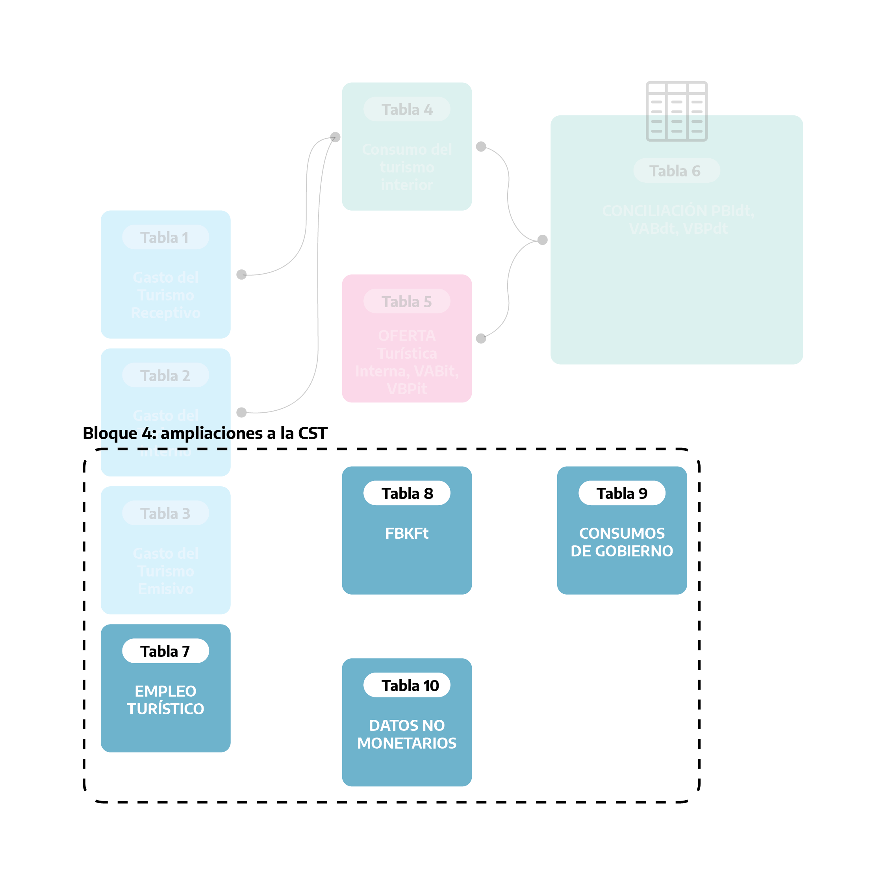

## Introducción

En el primer [posteo de la CST-A](https://bitacora.yvera.tur.ar/posts/2022-02-01-cuenta-satelite/) nos centramos en mostrar los resultados de los principales indicadores económicos del turismo alcanzados y su comparación con el mundo, el total de la economía nacional y con otros sectores productivos.  

En este segundo posteo, la propuesta es mostrar con más detalle la metodología de estimación de la CST-A y, en particular, recorrer las TABLAS elaboradas que son, en definitiva, donde se presenta la información económica del turismo.

El documento metodológico [Cuenta Satélite de Turismo: Recomendaciones sobre el Marco Conceptual (CST:RMC, 2008)](https://unstats.un.org/unsd/publication/seriesf/seriesf_80rev1s.pdf) elaborado por Naciones Unidas, EUROSTAT, Organización Mundial del Turismo y OCDE, propone la elaboración de 10 TABLAS en una CST:

En base a ellas, cada una de las tablas de la CST-A posee información novedosa, que se elabora a partir de reunir y consistir un conjunto de fuentes de información, y además se vinculan con las otras tablas de la CST-A, formando un sistema relacionado que permite **determinar y comprender la contribución económica del turismo en la Argentina**.

Como dijimos en el posteo anterior, el *propósito* de una Cuenta Satélite de Turismo es analizar minuciosamente todos los **aspectos económicos que se producen a partir de la demanda de bienes y servicios asociados con la actividad de los visitantes**. Es decir, la demanda de los visitantes emerge como lo determinante y solo a partir de esta se genera la actividad económica asociada al turismo. Con esta lógica, el primer bloque de tablas de la CST-A se dedica al consumo de los visitantes. 

## Bloque 1: demanda del visitante

El **Bloque 1: demanda del visitante** lo componen 4 tablas dedicadas al gasto y al consumo de los visitantes.

•	La **TABLA 1** presenta el gasto del turismo **receptor** por tipo de visitante (turista o excursionista) y por producto característico del turismo. El turismo receptor son las actividades de los visitantes no residentes en el país. La principal fuente de información para la CST-A es la [Encuesta de Turismo Internacional (ETI)](https://www.yvera.tur.ar/sinta/informe/documentos/descarga/5d5c00efe6866641938689.pdf) elaborada por el MINTURDEP y el INDEC, y las cuentas viajes y pasajeros de la [balanza de pagos del INDEC](https://www.indec.gob.ar/indec/web/Nivel4-Tema-3-35-45).       
•	La **TABLA 2** presenta el gasto del turismo **interno** por tipo de visitante (turista o excursionista) y por producto característico del turismo. El turismo interno son las actividades de los visitantes residentes en el país, durante sus viajes dentro de este o como parte de un viaje con destino en el exterior.  La fuente de información principal de la CST-A es la [Encuesta de Viajes y Turismo de los Hogares (EVyTH)](https://www.yvera.tur.ar/sinta/informe/info/encuesta-de-viajes-y-turismo-de-los-hogares-evyth) elaborada por el MINTURDEP.     
•	La **TABLA 4** conduce a la estimación del consumo turístico **interior** al sumar el gasto turístico receptor, el gasto turístico interno (TABLAS 1 y 2) y los otros componentes del consumo turístico interior. En la CST-A dentro de los "otros componentes" se incluyó el valor  de uso de segundas viviendas turísticas en propiedad de los residentes. La **TABLA 4** es medular, en el sentido de que contiene toda la demanda de los visitantes que luego será valuada en su aporte a la economía.  
•	La **TABLA 3** presenta el gasto del turismo **emisor** por tipo de visitante (turista o excursionista) y por producto característico del turismo. El turismo emisivo son las actividades de los visitantes residentes en el país durante los viajes en el exterior del país. Como se puede notar en el esquema, esta **TABLA 3** no se vincula con otras tablas de la CST-A puesto que todo el gasto que realicen los visitantes argentinos con proveedores del exterior no afecta la producción de la economía nacional. 

En la CST-A se estimaron las TABLAS 1, 2 y 4 para el año base 2004 y para el año 2018 debido a la mayor información del gasto turístico discriminado por producto en las fuentes específicas ([ETI](https://www.yvera.tur.ar/sinta/informe/documentos/descarga/5d5c00efe6866641938689.pdf) y [EVyTH](https://www.yvera.tur.ar/sinta/informe/info/encuesta-de-viajes-y-turismo-de-los-hogares-evyth)) y por la posibilidad de conciliar la demanda con la oferta de esos productos en la economía, como veremos más adelante.

## Bloque 2: Oferta de la industria

Viremos ahora la mirada hacia la oferta turística en la CST-A. El **Bloque 2: Oferta de la industria** lo compone una única tabla, la **TABLA 5**. 

La **TABLA 5** presenta las cuentas de producción de las industrias turísticas. Estas cuentas exponen el valor de la producción, el valor de los consumos intermedios para su elaboración y valor agregado como diferencia entre estos dos ítems. 

La importancia de la **TABLA 5** radica en, por un lado, conocer la dimensión y las relaciones sectoriales de los productores característicos del turismo, y por otro, en función de la apertura lograda en las actividades características impactar en la calidad de la medición del valor agregado generado por el consumo del visitante.   

La CST:RMC, 2008 propone una selección de industrias características del turismo (que le suma lo “internacionalmente comparable”) con base en la identificación de los productos característicos del turismo en la demanda de los visitantes. Aquí no profundizaremos más en estas definiciones y clasificaciones de actividades y productos, pero para aquellos que quieran interiorizarse lo invitamos a consultar el [Documento Técnico N°5: Medición de la contribución económica del turismo](https://dnme-minturdep.github.io/DT5_actividad_empleo/).

En la CST-A los [cuadros de oferta y utilización (COU)](https://www.indec.gob.ar/indec/web/Nivel4-Tema-3-9-114) de las cuentas nacionales son la materia prima para su elaboración. Los COU y por lo tanto la **TABLA 5** de la CST-A se elaboraron para el año base 2004 y el año 2018 y, en esta misma línea, las aperturas de los productos y actividades en cada año responde al detalle y disponibilidad de la información existente.

De la **TABLA 5** de la CST-A surgen indicadores de síntesis económicos del turismo, como el *valor bruto de producción de la industria del turismo* (VBPIT) o el *valor agregado de la industria del turismo* (VABIT). Ambos describen la dimensión de las industrias características y puede compararse con el total de la economía, pero nótese que estos indicadores contienen producción no demandada por visitantes así como, en el sentido contrario, no contienen producción consumida por visitantes (porque la industria que lo produjo no fue seleccionada como característica). Por ejemplo, estos indicadores incluyen toda producción de los restaurantes, cuando gran parte de esta producción no es consumida por visitantes, así como no incluye producción de artesanías (CST:RMC, 2008 no incluye inicialmente ramas productoras de bienes en las características del turismo).      

Para salvar esta instancia y proponer indicadores más específicos, la CST:RMC, 2008 avanza hacia la confrontación global del consumo turístico interior y la oferta interna como veremos en el **Bloque 3**.

## Bloque 3: confrontación oferta y demanda

En el **Bloque 3: confrontación oferta y demanda** se elabora la **TABLA 6**, donde confluyen la **TABLA 4** y la **TABLA 5**, que se completa con información de los COU para obtener la oferta interna disponible de los productos característicos (y otros) valuada a precios de adquisición:  las importaciones, los impuestos a los productos netos de subsidios y los márgenes de comercio y transporte. Entonces, la demanda de los visitantes es confrontada con la oferta interna a precios de adquisición y se obtienen  los **ratios turísticos por producto** (que indica la parte de la oferta interna que fue consumida por visitantes).

A partir de estos ratios turísticos por productos, para cada industria, es posible establecer la proporción turística de la producción (en términos de valor) como la suma de la proporción turística que corresponde a cada una de sus producciones. Así pues, para cada industria puede establecerse un **ratio turístico de la producción** (la relación entre el valor total de la proporción turística y el valor total de la producción de la industria), que se aplicará a los componentes del consumo intermedio (y, por ende, al valor agregado).

Por consiguiente, puede establecerse para cada industria una estimación de la parte de su valor agregado que corresponde a la contribución de su producción al consumo turístico interior total de todas las industrias, turísticas o no. Se denomina *valor agregado bruto directo turístico* (VABDT) a la suma de las partes de valor añadido de todas las industrias. 
Para obtener el *producto interior bruto directo turístico* (PIBDT), generado por el consumo turístico interior, es necesario añadir al VABDT los impuestos netos de subvenciones sobre los productos e importaciones turísticos que se estiman del mismo modo: utilizando el porcentaje correspondiente para cada producto. 

El VABDT y el PIBDT utilizados como principales indicadores de la contribución directa del turismo al valor agregado total o al PIB total se obtienen de la **TABLA 6**. 

Es por esto que la **TABLA 6** constituye el núcleo central de la cuenta satélite de turismo: de no elaborarse, aún a partir de datos parciales, el término cuenta satélite de turismo aplicado a la compilación de algunas de las tablas sería erróneo.

En la CST-A se elaboraron las **TABLAS 6** para cada año de la serie. En 2004 y 2018 con base en los COU de las cuentas nacionales, mientras que para los años 2016, 2017 y 2019, ante la inexistencia de los COU nacionales, se realizaron con base en estimaciones de COU reducidas para las industrias características del turismo.  
 

## Bloque 4: ampliaciones a la CST

En el **Bloque 4: ampliaciones a la CST**, el CST:RMC, 2008 presenta 4 tablas adicionales como propuesta para ampliaciones de la CST, sin que ellas integren el cuerpo principal de CST. 

En la **TABLA 7** se da cuenta del empleo en las industrias turísticas y es de importancia estratégica por el alto impacto del turismo en los puestos de trabajo. La propuesta del CST:RMC, 2008 es limitar el estudio de la industria del turismo, o sea a las ramas de actividad características, a expensas de que una parte de la producción no está destinada al consumo de los visitantes (y/o parte del consumo no producido por estas).

Esta recomendación fue atendida en la CST-A, donde se elaboró la **TABLA 7** para todos los años de la serie, en puestos de trabajo según la condición de ocupación (asalariado registrado, asalariado no registrado y no asalariado) para la industria del turismo característica en la Argentina.

Otros indicadores de empleo por fuera de los elaborados en la CST-A, como aproximaciones al empleo generado por el consumo de los visitantes, se pueden obtener de combinar los ratios turísticos de la producción (TABLA 6) y los puestos de trabajo de las industrias turísticas y no turística (TABLA 7).

En esta primera etapa, en la CST-A no se elaboraron la **TABLA 8**, sobre la formación bruta de capital fijo turístico y la **TABLA 9**, de consumo colectivo turístico, por falta de información de base disponible con el detalle requerido.  Aun así, como se advirtió anteriormente, estas ampliaciones no contribuyen a los indicadores de impacto económico del turismo (VABDT, PIBDT) que para la CST:RMC 2008 se limita al consumo de los visitantes y por lo tanto se completa en la **TABLA 6**. 

## Los invitamos a recorrer la CST-A:

Para las tablas e indicadores del año 2004 (en Excel): **[CST-A 2004](https://www.yvera.tur.ar/sinta/informe/documentos/descarga/61fad372d2e5b149489865.xlsx)**

Para las tablas e indicadores del año 2018 (en Excel): **[CST-A 2018](https://www.yvera.tur.ar/sinta/informe/documentos/descarga/61fb3e2065014019422528.xlsx)**

Año a año, y a medida que se elaboren los COU de las cuentas nacionales, iremos actualizando las tablas detalladas de cada CST-A anual. Este año, 2022, corresponderá difundir las de la CST-A de 2019 junto con los avances de indicadores síntesis para los años 2020 y 2021. 

## Siglas y abreviaturas

**COU**: Cuadros oferta y utilización

**CST**: Cuenta Satélite de Turismo

**CST-A**: Cuenta Satélite de Turismo de la Argentina 

**CST:RMC, 2008**: Cuenta Satélite de Turismo: Recomendaciones sobre el Marco Conceptual 2008, Estudios de métodos, F(80) (ONU 2010)

**ETI**: Encuesta de Turismo Internacional

**EVyTH**: Encuesta de Viajes y Turismo de los Hogares  

**INDEC**: Instituto Nacional de Estadística y Censos

**MINTURDEP**: Ministerio de Turismo y Deportes

## Recursos - CST-A

[**Publicación**](https://www.yvera.tur.ar/estadistica/informe/info/cuenta-satelite-de-turismo){target=”_blank”}

[**Documento Técnico #5: Medición de la contribución económica del turismo**](https://dnme-minturdep.github.io/DT5_actividad_empleo/){target=”_blank”}