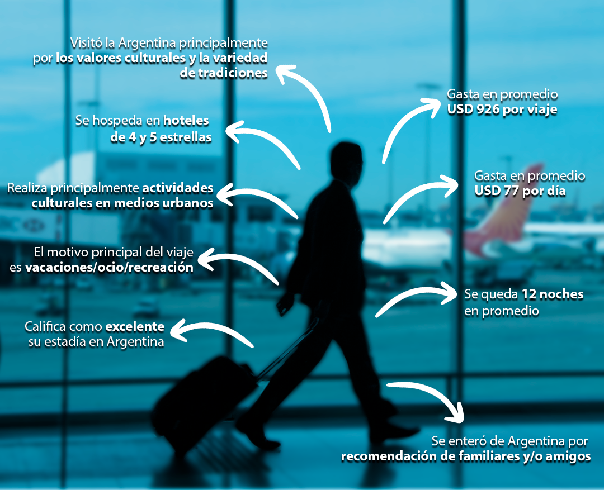

```{r setup, include=FALSE}
knitr::opts_chunk$set(echo = FALSE)
```

## ¿CON QUÉ INFORMACIÓN CONTAMOS DEL TURISMO INTERNACIONAL EN NUESTRO PAIS?

### Introducción

Desde la *Dirección Nacional de Mercados y Estadística del Ministerio de Turismo y Deportes de la Nación (DNMyE – MINTURDEP)* nos proponemos seguir dando a conocer otra de las fuentes de información más importantes a nivel nacional del turismo en Argentina. En esta oportunidad nos ocuparemos de la **Encuesta de Turismo Internacional (ETI) y de la Estimación Nacional del turismo internacional en Argentina**. En este post nos focalizaremos sólo en el turismo receptivo (turistas no residentes que visitan Argentina) para luego, en otra ocasión, avocarnos al turismo emisivo. Se mostrarán los principales datos, el perfil de los turistas no residentes que visitan la Argentina y los aspectos más relevantes del operativo encuesta. 


```{r}
### Cargo librerías
library(tidyverse) 
library(data.table)
library(haven)
library(readxl)
library(comunicacion)
library(glue) 
library(plotly)
library(lubridate) 
library(treemapify)
library(sf)


#saco notacion cientifica
options(scipen = 999)
```


```{r}
##~~~~~~~~~~~~~~~~~~~~~~~~~~~~~~~~~~~
##  ~ Carga de la base de datos  ----
##~~~~~~~~~~~~~~~~~~~~~~~~~~~~~~~~~~~

base_tur_internac <- readRDS("turismo_internacional_pais.rds")

source("armo_tablas_turismo_internacional.R")

base_eti_2019 <- read_sav("ETI E 2019.sav") %>% 
  zap_label() %>% 
  zap_labels()
									
source("armo_tablas_eti.R")


```

## ¿Cuántos turistas no residentes recibe la Argentina por año?

Para responder esta pregunta tenemos que referirnos a los datos que se elaboran desde la *DNMyE* correspondientes a la **Estimación Nacional del total de turistas no residentes en Argentina** por todos los medios de transporte utilizados, estos son: aéreos, terrestres y fluviales/marítimos. 

La fuente principal de dichos números son los **registros migratorios** de 225 pasos internacionales y la **Encuesta de Turismo Internacional** (de la cual hablaremos un poco más adelante). Con dicha información, y siguiendo las recomendaciones internacionales de la *Organización Mundial de Turismo (OMT)*, elaboramos las cifras del turismo receptivo y emisivo de Argentina [Ver documento metodológico](https://www.yvera.tur.ar/sinta/informe/documentos/descarga/5dc0460bcfa3e053142696.pdf) 

Ahora sí, contestemos la pregunta mirando el gráfico a continuación: 


```{r fig.height=5, fig.width=10}
#grafico serie turismo internacional por via

graf_serie_via_ti <- ggplot(tabla_serie_via_ti, aes(periodo, turistas, fill =via,
                                                    group = via,
                                                    text=paste0(format(turistas, big.mark = ".",decimal.mark = ",", digits = 1)," turistas")
                                                    ))+
  geom_area() +
  scale_fill_dnmye() + 
  scale_x_date(date_breaks = "1 months", date_labels = "%b%y", expand = c(0,10))+ 
  scale_y_continuous(breaks = seq(min(tabla_serie_via_ti$turistas), max(sum(tabla_serie_via_ti$turistas)), by = 200000), 
                     labels = scales::number_format(big.mark = ".", decimal.mark = ",")) + 
  theme_minimal()+
  theme(legend.position = "bottom", 
        axis.text.x =element_text (size = 8, angle=90),
        axis.text.y = element_text(size = 11),
        legend.title = element_blank(),
        legend.text = element_text (size =12),
        plot.caption =  element_text (size =12, hjust = 0.0)) +
  labs(title = "Evolución mensual del turismo internacional receptivo, por medio de transporte",
       subtitle = glue ("Total país. Enero 2016-{Mes_ult}-2021"),
       y = "", 
       x = "", 
       color= "",
       caption =  "Fuente: Dirección Nacional de Mercados y Estadistica, Ministerio de Turismo y Deportes." )

#Plotly

plot_1 <- graf_serie_via_ti %>%   
  ggplotly(tooltip = "text") %>% 
  layout(title = list(text = paste0('Evolución mensual del turismo internacional receptivo, por medio de transporte',
                                    '<br>',
                                    '<sup>',
                                    glue ("Enero 2016-{Mes_ult}-2021"),
                                    '</sup>'),
                      font = list(size = 15)),
         legend = list(x = 0.85, y = 0.99, font = list (size = 12)),
         margin = list(b=160), ##bottom margin in pixels
         annotations = 
           list(x = 1, y = -0.25, text = "Fuente: Dirección Nacional de Mercados y Estadstica, Ministerio de Turismo y Deportes", 
                showarrow = F, xref='paper', yref='paper', 
                xanchor='right', yanchor='auto', xshift=0, yshift=0,
                font = list(size = 10)
                ),
        xaxis = list(tickfont = list(size = 10)), 
        yaxis = list(tickfont = list(size = 10))
)


plot_1

#*falta ver como alinear nota.


```

En el año 2019, antes del colapso de la pandemia, Argentina recibió **7,4 millones de turistas no residentes por todos los pasos internacionales**, principalmente por la vía terrestre y la vía aérea (44% y 41%, respectivamente). 

En el gráfico se muestra la evolución mensual del turismo receptivo, donde es posible observar la estacionalidad propia de la actividad turística: los picos del verano, la temporada baja y el repunte en invierno por la llegada de turistas internacionales a los principales destinos de nieve. También vemos allí la caída estrepitosa en los años 2020 y 2021 producto de la pandemia.

Luego de dichos años, en octubre de 2021, se observa que el número de turistas internacionales ¡vuelven a mostrar signos de vida y comienza a tener mayor dinamismo! 

También nos podemos preguntar, *cuál es el principal mercado que nos visita*. Y para ello, analizaremos los datos según los principales países de residencia de los turistas extranjeros según el medio de transporte utilizado. Veamos el siguiente gráfico: 

```{r fig.height=4, fig.width=8}

graf_pais_ti <- ggplot(tabla_pais_ti) +   
  geom_bar(aes(x= pais_agrupado, weight= turistas_porc, fill =via))+
  scale_fill_dnmye() +
  geom_hline(yintercept = 0, color = "grey", alpha =0.7, size = 0.5) + 
  scale_y_continuous(labels = scales::percent_format()) + 
  theme_minimal()+
  theme(legend.position = "bottom", 
        axis.text.x =element_text (size =11, angle=45, vjust = 0.6),
        axis.text.y = element_text(size = 12),
        legend.text = element_text (size =12),
        plot.caption =  element_text (size =12, hjust = 0.0)) +
  labs(title = "Turismo internacional receptivo por país de residemcia según medio de transporte",
       subtitle = "Total país. Año 2019",
       y = "", 
       x = "", 
       color= "",
       fill="",
       caption =  "Fuente: Dirección Nacional de Mercados y Estadstica, Ministerio de Turismo y Deportes" )

graf_pais_ti


```

**Brasil ocupó el primer lugar** y representó el 20% del total de las llegadas del año 2019, principalmente utilizando medios de transporte aéreos. Luego, se ubica **Chile** (15%) pero la vía terrestre es el medio principal para este mercado. Los turistas europeos son otro mercado de importancia (14%), principalmente por los medios aéreos. 

Para seguir analizando y respondiendo otras preguntas del turismo internacional en Argentina, te invitamos a que juegues con el [Tablero de datos del turismo internacional](https://tableros.yvera.tur.ar/turismo_internacional/), en el cual podrás filtrar la información que desees y conocer más sobre el movimiento de turistas no residentes en nuestro país (año, mes, país de residencia, paso, entre otras variables). 

## ¿Qué características tiene el turista internacional que nos visita?

Para conocer un poco más sobre el *perfil del turista receptivo*, nos enfocaremos en la **Encuesta de Turismo Internacional (ETI)**. Este relevamiento es coordinado entre el *Ministerio de Turismo y Deportes de la Nación y el Instituto Nacional de Estadística y Censos (INDEC)* desde el año 2004 hasta la actualidad. El **principal objetivo** es conocer las características tanto de los viajes (el motivo, la duración, el/los destino/s, el/los tipos de alojamientos utilizados, etc.) como de los viajeros (lugar de residencia, conformación del grupo familiar que viaja, etc.), como también los gastos que realizó durante su estadía (en alojamiento, alimentación, entre otros).

La ETI se releva, principalmente, en pasos aéreos: **Aerop. Internacional de Ezeiza, Aeroparque J. Newbery, Aerop internacional de Córdoba y de Mendoza**. También se releva en el **Puerto de Buenos Aires** y en el paso fronterizo terrestre **Cristo Redentor** que limita con Chile. En su conjunto, representó aproximadamente el movimiento del 46% del total del turismo receptivo en la Argentina (año 2019). 

A partir de la información que nos brinda la ETI, y a modo de resumen, te presentamos el **perfil del turista no residente promedio**. Allí se sintetiza la información de las principales características de los turistas no residentes durante el año 2019. 



A su vez, también es posible cruzar los datos por diferentes variables de interés. A continuación, te mostramos cuáles son los principales tipos de alojamiento utilizados por los diferentes motivos de viaje. 

Los hoteles de mayor categoría, **los 4 y 5 estrellas**, son los más demandados por aquellos que nos visitan por *vacaciones/ocio/recreación* y *por negocios* (siendo en este último, mayor su participación). Como es de esperar, **Casa de familiares y/o amigos** es el principal alojamiento de aquellos que vinieron a visitar a los familiares y se hospedan allí. Los **hoteles de 1,2 y 3 estrellas** se ubican como el segundo tipo de alojamiento más utilizado por los turistas de vacaciones. 


```{r fig.height=6, fig.width=8}

# ETI. Motivo de viaje  por tipo de alojamiento

motivo_ta <- eti_tur %>% 
  mutate (motivo_viaje = case_when(p17nuev != 5 ~ p17nuev,
                                  p17nuev == 5 ~ 4), #recodifico rde y otros en "otros".
          motivo_viaje = factor(motivo_viaje, 
                               levels =c(1,2,3,4),
                               labels = c("Vacaciones","Visita a familiares",
                                      "Negocios","Otros")),
          tipo_aloj = factor (p21_ta_publ,
                              levels =c(1,2,3,4),
                              labels = c("Casa de familiares/amigos",
                                         "Hotel 1-2-3 estrellas",
                                         "Hotel 4-5 estrellas",
                                         "Otro"))) %>% 
  group_by(motivo_viaje, tipo_aloj) %>% 
  summarise(turistas = sum(WPF)) %>% 
  ungroup () %>% 
  mutate(prop_tur = turistas/sum(turistas)) 
 
g_motivo_ta <- ggplot(motivo_ta) +   
  geom_bar(aes(x= motivo_viaje, weight= prop_tur, fill = tipo_aloj))+
  geom_hline(yintercept = 0, color = "grey", alpha =0.7, size = 0.5) + 
  scale_y_continuous(labels = scales::percent_format()) + 
  scale_fill_dnmye() +
  theme_minimal()+
  theme(legend.position = "bottom", 
        axis.text.x =element_text (size =12, angle=45, vjust = 0.7),
        axis.text.y = element_text(size = 12),
        legend.text = element_text (size =12),
        plot.caption =  element_text (size =12, hjust = 0.0)) +
  labs(title = "Motivo de viaje según tipo de alojamiento principal",
       subtitle = glue ("Pasos ETI. Año 2019"),
       y = "", 
       x = "", 
       color= "",
       fill="",
       caption =  "Fuente: Encuesta de Turismo Internacional (ETI) - (MinTurDep- INDEC)." )

g_motivo_ta

```

Otro dato que nos permite ver la ETI es el **gasto promedio** de los turistas según el país de residencia y su **estadía promedio** en Argentina. Europa presenta la mayor estadía, casi 20 días en promedio en el año 2019, con un gasto promedio por viajero de USD 1370. Los países que incluye la categoría *Resto de América* son los que también presentaron estadías largas; 18,8 en promedio, con un gasto por viajero promedio de USD 1107. Los países limítrofes permanecen menos tiempo, siendo Bolivia el que registró una mayor estadía promedio (12 días promedio) con un gasto por viajero de USD 730. EE.UU. y Canadá son los que registraron el mayor **gasto diario** promedio (USD 97,4) y, en menor medida, los turistas brasileños (USD 97,1). 

```{r fig.height=4, fig.width=8}

# ETI. Gasto y estadía.

gasto_estad <- eti_tur %>% 
  mutate(pais_origen = factor(origen_cv, 
                               levels =c(1:9),
                               labels = c("Bolivia","Brasil","Chile","Paraguay",
                                         "Uruguay","EE.UU. y Canadá","Resto de América",                                                   "Europa", "Resto del mundo"))) %>% 
  group_by(pais_origen) %>% 
  summarise(turistas = sum(WPF),
            estadia= sum(P19_2* WPF) / sum(WPF),
            gasto_estada = sum(gastoest2 *WPF) / sum(WPF)) 

g_gasto_estad <- ggplot(gasto_estad) +   
geom_bar(aes(x= pais_origen, weight= gasto_estada), fill = dnmye_colores("cian")) +
geom_line(aes(x = pais_origen, y = estadia*80, group = 1, color = "Estadía media" ), size = 1.25) +
geom_hline(yintercept = 0, color = "grey", alpha =0.7, size = 0.5) + 
geom_label(aes(x = pais_origen, y =estadia*80, label = round(estadia,1), group = 1),
           fontface = "bold", size = 4, color = dnmye_colores("rosa")) +
scale_y_continuous(labels = scales::number_format(big.mark = ".", decimal.mark = ","),
                   name = "Gasto por viajero",
                   sec.axis = sec_axis(trans = ~./80,
                                       name = "Estadía media (en noches)")) +
theme_minimal()+
theme(legend.position = "bottom", 
      axis.text.x =element_text (size =10, angle=45, vjust = 0.5),
      axis.text.y = element_text(size = 12),
      legend.text = element_text (size =12),
      plot.caption =  element_text (size =12, hjust = 0.0)) +
labs(title = "Gasto promedio por viajero y estadía media según país de residencia",
     subtitle = glue ("Pasos ETI. Año 2019"),
     y = "", 
     x = "", 
     color= "",
     fill="",
     caption =  "Fuente: Encuesta de Turismo Internacional (ETI) - (MinTurDep- INDEC)." )

g_gasto_estad
```

Otra de las preguntas que se les realiza a los viajeros cuando finalizan su viaje en la Argentina, es sobre **qué aspectos fueron los determinantes** para elegir nuestro país como destino de su viaje. Los *valores culturales y la variedad de tradiciones* fue el aspecto más relevante para el turista receptivo en el año 2019. El 27,4% respondió que dicho aspecto fue el más significativo. Luego, la *diversidad de la naturaleza y los paisajes* fue el segundo más determinante (16,2% de los turistas). En el próximo gráfico verás todos los aspectos y sus correspondientes porcentajes de participación. 

```{r fig.height=4, fig.width=10}

# ETI. Aspectos	

tabla_eti_aspectos <- read_xlsx("eti_2019_tur_aspectos_activ.xlsx", sheet = "aspectos" ) 			

g_eti_aspectos <- ggplot(tabla_eti_aspectos, aes(x= aspectos, y = porc, fill = aspectos)) +   
  geom_col() +
  geom_text (aes(label=paste0(round(porc *100,1),"%")), position=position_stack(vjust=0.5))+
  geom_hline(yintercept = 0, color = "grey", alpha =0.7, size = 0.5) + 
  coord_flip()+
  scale_fill_dnmye() + 
  scale_y_continuous(labels = scales::percent_format()) + 
  scale_x_discrete(limits = tabla_eti_aspectos$aspectos[order(tabla_eti_aspectos$porc)] )+
  theme_minimal()+
  theme(legend.position = "", #saca referencia en leyenda
        legend.title = element_blank(), #saca titulo leyenda
        axis.text.x =element_text (size =12, vjust = 0.7),
        axis.text.y = element_text(size = 12),
        legend.text = element_blank(),
        plot.caption =  element_text (size =12, hjust = 0.0)) +
  labs(title = "Aspectos que influyeron en la decisión de viajar a Argentina",
       subtitle = "Año 2019. Pasos ETI",
       y = "", 
       x = "", 
       color= "",
       fill="",
       caption =  "Fuente: Encuesta de Turismo Internacional (ETI) - (MinTurDep- INDEC)." )
       
g_eti_aspectos

```

Por último, te mostramos otro dato interesante de la ETI: las **principales actividades turísticas** que realizaron en nuestro país los turistas extranjeros. En el gráfico a continuación se ve claramente, por la dimensión de cada una de las actividades, cuáles fueron las más destacadas: las *actividades culturales* y la *gastronomía* ocuparon el primer lugar en el año 2019, luego se ubicaron las actividades nocturnas, actividades en medios naturales, el tango, las visitas a los parques nacionales….


```{r fig.height=4, fig.width=8}

#ETI.Actividades.

tabla_eti_actividades <- read_xlsx(here::here("_posts", "2022-05-31-intro-eti", "eti_2019_tur_aspectos_activ.xlsx"), sheet = "actividades" ) 									

graf_eti_actividades <- tabla_eti_actividades %>% 
  ggplot(.,aes(area= Suma,
               fill = actividades))+
  geom_treemap()+
  scale_fill_discrete()+
  geom_treemap_text(aes(label=actividades) ,colour = "black", place = "topleft",
                    grow = T, reflow = T, size = 9,
                    #family= "Encode Sans Normal",
                    layout = "squarified") +
  theme_minimal() +
  theme(
    #text = element_text(family = "Encode Sans Normal"), 
    legend.position = "none",
    plot.caption  = element_text(size = 4),
    strip.text.y  = element_text(size = 3, face = "bold"),
    axis.text.x   = element_text(size = 3),
    axis.text.y   = element_text(size = 3),
    legend.text   = element_text(size = 5),
    legend.title  = element_blank()
  ) +
  labs(title = "Actividades realizadas de los turistas no residentes durante el viaje a la Argentina",
       subtitle = "Pasos ETI. Año 2019 \nLos tamaños dependen de la cantidad de turistas que realizaron cada actividad",
       y = "", 
       x = "", 
       color= "",
       fill="",
       caption =  "Fuente: Encuesta de Turismo Internacional (ETI) - (MinTurDep- INDEC)." )

graf_eti_actividades

```

## ¡Quiero más! 

Toda esta info y mucho más vas a poder encontrarla en nuestro portal [Sistema de Información Turística de la Argentina](https://www.yvera.tur.ar/sinta/). 

Algunas cosas que vas a poder encontrar....

### Informes: 

Sobre la **Estimación Nacional del turismo internacional**: son los documentos mensuales que producimos con los datos del total del turismo internacional de Argentina a nivel nacional.

Sobre **ETI**: son los documentos que publica el INDEC todos los meses, aproximadamente 40 días luego del periodo de referencia de los datos. Mensualmente se publican los principales datos de Ezeiza y Aeroparque y, en los trimestres, se adiciona info del resto de los pasos con las variables de perfil.

Ambos los encontrarás en el mismo link, [AQUÍ](https://www.yvera.tur.ar/sinta/informe/info/turismo-internacional) 

### Tablero de turismo internacional

Es la info del turismo internacional en formato de tabla dinámica para que puedas cruzar los datos por diferentes variables de interés. [AQUI](https://tableros.yvera.tur.ar/turismo_internacional)

### Datos Abiertos

Son archivos en formato *.csv* para que puedas levantar desde cualquier programa que utilices (Excel, SPSS, R, etc) tanto de la ETI como de la estimación nacional. 

[Dataset de turismo internacional](https://datos.yvera.gob.ar/dataset/turismo-internacional-total-pais) 

[Dataset de la ETI](https://datos.yvera.gob.ar/dataset/encuesta-turismo-internacional)

