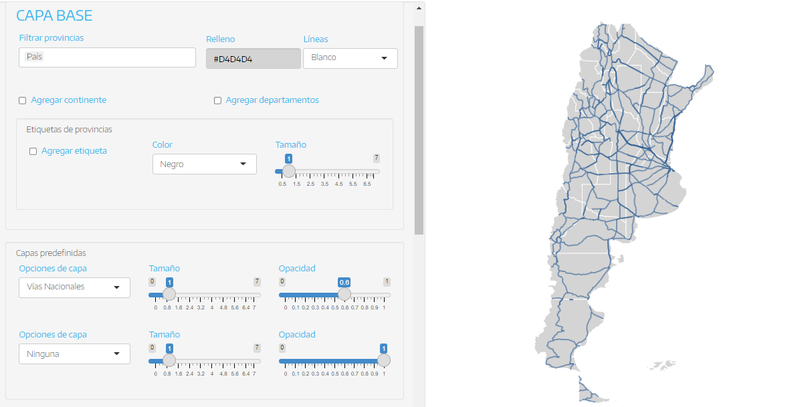
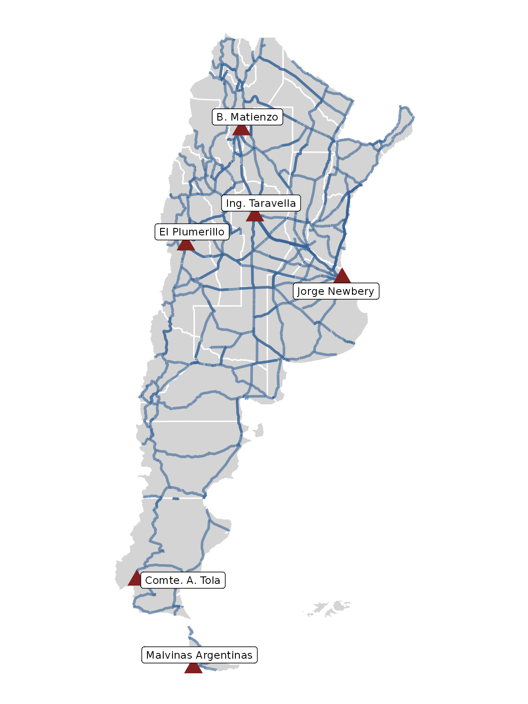

```{r setup, include=FALSE}
knitr::opts_chunk$set(echo = FALSE)
```


## ¿Para qué mapeAr?

En el día a día de la Dirección Nacional de Mercados y Estadística (DNMyE) trabajamos con datos de la actividad turística de Argentina que están, o pueden ser, georeferenciados, es decir, que tienen una ubicación conocida. Por ejemplo, los aeropuertos internacionales del país, los principales destinos turísticos de una provincia o las [Rutas Naturales](https://larutanatural.gob.ar/) en las que se divide al territorio argentino ocupan un lugar en el espacio.

Al contar con este tipo de datos se pueden elaborar mapas para visualizar la información geográfica, algo útil para conocer la distribución de esos datos en el espacio y como soporte para la elaboración de estrategias de desarrollo y promoción turística.

Por esto, desde la DNMyE se propuso desarrollar una plataforma de acceso libre para la realización de mapas de Argentina, con el objetivo de facilitar el proceso a quiénes no cuentan con conocimientos en herramientas de diseño o programación. Se puede acceder a la misma en el siguiente link: https://tableros.yvera.tur.ar/mapeAr/


## Trabajando con información geográfica

Existen distintos tipos de datos espaciales que se pueden "mapear", los cuales se representan a través de geometrías:

+ **Puntos**: refieren a una latitud y longitud específica donde se ubica el dato. Por ejemplo, el Puerto de Buenos Aires o las Cataratas del Iguazú.

+ **Líneas**: podemos definirlas como una sucesión de puntos. Un claro ejemplo son las rutas nacionales y provinciales.

+ **Polígonos**: representan áreas en el espacio, es decir, que tienen límites. Las provincias de un país se representan con polígonos, así como el país en sí mismo, por mencionar unos ejemplos.

Estos datos se suelen almacenar en distintos formatos, pero hay algunos específicos para guardar información geográfica como _.geojson_ y _.kml_, especialmente cuando se trabaja con líneas y polígonos. En el caso de puntos, es común utilizar formatos más conocidos como _.xlsx_ y _.csv_, donde tenemos una columna con la latitud del dato y otra con la longitud. A continuación podemos ver un ejemplo de una tabla muy sencilla, que contiene algunos aeropuertos del país:

```{r}
library(readxl)

aeropuertos <- read_excel("aeropuertos_modelo.xlsx")

kableExtra::kable(aeropuertos)
```

Ahora que sabemos a qué nos referimos con información geográfica, conozcamos mejor cómo funciona **mapeAr**.


## Mapeando datos

La plataforma de [mapeAr](https://tableros.yvera.tur.ar/mapeAr/) fue diseñada para poder elaborar mapas de Argentina cargando distintas capas de información geográfica. Cuando abrimos la aplicación nos encontramos con la siguiente interfaz:

```{r out.width="100%", out.height= "50%"}
knitr::include_graphics("mapear.png")
```

Del lado izquierdo se encuentran los controles para poder cargar y personalizar las capas de datos geográficos, mientras que a la derecha podemos previsualizar el mapa. Al iniciarse, se muestra una capa base con la geometría de Argentina con la división provincial, sobre la cual podemos realizar distintos ajustes y agregar más capas.

Para entender mejor el funcionamiento de la aplicación, hagamos un ejemplo de un mapa que muestre los aeropuertos que vimos más arriba, y para agregar un poco más de información, incorporemos las rutas nacionales.

### Capa base

Empecemos por configurar la **capa base**. Para nuestro ejemplo, vamos a dejar como base todo el país, pero si quisiéramos enfocarnos en algunas provincias podríamos seleccionarlas desde _Filtrar provincias_. Luego vamos a darle un poco de diseño a nuestra capa base cambiando el color de _Relleno_ a "#D4D4D4"[^1], el cual representa un gris claro, y el color de las _Líneas_ a "Blanco".

Para no complejizar la visualización, dejaremos el resto de las opciones de la capa base tal cual vienen cargadas. Sentíte libre de utilizar los botones de agregar las geometrías del continente y los departamentos o los nombres de las provincias, para darle más contexto al mapa.

Ya tenemos nuestro mapa base de Argentina, ahora incorporemos más información.

[^1]: Esta forma de escribir un color se conoce como sistema de numeración hexadecimal, se utiliza para representar colores a través de un código de 6 valores alfanuméricos precedido de un #.


### Capas predefinidas

En la DNMyE utilizamos algunas capas vinculadas a la actividad turística cotidianamente, por lo cual resulta útil poder cargar las mismas de manera rápida. Para esto, en el bloque de **capas predefinidas** guardamos las siguientes geometrías, con algunos parámetros preestablecidos (como el color): Regiones, Rutas Naturales, Circuitos (turísticos), Áreas Protegidas, Vías Nacionales y Capitales.

En nuestro ejemplo vamos a agregar la capa de Vías Nacionales, por lo que la elegimos en el primer selector de _Opciones de capa_, esperamos a que cargue y dejamos el segundo selector con la opción "Ninguna". Ahora tenemos un montón de líneas sobre el mapa, que nos permiten visualizar cómo se conecta el país a través de las rutas nacionales. Como luego vamos a incorporar nuestros datos de aeropuertos, ajustemos la _Opacidad_ de las líneas para que sea más fácil visualizar y distinguir las distintas capas. Arrastramos el control hasta el valor 0.6.

Hasta el momento nuestro tablero y mapa luce de la siguiente manera:

```{r out.width="100%", out.height= "50%"}

```


### Capas personalizadas

¡Llegó la hora de cargar nuestros propios datos! En este caso, vamos a sumar la base de aeropuertos que mencionamos, la cual contiene únicamente tres columnas (latitud, longitud y nombre del aeropuerto) y se encuentra en formato _.xlsx_.

Antes de cargar un archivo, es importante saber que hay algunos requisitos y recomendaciones que seguir para que la plataforma levante nuestra base de manera correcta. En la sección **¿Cómo usar?** se puede encontrar una descripción detallada, sugerimos leerla y descargar la base modelo con algunos aeropuertos (que es una versión más completa de la que estamos utilizando para el ejemplo).

En la sección de **Capa 1** nos encontramos con los siguientes comandos:

```{r out.width="100%", out.height= "60%"}
knitr::include_graphics("mapear1.png")
```

Primero, marcamos la opción de geometría que vamos a mapear. Para el ejemplo elegimos la opción de _Puntos_, ya que estamos trabajando con aeropuertos que tienen unas coordenadas (latitud y longitud) definidas. Luego hacemos click en "Buscar" dentro de _Cargar archivo_ y elegimos el archivo excel.

Si todo anduvo bien, veremos que en nuestro mapa figuran algunos puntos. Empecemos por aumentar el tamaño para identificarlos mejor, cambiando la opción _Tamaño_ a 5. Ya tenemos un mapa que cumple con nuestro objetivo de mostrar la ubicación de los aeropuertos con las rutas de fondo, pero vamos a personalizar un poco más la estética final.

Cambiamos el _Color_ de nuestros puntos a "#821F1F" y la _Forma_ a "Triangulos", ahora podemos distinguirlos mejor. También queremos saber cómo se llaman así que vamos a agregar unas etiquetas de _Referencias_, cambiando la opción de "Ninguna" al nombre de nuestra variable "nombre_aeropuerto", el _Tipo_ a "Etiqueta" y el _Tamaño_ a 3.

Si la visualización nos convence podemos descargar nuetro mapa, para lo cual elegimos el formato de salida (por ejemplo, PNG) y configuramos los parámetros de Ancho, Alto y DPI (resolución de la imagen). En nuestro ejemplo dejaremos todo tal cual, resultando en el siguiente mapa:

```{r out.width="80%", out.height= "100%"}

```

¡Listo! Con algunos clicks y ajustes logramos armar un mapa para descargar, compartir o incluir en nuestros trabajos, partiendo de una base de datos propia. Si te da curiosidad saber qué es lo que sucede por detrás de mapeAr, podés consultar el código fuente en el [repositorio de Github de la DNMyE](https://github.com/dnme-minturdep/mapeAr). También compartimos el código en R que permite replicar el mismo mapa que hicimos en la plataforma:

```
library(tidyverse)
library(sf)
library(readxl)
library(geoAr)
library(ggrepel)

#Cargo base de aeropuertos
aeropuertos <- read_excel("aeropuertos_modelo.xlsx") %>% 
  mutate(latitud = as.numeric(latitud),
         longitud = as.numeric(longitud))

#Cargo base de mapa Argentina
mapa_argentina <- get_geo("ARGENTINA", level = "provincia")

#Cargo base de rutas nacionales del IGN
rutas_nacionales <- read_sf("vial_nacional.kml") %>% 
  group_by(rtn) %>% 
  summarise(geometry = st_combine(geometry)) %>% 
  ungroup()

#Armo mapa
mapa_ejemplo <- ggplot() +
  geom_sf(data = mapa_argentina, fill = "#D4D4D4", color = "white") +
  geom_sf(data = rutas_nacionales, color = "#356296", alpha = 0.6) +
  geom_point(data = aeropuertos, aes(x = longitud, y = latitud),color = "#821F1F", size = 5, shape = 17) +
  geom_label_repel(data = aeropuertos, 
                   aes(x = longitud, y = latitud, label = nombre_aeropuerto), 
             size =3,  box.padding = 0.2, min.segment.length = 1,) +
  theme_void()
```
La ventaja de mapeAr no radica solo en que nos ahorramos de escribir o entender código, sino que también evitamos tener que buscar y procesar las capas con las geometrías de Argentina y rutas nacionales, siendo que trabajar con información geográfica puede llegar a ser complejo.

## Yendo un poco más allá...

En el caso de que queramos seguir personalizando el mapa, el tablero nos permite jugar con los parámetros de color, tamaño y forma (si se trata de puntos). Podemos, por ejemplo, asignar un color a los puntos en función de una variable de nuestra base. Para esto deberíamos seleccionar la opción _Según variable_ en _Color_ y luego elegir la variable categórica que nos sirva para colorear los puntos. También tenemos la opción de cargar un color específico para cada punto, creando una columna que se llame **color_hex** en nuestra base y especificando el código hexadecimal del color de cada registro (ver el modelo de data en la pestaña _¿Cómo usar?_).

Por último, hay que tener en cuenta que se pueden sumar hasta tres capas personalizadas, además de las dos predefinidas y la capa base. Un recurso útil para consultar información geográfica es el sitio del [Instituto Geográfico Nacional](https://www.ign.gob.ar/NuestrasActividades/InformacionGeoespacial/CapasSIG), donde se encuentran distintas bases que te pueden ayudar a crear mapas según tus necesidades.

¿Lista/o para mapear?

## Links

**Recurso:**
https://tableros.yvera.tur.ar/mapeAr/

**Repositorio:**
https://github.com/dnme-minturdep/mapeAr