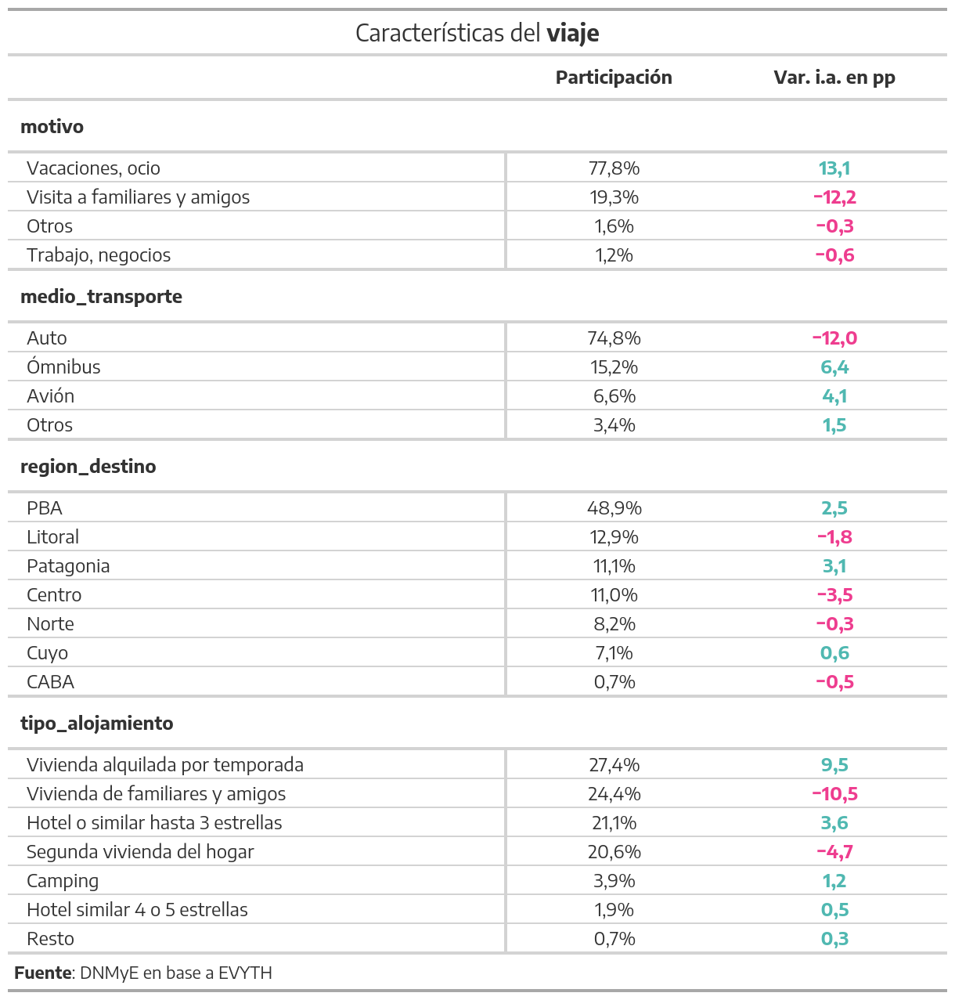

```{r setup, include=FALSE}
knitr::opts_chunk$set(echo = FALSE)

library(googlesheets4)
library(openxlsx)
library(tidyverse) # Easily Install and Load the 'Tidyverse', CRAN v1.3.0 # Easily Install and Load the 'Tidyverse', CRAN v1.3.0
library(comunicacion)
library(ggtext)
library(tidytext)
library(glue)
library(lubridate)
googlesheets4::gs4_deauth() 
```

# Introducción

La Dirección Nacional de Mercados y Estadística (DNMyE) elabora mensualmente un informe que reúne los datos actualizados del turismo, nutriéndose de las estadísticas elaboradas por la Dirección a partir de los relevamientos períodicos (Encuesta de Turismo Internacional, Encuesta de Ocupación Hotelera, Encuesta de Viajes y Turismo de los Hogares), asi como fuentes externas que complementan los datos del sector (Migraciones, ANAC, INDEC, Organización Mundial del Turismo). En esta oportunidad, se publica para el público general el último Informe Mensual de Estadísticas de Turismo (IMET), correspondiente al mes de julio, y además se disponibilizan ediciones anteriores del informe.


<br> 

A continuación se enumeran los contenidos que actualmente forman parte del informe, junto con la fuente de donde provienen los datos


# Contenidos

## Turismo Internacional

En base a la [estimación del turismo internacional](https://www.yvera.tur.ar/sinta/informe/info/turismo-internacional) elaborada por la DNMyE, con datos de la Dirección Nacional de Migraciones y la Encuesta de Turismo Internacional (ETI), se expone, en primer lugar, la evolución del turismo receptivo, el emisivo y la balanza turística.

Luego se refleja la evolución del gasto turístico internacional en base a la información proveniente de la Cuenta Viajes y la Cuenta Pasajes de la [Balanza de Pagos del INDEC](https://www.indec.gob.ar/indec/web/Nivel4-Tema-3-35-45). Cabe destacar que dicho indicador está compuesto por el gasto de los visitantes (turistas + excursionistas) y las compras de pasajes internacionales por parte de personas no residentes de Argentina a empresas residentes, en el caso del turismo receptivo, y por parte de personas residentes de Argentina a empresas no residentes, para el caso del turismo emisivo.

En tercer lugar, se presentan los mercados de origen y destino de los turistas, junto al saldo (receptivo-emisivo) de los principales destinos.

En cuarto lugar, la evolución del [Índice de tipo de cambio real multilateral turístico](https://tableros.yvera.tur.ar/recursos/biblioteca/metodologia_itcrmt.pdf), que refleja la competitividad cambiaria de Argentina, teniendo en cuenta la participación del resto de los países en el flujo turístico del país. Se contempla, también, la existencia de tipos de cambios diferentes al oficial que puedan influir en las transacciones de los turistas. 

Por último, se muestra información referida a la conectividad aéra internacional, a través de la cantidad de pasajeros transportados, asientos ofrecidos y vuelos realizados. Todo ello, en base a datos de la Administración Nacional de Aviación Civil (ANAC).

<br>


## Turismo interno

Se presenta información relevante de la [Encuesta de Viajes y Turismo de los Hogares (EVyTH)](https://www.yvera.tur.ar/sinta/informe/info/encuesta-de-viajes-y-turismo-de-los-hogares-evyth). En particular, la cantidad de turistas internos provenientes de grandes aglomerados urbanos, la estadía media y el gasto, con frecuencia trimestral. También podrá encontrase información sobre actividad aerocomercial de cabotaje, tales como asientos ofrecidos y pasajeros transportados, tomando datos de la ANAC

<br>
```{r}
turismo_interno <- read_csv("/srv/DataDNMYE/imet/serie_evyth.csv")

data_grafico_10 <- turismo_interno %>%
  filter(row_number() !=n()) %>% 
  select(year=anio,quart= trimestre, tur) %>%
  mutate(turistas = ifelse(is.na(tur), 0, tur),
         variacion_tur = round(turistas/lag(turistas, n = 4)-1,2)*100, 
         turistas = round(turistas/1000000000,1)) %>% 
  select(-turistas) %>% 
  pivot_longer(cols = c("tur","variacion_tur"), names_to = "indicador", values_to = "n") %>% 
  mutate(
    quart = as.roman(quart),
    period = paste0(year,"-",quart),
    #period = paste0(year, " \n", quart," \n", " Trim"),
    variacion_color = case_when(indicador == "variacion_tur" & n > 0 ~ "positiva",
                                indicador == "variacion_tur" & n < 0 ~ "negativa"),
    etiqueta = factor(indicador, levels = c("tur", "variacion_tur"),
                      labels = c("Turistas \n(en millones)", "Var. i.a. (%)")),
    n = case_when(indicador == "tur" ~ n / 1000000, TRUE ~ n),
    n_modif=case_when(indicador == "variacion_tur" & n > 50  ~ 55,## Acá modifico el valor en el eje Y
                      TRUE~n)) %>% filter(year >= 2015)
grafico_10 <- data_grafico_10 %>% 
  ggplot(aes(x = period, y = n_modif)) + 
  geom_hline(yintercept = 0, color = "black", alpha = 0.6) +
  geom_line(data = filter(data_grafico_10, indicador == "tur"), aes(group = ""), 
            size = 1,  alpha = .5, color =  dnmye_colores(6)) +
  geom_point(data = filter(data_grafico_10, indicador == "tur"),
             size = 1.1, color = dnmye_colores(6)) +
  geom_col(data = filter(data_grafico_10, (indicador == "variacion_tur" & !is.na(n_modif))),
           aes(fill = variacion_color)) +
  geom_segment(data=filter(data_grafico_10,indicador=="variacion_tur"),aes(x = "2021-I", xend ="2021-III",y = 35, yend =50), size = 1, color = "white", alpha = 1)+# Acá agrego "sensación" de corte
  geom_segment(data=filter(data_grafico_10,indicador=="variacion_tur"),aes(x = "2021-II", xend ="2021-IV",y = 35, yend = 50), size = 1, color = "white", alpha = 1)+# Acá agrego "sensación" de corte
  # geom_segment(data=filter(data_grafico_10,indicador=="variacion_tur"),aes(x = "2021-III", xend ="2021-V",y = 35, yend = 50), size = 1, color = "white", alpha = 1)+# Acá agrego "sensación" de corte
  scale_fill_manual(values = c("negativa" = dnmye_colores(1), 
                               "positiva" = dnmye_colores(5))) +
  geom_text(data = filter(filter(data_grafico_10, (indicador == "variacion_tur" & !is.na(n_modif))), row_number() %in% seq(1,nrow(data_grafico_10),by=2)),
            aes(x = period, y = n_modif, label = paste0(n, "%"), colour = variacion_color),
            size = 2,  
            fontface = "bold",
            vjust = -0.25,
            family = "Encode Sans") +
  geom_text(data = filter(data_grafico_10, (indicador == "tur" & period == "2022-I")),
            aes(x = period, y = n_modif, label = paste0(format(round(n,1),decimal.mark=","),"M")),
            color = dnmye_colores(1),
            size = 3,  
            fontface = "bold",
            vjust = -0.25,
            family = "Encode Sans")+
  scale_colour_manual(values = c("positiva" = "black",
                                 "negativa" = "white")) +
  coord_cartesian(clip="off")+
  theme_minimal() +
  theme(
    text = element_text(family = "Encode Sans"), 
    plot.title    = element_markdown(size = 10),
    plot.subtitle = element_markdown(size = 8),
    plot.caption  = element_markdown(size = 6),
    strip.text.y  = element_text(size = 8, face = "bold"),
    axis.text.x   = element_text(size = 10,angle = 90),
    axis.text.y   = element_text(size = 10),
    panel.grid.minor.x = element_blank(),
    panel.grid.major.x = element_blank(),
    legend.position = "none",
    strip.placement = "outside"
  ) +
  facet_grid(facets = "etiqueta", scale="free")+
  labs(title = "TURISTAS INTERNOS",
       subtitle = glue("**1° trimestre 2015 - 1° trimestre 2022. Cantidad de turistas y variación interanual**"),#Cambiar año
       caption = "Fuente: DNMyE en base a Encuesta de Viajes y Turismo de los Hogares.",
       x = "", y = "")
grafico_10
```


## Sector hotelero

Incluye estadísticas relevadas por la [Encuesta de Ocupación Hotelera (EOH)](https://www.yvera.tur.ar/sinta/informe/info/encuesta-de-ocupacion-hotelera-eoh). Podrán visualizarse datos referidos a las pernoctaciones, los viajeros hospedados y su estadía promedio, según su residencia de origen (residentes y no residentes).

<br>


## Economía del sector turístico

El [Estimador Mensual de Actividad Económica (EMAE)](https://www.indec.gob.ar/indec/web/Nivel4-Tema-3-9-48), elaborado por el INDEC, permite ver la evolución de la actividad económica por sector de actividad, con frecuencia mensual. Se destaca, entonces, el seguimiento de la actividad en **hoteles y restaurantes**, en relación con el nivel general y el resto de los sectores.

Por otra parte, se podrá encontrar información referida al empleo privado registrado en todos los rubros económicos, distinguiéndose el de **hoteles y restaurantes**. Esta información es elaborada en base a datos del [Ministerio de Trabajo (MTEySS)](https://www.trabajo.gob.ar/estadisticas/index.asp) a partir del Sistema Integrado Previsional Argentino (SIPA).

<br>

```{r,fig.width=14,fig.height=8}
#Grafico_17 - ESTIMADOR MENSUAL DE ACTIVIDAD ECONÓMICA (EMAE)
# DATOS
get_indice_anual <- function(x) (round(x / lag(x, n = 12)-1, digits = 3) * 100)
fecha.emae <- "2022-05-01"

data_serie_emae <- read_sheet("https://docs.google.com/spreadsheets/d/1ff3v_hxPxhu5kovPJYKnubifIvswD1-nQzdcqWFj3I4/edit#gid=0")
# Cargo etiquetas para rama de actividad
etiquetas_actividad <- read.xlsx(xlsxFile = "img_bitacora/etiquetas_variables.xlsx", sheet = 3)

data_serie_emae <- data_serie_emae %>% 
  mutate_at(.vars = vars(everything()),
            .funs = ~ as.numeric(.))

# Datos grafico
data_grafico_17_acum <- data_serie_emae %>% 
  select(year, month, emae_total_ce, emae_agro_ce, emae_pesca_ce, emae_mina_ce, emae_manuf_ce, emae_electr_ce, emae_construc_ce, emae_comercio_ce,
         emae_hyr_ce, emae_transp_ce, emae_intermfciera_ce, emae_inmob_ce, emae_admnpub_ce, emae_ensenianza_ce, 
         emae_servsociales_ce, emae_otrosserv_ce) %>%
  group_by(year) %>% mutate(across(starts_with("emae"), list(acumulado = cumsum)),
                            period = make_date(year, month)) %>% ungroup() %>% 
  mutate(across(ends_with("acumulado"), list(indice = get_indice_anual))) %>% 
  pivot_longer(cols = contains("indice"), names_to = "indicador", values_to = "n") %>% 
  select(period, indicador, n) %>% 
  filter(period == fecha.emae) %>% 
  mutate(indicador = str_replace_all(indicador, c("emae_|_ce_acumulado_indice"), "")) %>% 
  left_join(etiquetas_actividad, by = c("indicador" = "actividad")) %>% 
  mutate(etiqueta = case_when(indicador == "hyr" ~ glue("<span style='color:{dnmye_colores(6)}'>**Hoteles y restaurantes**</span>"),
                              indicador == "total" ~ "<strong><span style ='font-size:12pt'>Total</span><strong>",
                              indicador == "admnpub" ~ "Administración pública y defensa; planes de seguridad social de afiliación obligatoria",
                              TRUE ~ etiqueta),
         resultado = "acum",
         var = "acum",
         destacada_colour = "acum")

data_grafico_17 <- data_serie_emae %>% 
  select(year, month, emae_total_ce, emae_agro_ce, emae_pesca_ce, emae_mina_ce, emae_manuf_ce, emae_electr_ce, emae_construc_ce, emae_comercio_ce,
         emae_hyr_ce, emae_transp_ce, emae_intermfciera_ce, emae_inmob_ce, emae_admnpub_ce, emae_ensenianza_ce, 
         emae_servsociales_ce, emae_otrosserv_ce) %>% 
  mutate(across(starts_with("emae"), list(indice = get_indice_anual)),
         period = make_date(year, month)) %>% 
  pivot_longer(cols = contains("indice"), names_to = "indicador", values_to = "n") %>% 
  select(period, indicador, n) %>% 
  filter(period == fecha.emae) %>% 
  mutate(indicador = str_replace_all(indicador, c("emae_|_ce_indice"), ""), 
         resultado = case_when(n >= 0 ~ "positivo",
                               n < 0 ~ "negativo")) %>% 
  left_join(etiquetas_actividad, by = c("indicador" = "actividad")) %>% 
  mutate(etiqueta = case_when(indicador == "hyr" ~ glue("<span style='color:{dnmye_colores(6)}'>**Hoteles y restaurantes**</span>"),
                              indicador == "total" ~ "<strong><span style ='font-size:12pt'>Total</span><strong>",
                              TRUE ~ etiqueta),
         destacada_colour = case_when(indicador == "hyr" ~ "turismo", 
                                      indicador == "total" ~ "total",
                                      TRUE ~ "no"))

data_grafico_emae <- bind_rows(data_grafico_17,data_grafico_17_acum) %>% 
  mutate(orden = reorder(
    indicador,
    X = n * (is.na(var))),
    signo = ifelse(n >0,"positivo","negativo")) # %>% 
#filter(resultado != "acum") #SOLO PARA ENERO!!!
#AGREGO VARIACIÓN CON RESPECTO A 2019
data_grafico_17_2019 <- data_serie_emae %>% 
  select(year, month, emae_total_ce, emae_agro_ce, emae_pesca_ce, emae_mina_ce, emae_manuf_ce, emae_electr_ce, emae_construc_ce, emae_comercio_ce,
         emae_hyr_ce, emae_transp_ce, emae_intermfciera_ce, emae_inmob_ce, emae_admnpub_ce, emae_ensenianza_ce, 
         emae_servsociales_ce, emae_otrosserv_ce) %>% 
  mutate(across(starts_with("emae"), list(indice = function(x) (round(x / lag(x, n = 36)-1, digits = 3) * 100))),
         period = make_date(year, month)) %>% 
  pivot_longer(cols = contains("indice"), names_to = "indicador", values_to = "n") %>% 
  select(period, indicador, n) %>% 
  filter(period == fecha.emae) %>% 
  mutate(indicador = str_replace_all(indicador, c("emae_|_ce_indice"), ""), 
         resultado = case_when(n > 0 ~ "positivo",
                               n < 0 ~ "negativo")) %>% 
  left_join(etiquetas_actividad, by = c("indicador" = "actividad")) %>% 
  mutate(etiqueta = case_when(indicador == "hyr" ~ glue("<span style='color:{dnmye_colores(6)}'>**Hoteles y restaurantes**</span>"),
                              indicador == "total" ~ "<strong><span style ='font-size:5pt'>Total</span><strong>",
                              TRUE ~ etiqueta),
         destacada_colour = case_when(indicador == "hyr" ~ "turismo", 
                                      indicador == "total" ~ "total",
                                      TRUE ~ "no")) %>% 
  select(period,indicador,var.19=n)

data_grafico_emae <- left_join(data_grafico_emae,data_grafico_17_2019,by=c("period","indicador"))
# GRAFICO
#CORTE DE BARRA:
#
data_grafico_emae1 <- data_grafico_emae %>%
  mutate(n_mod = ifelse(n>100,100,n))


grafico_17 <- data_grafico_emae1 %>% 
  ggplot(aes(x = reorder(etiqueta,n*(is.na(var))), fill = resultado,width=.8))+
  # geom_segment(aes(x=reorder(etiqueta,n*(is.na(var))),xend= reorder(etiqueta,n*(is.na(var))),
  #                  y = 90, yend = 100), size = 2, color = "black", alpha = 1) +
  geom_col(aes(y=n_mod), 
           alpha = ifelse(data_grafico_emae$indicador == "hyr", 1, 0.6), position = "dodge") +
  geom_text(aes(y=n_mod,label = paste0(format(n,decimal.mark = ",",big.mark = "."), "%"),
                colour   = destacada_colour,
                #fontface = ifelse(indicador == "hyr", "bold", "plain")),
                fontface = ifelse(indicador == "total", 5,
                                  ifelse(indicador == "hyr", 2, 1))),
            size = ifelse(data_grafico_emae$indicador == "total", 5, 4.5),
            position = position_dodge(width = 0.9),
            hjust =  ifelse(data_grafico_emae$signo =="positivo", -0.1,1.05),
            family = "Encode Sans") +
  geom_label(aes(label=paste0(format(var.19,decimal.mark = ",",big.mark = "."),"%"),y=max(n_mod)*1.45),
             color=ifelse(data_grafico_emae$var.19 <0, "#EE3D8F","#50B8B1"),fill="white",
             size=4.5)+
  geom_hline(yintercept = 0, size = 0.1) +
  annotate("curve", x = 16.4, xend=16.3,yend=41.1*1.74,
           y =40*1.64, 
           curvature = -.3,
           color = "black") +
  annotate(geom = "text",  
           x = 16.1,
           y = 42*1.72,
           label = "Vs. may. 2019" ,
           hjust = "left", size = 4.5,
           color = "black")+
  #geom_hline(yintercept =95,color="white",size=3) +
  scale_fill_manual(values = c("negativo" = dnmye_colores(1),
                               "positivo" = dnmye_colores(5)
                               ,
                               "acum" = "darkgrey"
  )) +
  scale_colour_manual(values = c("turismo" = dnmye_colores(6),
                                 "total" = "black",
                                 "no" = "black"
                                 ,
                                 "acum" = "grey51"
  )) +
  ylim(-7, 100) +
  coord_flip() +
  theme_minimal() +
  theme(
    text = element_text(family = "Encode Sans",size = 10), 
    plot.title    = element_markdown(size = 14),
    plot.subtitle = element_markdown(size = 12, face = "bold"),
    plot.caption  = element_markdown(size = 12),
    strip.text.y  = element_text(size = 12, face = "bold"),
    axis.text.x   = element_blank(),
    axis.text.y   = element_markdown(size = 12),
    panel.grid.major.x = element_blank(),
    panel.grid.minor.x = element_blank(),
    panel.grid.major.y = element_line(size = .1),
    legend.position = "none",
    # legend.title = element_text(size = 4, face = "bold"),
    # legend.text = element_text(size = 3),
    # legend.key.size = unit(0.15, "cm"),
    strip.placement = "outside"
  )+
  labs(title = "ESTIMADOR MENSUAL DE ACTIVIDAD ECONÓMICA (EMAE)",
       x="",y="",
       subtitle = glue("**Variación interanual mayo 2022.Variación acum i.a. 2022**"),
       caption = "**Fuente**: DDNMyE en base a INDEC") 
grafico_17
```


## Turismo en el mundo

Evolución de las llegadas de turistas internacionales por región y subregión de destino, con énfasis en Sudamérica, en base a datos del Barómetro de la [Organización Mundial del Turismo (OMT)](https://www.unwto.org/es/taxonomy/term/347)


```{r,fig.width=14,fig.height=8}
`%out%` <- function(a,b) ! a %in% b
data_serie_tur_internacional_mundo <- read_sheet("https://docs.google.com/spreadsheets/d/1O-RQY8m1_kSmJxpAZEv19Lcfe1oRcq_Ltur3lgH1Mf4/edit#gid=98183415", 
                                                 sheet = 1)

# Cargo etiquetas de regiones y subregiones
etiquetas_mundo <- read.xlsx(xlsxFile = "img_bitacora/etiquetas_variables.xlsx", sheet = 4)

data_grafico_20 <- data_serie_tur_internacional_mundo %>% 
  pivot_longer(cols = c(3:length(.)), names_to = "indicador", values_to = "n") %>% 
  left_join(etiquetas_mundo, by = c("indicador" = "region")) %>%
  mutate(n = as.numeric(n),
         resultado = case_when(n > 0 & grepl('vs21$', period) ~ "positivo",
                               n < 0 & grepl('vs21$', period) ~ "negativo",
                               grepl('vs19$', period) ~ "vs2019"),
         destacada_colour = case_when(indicador == "mund" ~ "destaca", 
                                      TRUE ~ "no_destaca"),
         etiqueta_reg = factor(etiqueta_reg, 
                               levels = c("Europa", "Asia y el Pacífico", "Américas", "África", "Oriente Medio")),
         etiqueta_sub_reg = factor(etiqueta_sub_reg,
                                   levels = rev(c("Europa del Norte", 
                                                  "Europa Occidental", "Europa Central / Oriental", 
                                                  "Europa Meridional / Medit.", 
                                                  "Asia del Nordeste", "Asia del Sudeste", "Oceanía", 
                                                  "Asia Meridional", "América del Norte",
                                                  "El Caribe", "América Central", "América del Sur", 
                                                  "África del Norte", "África Subsahariana",
                                                  "Oriente Medio")))
         #etiqueta_sub_reg = reorder_within(etiqueta_sub_reg, n, etiqueta_reg)
  )

# GRAFICO
region_etiquetas <- c("Europa" = paste0("Europa \n", 
                                        data_grafico_20$n[data_grafico_20$indicador == "euro" & data_grafico_20$resultado != "vs2019"], "%", " vs 2021, \n", 
                                        data_grafico_20$n[data_grafico_20$indicador == "euro" & data_grafico_20$resultado == "vs2019"], "%", " vs 2019"),
                      "Asia y el Pacífico" = paste0("Asia y el Pacífico \n", 
                                                    data_grafico_20$n[data_grafico_20$indicador == "asia_pac" & data_grafico_20$resultado != "vs2019"], "%", " vs 2021, \n",
                                                    data_grafico_20$n[data_grafico_20$indicador == "asia_pac" & data_grafico_20$resultado == "vs2019"], "%", " vs 2019"),
                      "Américas" = paste0("Américas \n", 
                                          data_grafico_20$n[data_grafico_20$indicador == "amer" & data_grafico_20$resultado != "vs2019"], "%", " vs 2021 \n",
                                          data_grafico_20$n[data_grafico_20$indicador == "amer" & data_grafico_20$resultado == "vs2019"], "%", " vs 2019"),
                      "África"= paste0("África \n", 
                                       data_grafico_20$n[data_grafico_20$indicador == "afric" & data_grafico_20$resultado != "vs2019"], "%", " vs 2021, \n",
                                       data_grafico_20$n[data_grafico_20$indicador == "afric" & data_grafico_20$resultado == "vs2019"], "%", " vs 2019"),
                      "Oriente Medio" = paste0("Oriente Medio \n", 
                                               data_grafico_20$n[data_grafico_20$indicador == "medioor" & data_grafico_20$resultado != "vs2019"], "%", " vs 2021, \n",
                                               data_grafico_20$n[data_grafico_20$indicador == "medioor" & data_grafico_20$resultado == "vs2019"], "%", " vs 2019"))

grafico_20 <- ggplot(data = filter(data_grafico_20, indicador %out%
                                     c("mund", "euro", "asia_pac", "amer", "afric")),
                     aes(x = reorder_within(etiqueta_sub_reg, -n, etiqueta_reg), y = n, fill = resultado)) +
  geom_col(aes(y=n), width = 1, position = "dodge") +
  geom_text(aes(y=n, label = paste0(format(n,decimal.mark = ","), "%")),
            size = 4.5, 
            hjust = 1.1,
            family = "Encode Sans",
            position = position_dodge(width = 0.9)) +
  geom_hline(yintercept = 0, size = 0.1) +
  scale_fill_manual(values = c("negativo" = dnmye_colores(1), 
                               "positivo" = dnmye_colores(5),
                               "vs2019" = "darkgrey"
  )) +
  scale_colour_manual(values = c("destaca" = dnmye_colores(1),
                                 "no_destaca" = "black")) +
  scale_x_reordered() +
  ylim(-100, 650) +
  coord_flip(clip = "off") +
  theme_minimal() +
  facet_grid(facets = "etiqueta_reg", scales = "free", space = "free", switch = "x",
             labeller = as_labeller(region_etiquetas))+
  theme(
    text = element_text(family = "Encode Sans"), 
    plot.title    = element_text(size = 16),
    plot.subtitle = element_text(size = 14, face = "bold"),
    plot.caption  = element_text(size =12),
    axis.text.x   = element_text(size = 12),
    axis.text.y   = element_markdown(size = 12),
    panel.grid.major.x = element_blank(),
    panel.grid.minor.x = element_blank(),
    panel.grid.major.y = element_line( size = .1),
    legend.position = "none",
    strip.placement = "outside",
    strip.text.y = element_text(size = 12),
    strip.text.y.right = element_text(angle = 0,size=10)
  )+
  labs(title = "LLEGADAS DE TURISTAS INTERNACIONALES POR REGIÓN Y SUBREGIÓN DE DESTINO",
       x="",y="",
       subtitle = glue("var i.a. 1 trimestre 2022 . Mundo: 182,2%"),
       caption = "Fuente: DNMyE en base al Barómetro de la OMT edición mayo 2022") 

grafico_20
```

## Perfil del turista no residente

A partir de información de la [ETI](https://www.yvera.tur.ar/sinta/informe/info/turismo-internacional), se presentan las características de los turistas no residentes (género, edad), y sus viajes (tipo de alojamiento elegido, utilización de paquete turístico, motivo de viaje), correspondientes al último trimestre disponible. A su vez, se exponen las actividades realizadas y la calificación de calidad que le otorgan los turistas a los rubros utilizados.


## Perfil del turista interno

Tomando los datos relevados por la [EVyTH](https://www.yvera.tur.ar/sinta/informe/info/encuesta-de-viajes-y-turismo-de-los-hogares-evyth), se presentan las características de los turistas internos (distribución por quintil de ingresos, edad, región de origen y género), así como las características de sus viajes (medio de transporte utilizado, motivo de viaje, región de destino, tipo de alojamiento elegido), para el último trimestre relevado.



