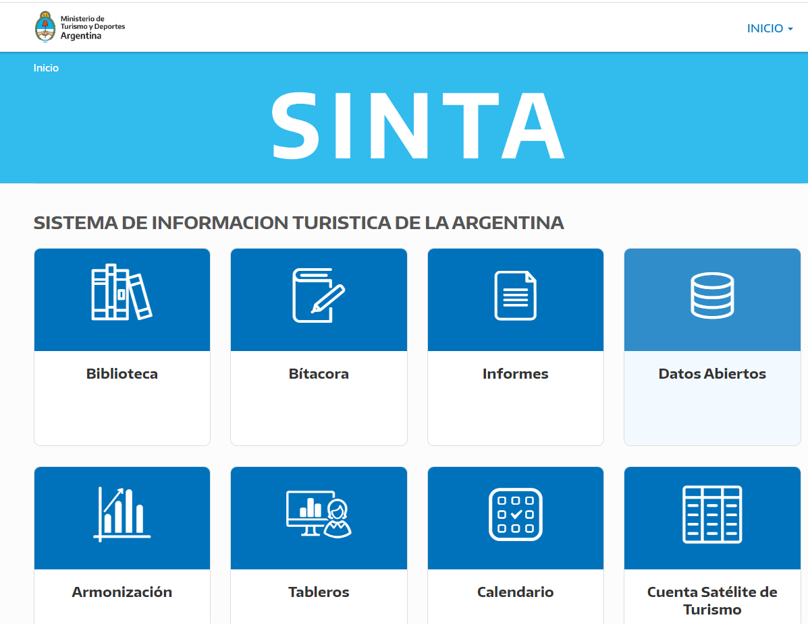

```{r setup, include=FALSE}
knitr::opts_chunk$set(echo = FALSE)
```

Desde la Dirección Nacional de Mercados y Estadística (DNMyE) venimos
trabajando de manera sostenida en la apertura de datos, procesos y la
generación de plataformas, con el propósito de hacer lo más accesible
posible, la diversidad de recursos con los que trabajamos, para diversos
públicos. Este progresivo desarrollo fue conformando lo que hoy
conocemos como el [**Sistema de Información Turística de la Argentina
(SINTA)**](https://www.yvera.tur.ar/sinta/).

**En esta ocasión presentamos un nuevo micrositio dentro del SINTA: la
[BIBLIOTECA](https://biblioteca.yvera.tur.ar/)**. Así, mientras el
sitio de [INFORMES](https://www.yvera.tur.ar/sinta/informe) tiene como
objetivo principal reunir los informes de prensa y reportes de los
operativos estadísiticos o seguimiento de indicadores; o el [Portal de
Datos Abiertos](https://datos.yvera.gob.ar/) es el espacio donde
publicamos series de indicadores o bases de microdatos, en este nuevo
espacio tenemos como objetivo reunir y compartir Investigaciones,
Documentos de Trabajo, Anuarios Estadísticos, Manuales Metodológicos o
Informes periódicos de coyuntura.

```{r echo = FALSE}

```

## BIBLIOTECA

La colección de documentos [que acá se
publican](https://biblioteca.yvera.tur.ar/) fueron categorizados en tres
grandes grupos con etiquetas para cada categoría que permiten una rápida
navegación según el tema de interés: **"Documentos de Trabajo"**,
**"Metodología"** y **"Anuario Estadístico"**

### Documentos de Trabajo

Estos son documentos de investigación y análisis producidos en el marco
de la Subsecretaría de Desarrollo Estratégico del cual depende esta
DNMyE. Entre otros se pueden encontrar, [**por ejemplo, las propuestas y
estrategias del programa La Ruta
Natural**](https://larutanatural.gob.ar/)**;** o perfiles de turismo
(tales como Naturaleza o Cultura) a partir de las encuestas de turismo
interno e internacional cuyos cuestionarios permiten entender las
prácticas turísticas relacionadas con esos entornos.

### Metodología

Bajo esta categoría se agrupan los documentos técnicos y metodológicos
de los operativos que nutren las estadísicas básicas del turismo en
Argentina *(Encuesta de Turismo Internacional*, *Encuesta de Ocupación
Hotelera* y *Encuesta de Viajes y Turismo en los Hogares*), los
relacionados con la Cuenta Satelite de la Argentina (CST-A) y los
insumos del proyecto de
[*Armonización*](https://armonizacion.yvera.tur.ar/)*.*

### Anuario Estadístico

Por último se rune bajo esta etiqueta los *Anuarios de Estadísticas de
Turismo (AET)* de la serie 2006 - 2015, discontinuada en 2016. En la
actualidad se está trabajando para su relanzamiento con el AET 2021 de
pronta publicación, y la reconstrucción de la serie para atras (2016 -
2020).

## COYUNTURA

El micrositio contiene además una [sección
dedicada](https://biblioteca.yvera.tur.ar/coyuntura.html) a
publicaciones periódicas de seguimiento estadístico y económico del
sector turístico:

1.  El *Informe Mensual de Estadísicas de Turismo (IMET)*
2.  El *Panorama Económico del Turismo en Argentina*
