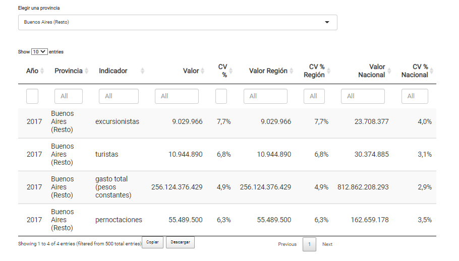
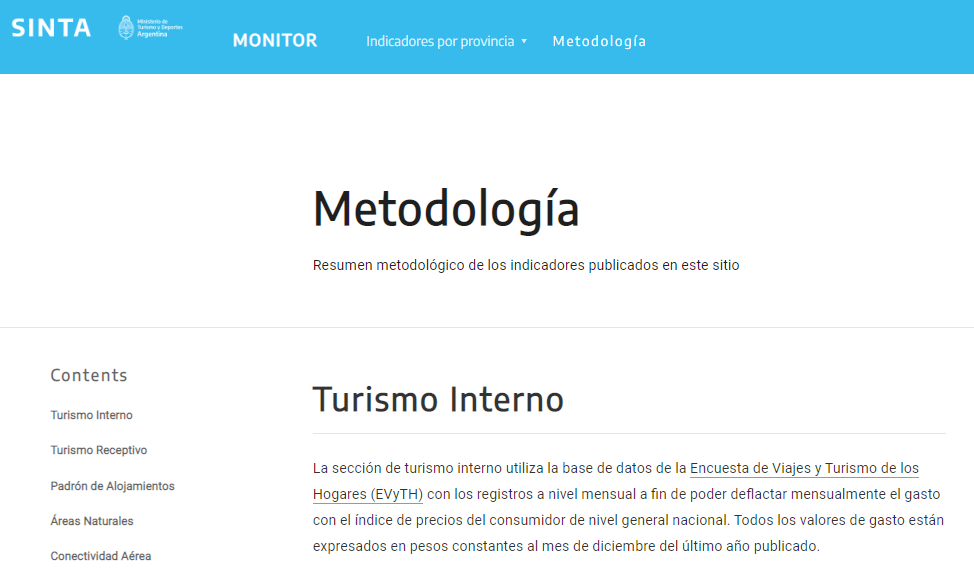

```{r setup, include=FALSE}
knitr::opts_chunk$set(echo = FALSE)
```

La DNMyE presenta la nueva versión del [MONITOR](https://provincias.yvera.tur.ar/), el portal de estadísticas del turismo en las provincias. En esta segunda edición del portal se mejoró la navegabilidad integrando un selector de provincia en cada sección de la página, se mejoraron los gráficos de los indicadores y se presentan las tablas en un formato que permite su descarga por el usuario.

Además, en la [sección de turismo interno](https://provincias.yvera.tur.ar/interno.html) se añadieron las estimaciones de los coeficientes de variación para cada indicador, así como los valores correspondientes a cada región en las que la Encuenta de Viajes y Turismo de los Hogares (EVyTH) divide al país.

```{r, out.width='100%'}

```


También se reemplazó el mapa de empresas de la versión anterior por un mapa interactivo más fácil de navegar.

```{r}
knitr::include_graphics("empresas.gif")
```


Por último se añadió un indice de recursos en cada sección para ahondar en cada uno de los temas presentados y una sección de [metodología](https://provincias.yvera.tur.ar/metodologia.html) con la explicación de cómo se construyó cada una de las secciones.

```{r, out.width='100%'}

```


Se puede acceder a la plataforma desde:

- la página del
[**Sistema Federal de Gestión de Datos Turísticos de la Argentina**](https://datatur.yvera.tur.ar/)

- o directamente desde la página: <https://provincias.yvera.tur.ar/>


