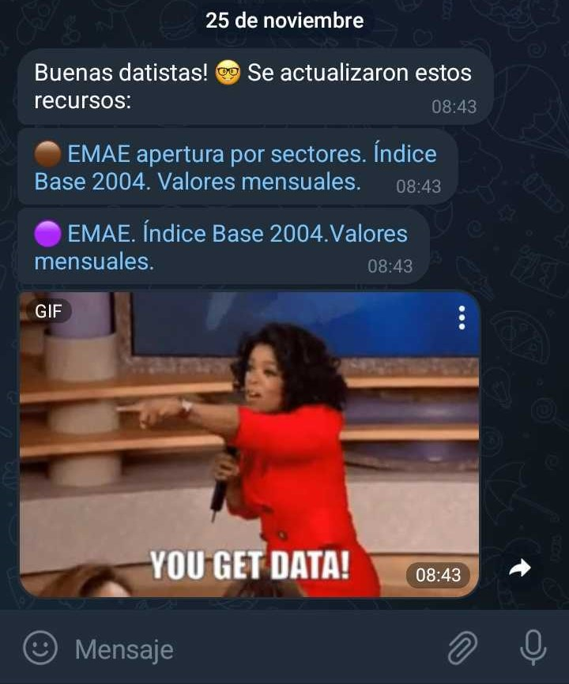

```{r setup, include=FALSE}
knitr::opts_chunk$set(echo = FALSE)
```

En un primer post presentamos a [SintIA](https://bitacora.yvera.tur.ar/posts/2022-09-08-sintia/), el bot de *Telegram* la Dirección Nacional de Mercados y Estadística (DNMyE) que envía avisos sobre novedades a usuarios y usuarias del [SINTA](https://www.yvera.tur.ar/sinta/).

En esta instancia, compartimos otra funcionalidad que incorporamos al flujo interno de trabajo de la dirección. Habitualmente, utilizamos datos publicados por otros organismos, como el [INDEC](https://www.indec.gob.ar/) o el [Ministerio de Desarrollo Productivo](https://datos.produccion.gob.ar/), para el análisis y la elaboración de estadísticas referentes al sector turístico del país.

Por ejemplo, el Índice de Precios al Consumidor (IPC), la cantidad de puestos de trabajo por sector o el Estimador Mensual de Actividad Económica (EMAE), son insumos útiles en la caracterización del turismo como actividad económica.

En este sentido, hacer seguimiento de las novedades en esos recursos resulta importante para la actualización de los datos publicados en el SINTA. Para evitar realizar consultas, cotidianas, de forma manual, optamos por asignarle la tarea a SintIA.

## ¿Qué hace SintIA?

A través de un flujo automatizado con *Github Actions*, SintIA revisa todos los días, en distintos horarios, si se actualizó alguno de los recursos utilizados por la dirección. Para esto, lee los datos publicados en los portales correspondientes, mediante su *URL*, y los compara con los últimos datos registrados (los cuáles se encuentran guardados en un csv).

En caso de que haya nuevos datos, guarda los cambios en el csv y envía un mensaje por *Telegram* al equipo de la DNMyE, como el siguiente: 

```{r}

```

(¡Sí, con meme incluido!)

Cada recurso tiene un ID, un nombre, un link y un emoji asignados, para facilitar tanto la consulta como el aviso al equipo. De esta forma, no tenemos que preocuparnos por visitar los portales de datos cotidianamente, ya que SintIA lo hace programáticamente.  

## ¿Querés crear tu propio bot?

Desde la DNMyE abrimos el código utilizado para programar este flujo, podés conocer más sobre su funcionamiento en el siguiente repositorio de *Github*: https://github.com/dnme-minturdep/sintIA_consultas.

Además, usando el código de base podés armar tu propio bot para recibir avisos de recursos que te sean útiles en tus proyectos. Te compartimos unos pasos a seguir para hacerlo:

1. Hacé un *fork* del repositorio en tu *Github*.

2. Creá un bot en *Telegram* a través de la aplicación. Interactuando con el usuario @BotFather podés generar el *token* que te permitirá enviar y recibir mensajes, además de ponerle un nombre y una descripción.

3. Usando el paquete de R `telegram.bot` (ver [documentación](https://ebeneditos.github.io/telegram.bot/)) podés buscar el ID de la persona o las personas a notificar (las cuales deben inicializar o escribirle al bot primero).

4. Guardá las claves (token e IDs) en lugares que no sean visibles por cualquiera, en nuestro caso usamos *Github Secrets*, y hacé los cambios necesarios en el código para recibir actualizaciones de tu interés.

¡Esperamos te sea de utilidad!

Y no te olvides de ponerte en contacto con SintIA para recibir las novedades del SINTA, buscando al usuario de *Telegram* @RDatinaBot o siguiendo este link: https://t.me/RDatinaBot.