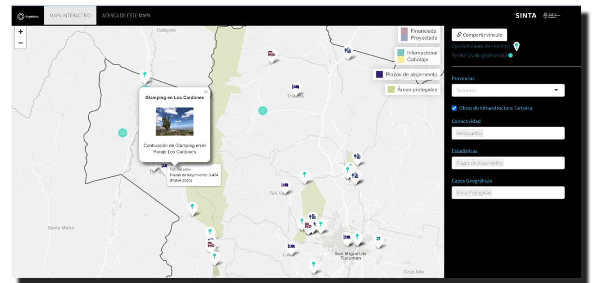

```{r setup, include=FALSE}
knitr::opts_chunk$set(echo = FALSE)
```

La **Dirección Nacional de Créditos e Inversiones Turísticas** de la Subsecretaría de Desarrollo Estratégico del Ministerio de Turismo y Deportes desarrolló una [**plataforma**](http://inversionesturisticas.tur.ar/) **destinada a la Promoción de Inversión Privada en Turismo**. Incluye información a nivel nacional y jurisdiccional relevante para la toma de decisiones para quienes deseen invertir. La misma está disponible en español e inglés y cuenta con más de 80 documentos especializados con información complementaria.

Como parte de esta propuesta, desde la **Dirección Nacional de Mercados y Estadística (DNMyE)**, publicamos un visor de información geográfica que implicó un trabajo de georreferenciación de información y el desarrollo de una herramienta interactiva, como parte de la **Plataforma de Inversiones Turísticas,** con el objetivo de facilitar el análisis y la toma de decisiones sobre las oportunidades de negocios en el contexto de las jurisdicciones.

```{r echo=FALSE}



```

## Hoja de Ruta por el *Visor Geográfico de Turismo para las Inversiones*

1.  La aplicación permite explorar el conjunto de información disponible poniendo el foco en cada una de las provincias.

2.  Por defecto muestra dos tipos de referencias relativas a las Inversiones Turísticas: **(a) Oportunidades de Inversión y (b) Territorios de Oportunidad.**

3.  Una vez elegido un distrito se puede marcar una caja que permite visualizar **Obras de Infraestructura Turística** en curso (diferenciando si las mismas ya se encuentran financiadas o proyectadas).

4.  La herramienta presenta luego tres tipos de **capas de información adicional** que pueden ser activadas:

    -   ***CONECTIVIDAD***: agrupa información relativa a las redes viales (nacional y provincial), aeropuertos, puertos y pasos internacionales.\

    -   ***ESTADÍSTICAS***: una selección de indicadores de oferta y demanda del sector hotelero y acceso a internet de la población.\

    -   ***CAPAS GEOGRÁFICAS***: permite visualizar polígonos de áreas protegidas y la propuesta territorial del programa [La Ruta Natural](https://larutanatural.gob.ar/).

## 🔗 ACCESO AL MAPA <https://tableros.yvera.tur.ar/inversiones/>

------------------------------------------------------------------------

### Glosario

-   **Territorios de oportunidad**: atractivos estratégicos culturales o de naturaleza con potencial de desarrollo.

-   **Vectores de inversión**: actividades turísticas vinculadas al desarrollo turístico con potencial para invertir.

-   **Oportunidades de negocio**: terrenos y/o bienes públicos o privados disponibles para desarrollar diversas actividades que contribuyan a la mejora de la oferta turística local y/o regional.

### Fuentes de Información

-   La información de territorios de oportunidad y oportunidades de inversión, así como la información relativa a las obras de infraestructura fue elaborada por el Ministerio de Turismo y Deportes de la Nación.

-   Los datos correspondientes a vías terrestres provienen de las capas geográficas publicadas por el [Instituto Geográfico Nacional (IGN)](https://www.ign.gob.ar/NuestrasActividades/InformacionGeoespacial/CapasSIG) y el Ministerio de Obras Públicas de la Nación (MOP). La selección de vías terrestres principales fue realizada por el Ministerio de Turismo y Deportes.

-   Los datos de pasos terrestres internacionales y de puertos principales fueron producidos a partir de las capas geográficas publicadas por el MOP e [IGN](https://www.ign.gob.ar/NuestrasActividades/InformacionGeoespacial/CapasSIG), junto a un proceso de geocodificación de los pasos internacionales reportados por la Dirección Nacional de Migraciones del Ministerio de Interior.

-   Los datos de los aeropuertos provienen de información facilitada por la [Administración Nacional de Aviación Civil](https://datos.anac.gob.ar/estadisticas/).

-   Los datos correspondientes a cantidad de plazas por departamento provienen del [Padrón Único Nacional de Alojamiento (PUNA)](https://tableros.yvera.tur.ar/puna/) de la Dirección Nacional de Mercados y Estadística del Ministerio de Turismo y Deportes de la Nación (DNMyE).

-   Los datos de demanda turística fueron elaborados a partir de la [Encuesta de Ocupación Hotelera](https://tableros.yvera.tur.ar/eoh.html) realizada por la DNMyE junto al Instituto Nacional de Estadísticas y Censos.

-   La información sobre acceso a internet proviene del cruce entre datos del [Ente Nacional de Comunicaciones (ENACOM)](https://datosabiertos.enacom.gob.ar/home) y la población proyectada por INDEC.

-   La capa geográfica de áreas protegidas proviene del [IGN](https://www.ign.gob.ar/NuestrasActividades/InformacionGeoespacial/CapasSIG) a partir de la cual la DNMyE ha realizado una selección.

-   La capa geográfica de rutas naturales fue elaborada por el Ministerio de Turismo y Deportes de la Nación. Para más detalles ver [La propuesta territorial de La Ruta Natural](https://tableros.yvera.tur.ar/recursos/biblioteca/propuesta_territorial_lrn.pdf).
