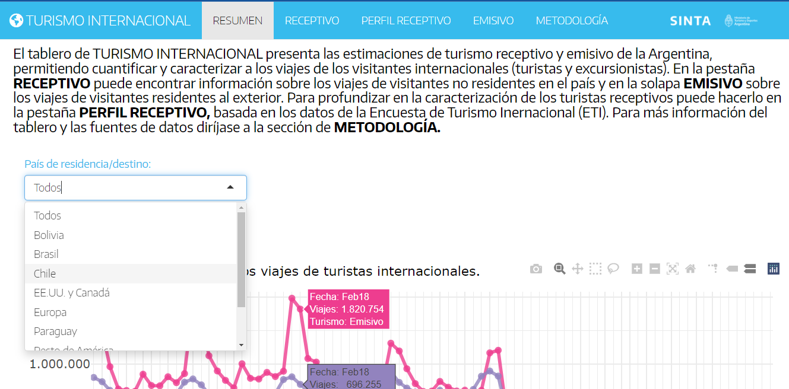
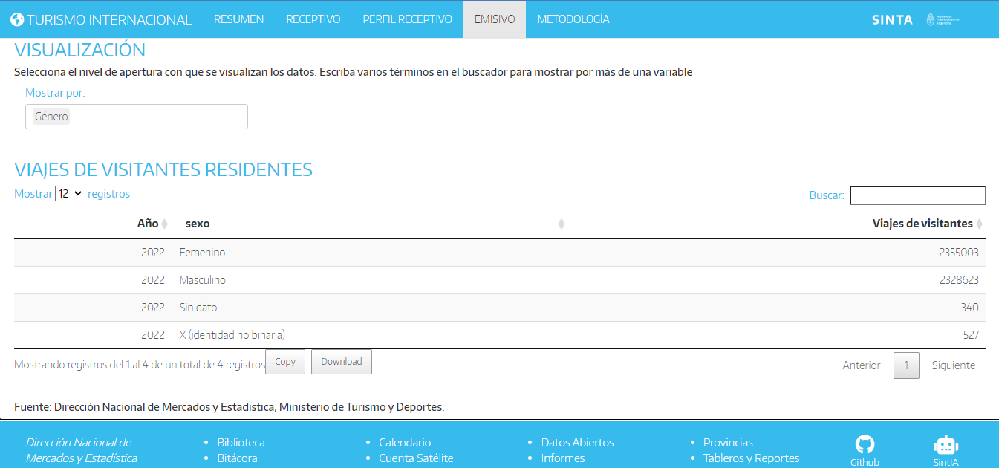
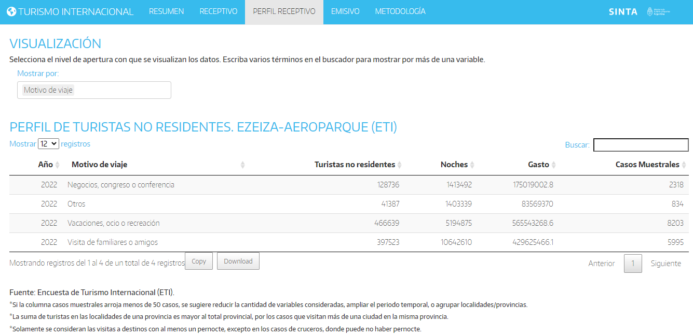

<aside>

💻 [**TABLERO**: Turismo Internacional](https://tableros.yvera.tur.ar/turismo_internacional/)

</aside>

El [**tablero de TURISMO INTERNACIONAL**](https://tableros.yvera.tur.ar/turismo_internacional/) presenta las estimaciones de turismo receptivo y emisivo de la Argentina. Esta nueva versión incorpora novedades que permiten, por ejemplo, cuantificar y caracterizar a los viajes de los visitantes internacionales (sumando datos de excursionistas a los de turistas), o la caracterización de perfiles de turismo receptivo (no residentes que visitan Argentina).

```{r echo = FALSE}




```

### NOVEDADES

**RESUMEN**

La primera pestaña presenta el contenido de toda la aplicación, a la vez que permite visualizar rápidamente una serie de tiempo con las estimaciones de *Emisivo* y *Receptivo*, incorporando un menú desplegable que permite explorar la serie por mercados (por país de residencia o destino agrupado). Se agregaron además dos nuevas visualizaciones que muestran el acumulado anual al último dato disponible por mercado y por medio de transporte.

```{r echo=FALSE}

knitr::include_graphics("ti2.png")
```

**EMISIVO / RECEPTIVO**

Las pestañas por tipo de turismo (emisivo o receptivo) de la versión previa permiten ahora acceder a las estimaciones no sólo de Turistas, que es el valor por defecto en ambas pestañas, sino también de Excursionistas (aquellos visitantes que no pernoctan en el destino). Una caja de selección al comienzo de los respectivos módulos de *FILTRO* permite seleccionar la opción de preferencia.

Por otro lado se generó la posibilidad de nuevas aperturas dentro de los módulos de *VISUALIZACIÓN*. A las variables ya habilitadas (para *Mostrar por* los datos previamente filtrados), como ser `Mes`, `Vía`, `Paso`, etc., se agregaron `Tipo de Visitante`, `Género` y `Tramos de edad`.

```{r echo = FALSE}

```

**PERFIL RECEPTIVO**

Esta nueva pestaña permite caracterizar el perfil del turismo receptivo que egresó del país por los pasos de Ezeiza y Aeroparque, a partir de la [Encuesta de Turismo Internacional (ETI)](https://bitacora.yvera.tur.ar/posts/2022-05-31-intro-eti/ "Encuesta de Turismo Internacional (ETI)"). Se pueden analizar algunas características de los turistas (país de residencia, tipo de alojamiento principal en el país, motivo de viaje), así como conocer los destinos (localidades, provincias) que han visitado en la Argentina.

<aside>

***Encuesta de Turismo Internacional (ETI)***

📊 [Datos Abiertos](https://datos.yvera.gob.ar/dataset/encuesta-turismo-internacional)\
📚 [Metodología](https://www.yvera.tur.ar/sinta/informe/documentos/descarga/5d5c00efe6866641938689.pdf)\
📑 [Reportes](https://www.yvera.tur.ar/sinta/informe/info/turismo-internacional/informes-tecnicos)

</aside>



Se puede acceder a la plataforma desde la [página del SINTA](https://www.yvera.tur.ar/sinta/) o directamente desde la página: <https://tableros.yvera.tur.ar/turismo_internacional/>

::: {.infobox}
Para recibir las novedades del SINTA escribíle al bot de Telegram de la DNMyE <a href='https://bitacora.yvera.tur.ar/posts/2022-09-08-sintia/' target='_blank'>*SintIA*</a>: <a href='https://t.me/RDatinaBot' target='_blank'>@RDatinaBot</a> 🤖
:::
