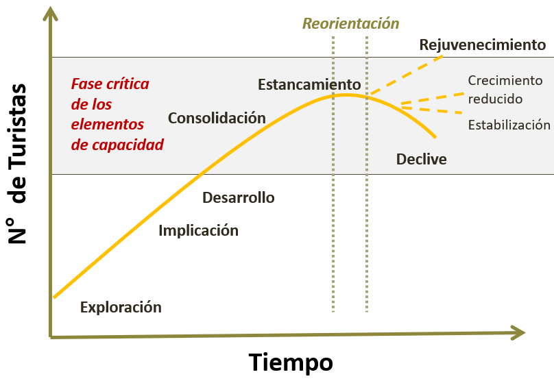

```{r setup, include=FALSE}
knitr::opts_chunk$set(echo = FALSE)
library(herramientas)
library(tidyverse)
library(lubridate)
library(comunicacion)
library(glue)
library(sf)
```

```{r, cache=TRUE}


source("puna_clasificacion.R")
```

# Presentación

En el **[Documento de Trabajo N° 8](https://tableros.yvera.tur.ar/recursos/biblioteca/DT8_clasificacion_localidades.pdf)** se realiza el ejercicio de clasificar en tres categorías diferentes un conjunto de localidades de Argentina en función de su nivel de desarrollo turístico conceptualizado a partir del modelo de ciclo de vida de los destinos turísticos (MCVDT) de [Butler (1980)](https://onlinelibrary.wiley.com/doi/abs/10.1111/j.1541-0064.1980.tb00970.x). 

**Modelo de Ciclo de Vida de los Destinos Turísticos (MCVDT)**

```{r echo = FALSE}




```


<aside>

### Referencias

Butler, R. W. (1980): “The concept of a tourist area cycle of evolution: implications for management of resources”, Canadian Geographies / Les géographies canadiennes, 24, 1, pp. 5-12, <https://onlinelibrary.wiley.com/doi/abs/10.1111/j.1541-0064.1980.tb00970.x>. 

</aside>

Las tres categorías suponen niveles de maduración crecientes del destino turístico en términos de sus capacidades: la categoría de *emergente* comprende las fases de exploración (I) e implicación (II), la categoría *en desarrollo* a la fase de desarrollo (III) y finalmente la categoría de *consolidada* que comprende a las fases de consolidación (IV), estancamiento (V), declive (VI) y rejuvenecimiento (VII).

# Estrategia

Se evaluaron diferentes indicadores generados por la Dirección Nacional de Mercados y Estadística que podían servir para clasificar las localidades considerando su regularidad de actualización, la granularidad y la cobertura geográfica. De ellos los principales candidatos fueron la cantidad de plazas de alojamiento a partir de [PUNA](https://tableros.yvera.tur.ar/puna/), la tasa de ocupación hotelera y la estadía promedio a partir de la [EOH](https://tableros.yvera.tur.ar/eoh.html), la estacionalidad de la oferta y la demanda (ver [Documento de Trabajo N° 6](https://tableros.yvera.tur.ar/recursos/biblioteca/estacionalidad_turismo.pdf)), y la disponibilidad de medios de transporte (por ejemplo en función de los datos del [Tablero de Conectividad](https://tableros.yvera.tur.ar/conectividad/)).

De estos indicadores posibles la cantidad de plazas de alojamiento se eligió como mejor indicador para realizar el ejercicio de clasificación unidimensional, ya que presentaba continuidad en el tiempo, granularidad geográfica a nivel localidad, y una amplia cobertura geográfica (más de un 36% de las localidades del país).

```{r, fig.cap= "Mapa de cobertura de localidades por el PUNA"}
bahra_locs <- read_sf("/srv/DataDNMYE/capas_sig/localidades_bahra.geojson")
puna_locs <- read_sf("/srv/DataDNMYE/capas_sig/puna_localidades_bahra.gpkg")

ggplot() +
  geom_sf(data = geoAr::get_geo(geo = "ARGENTINA", level = "provincia")) +
  geom_sf(data = bahra_locs, aes(color = "Sin cobertura PUNA"), alpha = 0.6, size = .5) +
  geom_sf(data = puna_locs,aes(color = "Con cobertura PUNA"), alpha = 0.8, size = .5) +
  scale_colour_manual(
                      name = "Localidades",
        values = c(
                   "Con cobertura PUNA" = comunicacion::dnmye_colores("rosa"),
                   "Sin cobertura PUNA" = "black"
                   ),
        breaks = c("Con cobertura PUNA", "Sin cobertura PUNA"),
        labels = c("Con cobertura PUNA", "Sin cobertura PUNA")
  ) +
  theme_void()
```
Fuente: Elaboración propia en base a datos de BAHRA y PUNA.

Una vez elegido el mejor indicador disponible se procedió a analizar la distribución del mismo a fin de entender el mejor mecanismo de corte para la clasificación en función de la variable elegida. El objetivo fue hallar un método que permitiera dividir la distribución en tres secciones que se correspondan con las tres categorías de nivel de desarrollo turístico. Se optó por usar un algoritmo de clasificación específico para distribuciones de colas pesadas llamado ["Head-Tails"](https://cran.r-project.org/package=classInt).

**Clasificación de localidades por plazas de alojamiento**
```{r}
resumen %>% 
  mutate(Clasificación = factor(Clasificación, levels = c("Emergente", "En desarrollo", "Consolidado"))) %>% 
  ggplot(aes(x = plazas_alojamientos, fill = Clasificación)) +
  geom_histogram( bins = 25,  color = "white") +
  scale_x_log10() +
  comunicacion::scale_fill_dnmye() +
  ylab("Localidades") + xlab("Plazas de Alojamiento (escala logaritmica)") +
  labs(subtitle = "Valor umbral Head-Tails = 0.2"
       # , caption = "Fuente: elaboración propia en base a datos del PUNA"
       ) +
  theme_minimal() #+
      # theme(plot.caption = element_text(hjust = 0))
```
Fuente: Elaboración propia en base a datos de PUNA.


# Resultados

Sobre la clasificación obtenida mediante el algoritmo de "Head-Tails" se realizó un análisis de los casos con valores cercanos a los puntos de corte en función de considerar especificidades de los mismos que no estuvieran reflejados en su cantidad de plazas de alojamiento. En función de ese análisis se corrigieron marginalmente los puntos de corte para llegar a una nueva clasificación.

Mediante esa corrección se llegó a la siguiente distribución de la clasificación de las localidades PUNA: 1089 localidades en la categoría *emergente*, 115 localidades en la categoría *en desarrollo* y 78 localidades en la categoría *consolidado*. Se puede observar en el siguiente mapa la distribución espacial que resulta de la clasificación realizada.

**Distribución geográfica de las localidades clasificadas**
```{r, fig.height= 7}

consolidados_geom <- puna_geom %>% 
  filter(Clasificación %in% c("Consolidado")) 

# consolidados_geom <- consolidados_geom %>% 
#   st_transform(crs = 5345)
# 
# consolidados_geom <- consolidados_geom %>% 
#   st_buffer(dist = 50*1000)
# 
# consolidados_geom <- consolidados_geom %>% 
#   st_transform(crs = 4326)
# 
# consolidados_geom <- consolidados_geom %>% 
#   st_union()

puna_geom %>% 
  ggplot() +
    geom_sf(data = geoAr::get_geo(geo = "ARGENTINA",
                                  level = "provincia"), fill = "darkgrey") +
    geom_sf(data =  ~ filter(., Clasificación == "Emergente"), aes(color = Clasificación) ,
              alpha = .6
            ) +
      geom_sf(data =  ~ filter(., Clasificación == "En desarrollo"),  aes(color = Clasificación),
              alpha = .8
              ) +
      geom_sf(data =  ~ filter(., Clasificación == "Consolidado"), aes(color = Clasificación),
              alpha = .8
              # color = comunicacion::dnmye_colores("azul verde")
              ) +
  # comunicacion::scale_color_dnmye() +
  scale_colour_manual(
  values = c("Emergente" = comunicacion::dnmye_colores("rosa"), 
             "En desarrollo" = comunicacion::dnmye_colores("pera"),
             "Consolidado" = comunicacion::dnmye_colores("cian")
             ),
  breaks = c("Emergente", "En desarrollo", "Consolidado"),
  labels = c("Emergente", "En desarrollo", "Consolidado")
  ) +
  theme_void() #+
  # labs(title = "Distribución territorial de las localidades clasificadas\nsegún nivel de desarrollo turístico.", caption = "Fuente: elaboración propia en base a datos del PUNA" ) +
      # theme(plot.caption = element_text(hjust = 0))


```
Fuente: Elaboración propia en base a datos de BAHRA y PUNA.

Para mejorar la clasificación realizada en este primer ejercicio se están elaborando nuevos indicadores que permitirán realizar un análisis multidimensional del nivel de desarrollo de las localidades y su seguimiento a lo largo del tiempo.

En tal sentido las próximas iteraciones de la propuesta de clasificación del nivel desarrollo de destinos turísticos procurará incorporar indicadores como: (i)  distancia de cada localidad respecto a un aeropuerto y/o puerto; (ii) desarrollo de vías terrestres; (iii) cantidad de empresas de ramas características del turismo y (iv) disponibilidad de servicio de internet y de centros de salud. 


# 🔗 Documento de Trabajo N°8

Se puede descargar el documento **[Clasificación de localidades según nivel de desarrollo turístico](https://tableros.yvera.tur.ar/recursos/biblioteca/DT8_clasificacion_localidades.pdf)** de la  BIBLIOTECA del  [Sistema de Información Turística de Argentina (SINTA)](https://www.yvera.tur.ar/sinta/)  https://biblioteca.yvera.tur.ar/


# 🔗 Recursos

- [Padrón Único Nacional de Alojamiento (PUNA)](https://tableros.yvera.tur.ar/puna/) 

- [Encuesta de Ocupación Hotelera (EOH)](https://tableros.yvera.tur.ar/eoh.html)
 
- [Tablero de Conectividad Aérea](https://tableros.yvera.tur.ar/conectividad/)

- [Documento de Trabajo N°6: Estacionalidad en Turismo. Análisis territorial a partir de la ocupación hotelera y el empleo en Argentina](https://tableros.yvera.tur.ar/recursos/biblioteca/estacionalidad_turismo.pdf)


::: {.infobox}
Para recibir las novedades del SINTA escribíle al bot de Telegram de la DNMyE <a href=‘https://bitacora.yvera.tur.ar/posts/2022-09-08-sintia/’ target=‘_blank’>*SintIA*</a>: <a href=‘https://t.me/RDatinaBot’ target=‘_blank’>@RDatinaBot</a> 🤖
:::

