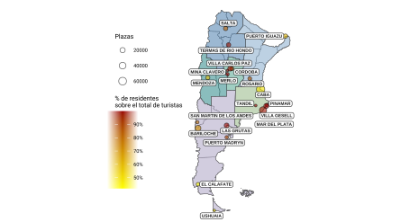
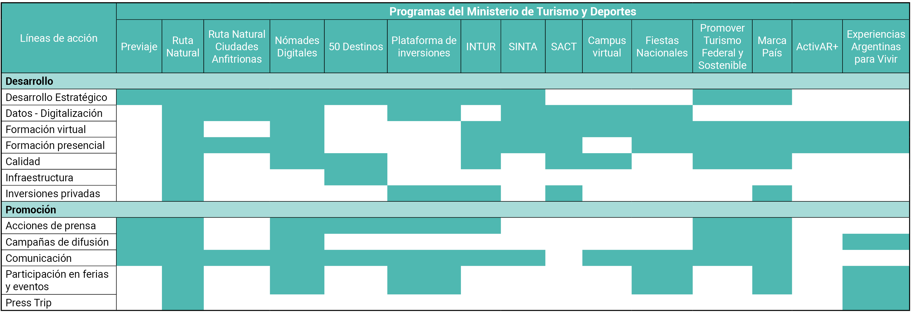

```{r setup, include=FALSE}
knitr::opts_chunk$set(echo = FALSE)
library(knitr)
```

# Introducción

[Argentina Productiva 2030. Plan para el Desarrollo Productivo, Industrial y Tecnológico](https://www.argentina.gob.ar/produccion/argentina-productiva-2030) es un proyecto que procura transformar el entramado productivo del país con vistas a mejorar los indicadores sociales, económicos y ambientales. Propone como metas generales a 2030 la reducción de la pobreza a la mitad, la disminución de la indigencia en un 70%, la baja del desempleo al 5%, la creación de más de 3,5 millones de puestos de trabajo registrados en el sector privado y de más de 100.000 nuevas empresas, la disminución de las tres grandes desigualdades que tiene el país (las territoriales, las de ingresos y las de género) y también la reducción del impacto ambiental de las actividades productivas. Para lograr tales grandes metas, el Plan Argentina Productiva 2030 está organizado en 11 misiones productivas. El concepto de “misiones” refiere a que la resolución de diferentes problemáticas (no necesariamente económicas, sino también sociales y ambientales, como el cambio climático, el acceso a la salud, la defensa nacional, las brechas digitales, etc.) y puede ser una oportunidad también para la creación de capacidades tecnológicas y la transformación virtuosa de la matriz productiva, para lo cual es necesario el trabajo coordinado entre sector público y privado y entre diferentes sectores productivos. 

**Misiones del Plan Argentina Productiva 2030**

```{r , out.height=400,out.width=500}
include_graphics("misiones.PNG")
```


En este marco, la misión 11 se propone como objetivo desarrollar la actividad turística local partiendo del enorme potencial que Argentina tiene para promover el turismo de naturaleza como eje vertebral del desarrollo turístico. 

Tras la pandemia, el turismo está renaciendo en nuestro país y en el resto del mundo, y en la próxima década habrá variadas oportunidades para potenciarlo y transformarlo virtuosamente. Se trata de una actividad profundamente federal, intensiva en la generación de empleo, con mayores oportunidades para la inserción laboral de jóvenes que otras ramas, y generadora de experiencias de bienestar individual y colectivo. El sector presenta varios desafíos: si bien antes de la pandemia era un complejo exportador muy relevante, en la última década fue una fuente severa de salidad de divisas por la vía del turismo emisivo. Asimismo, el impacto ambiental del turismo es considerable, a la vez que hay un importante terreno para recorrer en materia de incorporación de nuevas tecnologías digitales, en la calidad de los servicios y en los encadenamientos virtuosos con otros sectores. También la actividad se caracteriza por una elevada concentración en pocos destinos y por una alta estacionalidad, que dificulta la generación de empleos estables.

El documento contiene un diagnóstico del sector, un análisis de los proyectos productivos para el desarrollo sostenible del turismo que estructuran la misión, una sección de políticas relacionadas con el desarrollo de la misión y, finalmente, indicadores y metas hacia 2030.


# Diagnóstico

El documento inicia con una descripción del sector en términos de su evolución reciente a nivel mundial y en nuestro país, luego aborda algunas de sus características más salientes: diversidad de destinos producto de su gran biodiversidad, el desarrollo asimétrico de los destinos, la alta estacionalidad que lo caracteriza, la infraestructura de transporte con la que cuenta, entre otras. Presenta, además, la contribución de la actividad turística en la economía en su conjunto, en el sector externo y, por último, describe los sectores involucrados más relevantes: alojamiento, agencias de viajes y transporte.

**Destinos según cantidad de plazas y proporción de turistas residentes hospedados**
```{r }

```


# Proyectos productivos para el desarrollo sostenible del turismo

Con el fin de alcanzar el objetivo propuesto, la Misión se desagrega en cuatro proyectos: 

## Proyecto 1: Incrementar el turismo sustentable en el país y limitar el impacto ambiental de las prácticas turísticas en su conjunto

La necesidad de reducir el impacto ambiental de las prácticas humanas tiene un capítulo específico en la actividad turística. En este sentido, los Objetivos de Desarrollo Sostenible (ODS), incorporan en la agenda hacia 2030 objetivos ambientales al desarrollo económico y social, con el turismo como uno de las actividades involucradas. La Organización Mundial del Turismo (OMT), a su vez, elaboró un diagnóstico que puntualiza el aporte del turismo a cada objetvio específico. En Argentina, la Ley Nacional de Turismo (n° 25.997) procura que la actividad turística se desarrolle en armonía con los recursos naturales y culturales y promueve el desarrollo sostenible del turismo en tres ejes básicos: ambiente, sociedad y economía.

En este sentido, el turismo de naturaleza es un segmento estratégico para el sector turístico de Argentina, y uno de los tipos de turismo de mayor crecimiento, tanto en nuestro país como en el mundo. Este crecimiento es el reflejo de una tendencia global en la que los destinos naturales, los espacios abiertos y las experiencias genuinas en ámbitos silvestres, permiten a una población crecientemente urbana reconectar con la naturaleza y ocupan un lugar central en la preferencia de los viajeros, en parte debido a las consecuencias de la pandemia de COVID-19. 

El proyecto referido presenta las estadísiticas disponibles del turismo de naturaleza en Argentina realizado por visitantes residentes y no residentes. Por otra parte, repasa algunas experiencias internacionales que tienen al turismo de naturaleza como eje de las políticas de promoción y desarrollo de países seleccionados.

Estas caracterizaciones, sumadas al potencial de los atractivos naturales del país, en un contexto global de expansión del turismo de naturaleza, posicionan a esta actividad como uno de los segmentos clave para el impulso de la actividad económica, el empleo, el ingreso de divisas y el desarrollo territorial en el país a partir del turismo.

**Parques nacionales y áreas protegidas**

```{r }
include_graphics("mapa1_parques_areas.svg")
```

## Proyecto 2: Promover el turismo 4.0, la digitalización de empresas turísticas e incentivar la llegada de nómades digitales.

La inclusión de la transformación digital en la actividad turística ha estado ganando cada vez más espacio en las agendas de discusión de políticas productivas para el sector. Las iniciativas sobre la confluencia entre las tecnologías digitales y el turismo tradicional se han incrementado sostenidamente en la última década, con mayor relevancia en los países desarrollados. La Organización Mundial del Turismo (OMT), dependiente de la ONU, tiene como ejes de uno de sus principales planes de acción a la innovación y la transformación digital en el sector.

El documento revisa, en esta sección, las penetración de las tecnologías digitales en el sector en Argentina. Por otro lado, describe las iniciativas de otros países para la transformación digital de la actividad, con propuestas de turismo 4.0, destinos turísticos inteligentes, adopción de nuevas tecnologías, entre otras. 

Este documento trabaja, también, con otro de los potenciales del sector: la atracción de nómades digitales. Se trata de turistas que complementan su modalidad remota de ocupación con sus deseos de conocer y recorrer otros países y culturas. Este segmento proviene de distintas partes del mundo, especialmente Europa Occidental y Estados Unidos, y cuenta con un nivel de consumo mayor al del resto de los visitantes, al tratarse por lo general de profesionales de ingresos altos que trabajan en servicios basados en el conocimiento, una actividad cuyas remuneraciones superan al promedio de la economía. Argentina cuenta con una amplia variedad de destinos turísticos y, a su vez, un conjunto de ciudades que podrían funcionar como anfitrionas de nómades digitales. El impulso de esta actividad permitiría posicionar nuevos destinos que tengan la capacidad de albergar este tipo de turistas, por combinar una buena conectividad digital, de transporte, oferta cultural y poseer atractivos cercanos. Asimismo, podría contribuir a desestacionalizar la actividad turística en destinos consolidados. 

**Principal medio de venta de servicios, prestadores de los rubros alojamiento y transporte**

```{r }
include_graphics("tabla19_canal_venta_encuesta_sin_titulo.png")
```


## Proyecto 3: Potenciar la vinculación del turismo con otras actividades económicas

Existe un gran potencial de integración del turismo con numerosas actividades productivas en todo el país, permitiendo vincularlas a atractivos de interés cercanos y aprovechar la infraestructura para potenciar el desarrollo de destinos y productos turísticos, especialmente en zonas que desarrollan actividades ligadas a la producción primaria. 

El proyecto analiza diferentes tipos de vinculaciones, especifica territorialmente su presencia y propone iniciativas para su desarrollo. 

Una primera vinculación es la que existe entre actividades primarias y el turismo. Un ejemplo son las visitas turísticas a los establecimientos productivos, donde el caso más desarrollado es el del enoturismo. En tanto, existen actividades que se desarrollan en zonas alejadas de centros urbanos, como la minería o la extracción de hidrocarburos, que demandan un desarrollo de infraestructura vial y, en algunos casos, de alojamiento para el personal, que permitirían vincularlas como zonas cercanas que sean de interés para el desarrollo turístico. Así como estas actividades contribuyen a generar una infraestructura que amplía los potenciales turísticos, el turismo también es relevante para ampliar las oportunidades productivas en tales zonas alejadas especializadas en actividades extractivas no renovables. Por último, se analiza el caso de las ciudades, mayores e intermedias, que no se caracterizan por tener actividad turística tradicional desarrollada pero que cuentan con oferta ligada al turismo de reuniones (congresos, convenciones, ferias, exposiciones) y además tienen un desarrollo de infraestructura de transporte, así como una actividad cultural y recreativa de envergadura. Esto permite vincularlas como ciudades anfitrionas dentro de itinerarios turísticos que involucran otros destinos, y también incrementar las visitas turísticas a estas ciudades.

**Establecimientos con actividades primarias y turísticas, principales actividades**

```{r }
include_graphics("mapa9_actividades.svg")
```


## Proyecto 4: Aumentar el ingreso de divisas por turismo

En el mundo, el sector turístico es una fuente relevante de generación de divisas para economías en desarrollo. En el siglo XXI se observa, tras la crisis de 2002 unos primeros años con una balanza turística relativamente equilibrada para nuestro país. Durante la última década, la balanza se volvió crecientemente deficitaria, acumulando un déficit de 23.500 millones entre 2011 y 2020. El déficit tocó un máximo de más de USD 6.000 millones en 2017, previo a la crisis cambiaria de 2018-2019. En efecto, parte importante de la escasez de dólares que caracterizó a la economía argentina durante la última década tuvo que ver con el severo desbalance comercial del sector turístico.

El aporte del documento se centra en la descripción de los distintos mercados de origen de nuestros 
visitantes internacionales, mostrando la evolución de las llegadas, el gasto de los turistas, su 
estadía promedio, el rango etario, entre otros indicadores.

Se presenta, además, un estudio de los determinantes macroeconómicos del turismo internacional en el país, en particular, el efecto que tienen las variaciones de los ingresos y del tipo de cambio en el turismo receptivo y emisivo.

Las conclusiones, presentadas en términos orientativos en el documento, consideran que se puede extraer de estos análisis una lección de política pública para tener en cuenta, y que tienen que ver con las complicaciones derivadas de tener procesos sostenidos de apreciación cambiaria real en materia de divisas ligadas al turismo. Sobre estas bases se plantean más adelante las metas para el sector hacia 2030 y las políticas para contribuir a alcanzarlas. 


# Políticas de turismo hacia un Plan 2030

Las políticas reseñadas en el documento dan cuenta de programas, acciones y medidas que persiguen los objetivos planteados, y se encadenan secuencialmente a partir de la afectación que la pandemia COVID-19 tuvo sobre el sector turístico. Ejemplo de estas son las políticas de sostenimiento (como APTur, FACT, PreViaje), que se implementaron para transitar el shock negativo y la transición; el diseño de nuevas políticas de desarrollo que buscan atacar ciertos déficits y acompañar nuevas formas de turismo; la ejecución de estos nuevos programas y la generación continua de nuevas herramientas. Aunque, los diversos proyectos y metas están vinculados con múltiples acciones, el documento está transversalmente basado en algunas políticas específicas. En este sentido, el programa La Ruta Natural juega un rol central. En buena medida este funciona como paraguas de muchas de las iniciativas que se describen en el documento, articulando acciones de diagnóstico y planteo estratégico, calidad, desarrollo de infraestructura, promoción interna y externa. El programa fue elaborado bajo la premisa de que el sector tiene una dinámica territorial particular y que debe ser el territorio, con sus características específicas, el eje ordenador de una estrategia integral de promoción y desarrollo que persiga los objetivos ambientales, socioculturales, de calidad y socioeconómicos que requiere el desarrollo sustentable, con un abordaje federal y con la capacidad de vinculación de diversos sectores y actividades productivas.

Por otra parte, el trabajo que acá se presenta es también fruto de un arduo trabajo de
procesamiento, sistematización, limpieza y curaduría de múltiples fuentes de datos y la
generación de diversos soportes para su consulta. Desde los tradicionales operativos que resultan en las estadísticas básicas de turismo, al procesamiento de una multiplicidad de registros administrativos y fuentes de otras organizaciones, desde la Dirección Nacional de Mercados y Estadística de la Subsecretaría de Desarrollo Estratégico se trabaja en lo que hoy conocemos como el Sistema de Información Turística de la Argentina (SINTA): un conjunto de herramientas y plataformas que facilitan el acceso a datos e información turística de Argentina.

El Sistema Argentino de Calidad Turística (SACT) ocupa también un lugar preponderante en esta Misión. Se trata de un conjunto de herramientas orientadas a la mejora en la competitividad de las organizaciones que forman parte de la cadena de valor del turismo, cuya implementación se trabaja en conjunto entre el Ministerio de Turismo y Deportes y las jurisdicciones provinciales. Estas herramientas se hacen presentes en cada uno de los proyectos que componen la Misión. En particular, las Directrices de Turismo Sostenible y el programa Municipios Turísticos Sostenibles contribuyen al desarrollo del turismo sustentable del país. Las Directrices de Gestión de Destino Turístico Inteligente aportan a la implementación de la tecnología de la
información en el sector. La vinculación del turismo con otras actividades económicas cuenta con dos ejemplos de políticas dentro del área de calidad: las Directrices de Gestión Turística de Bodegas y el sello CocinAR. La atracción de nómades digitales cuenta con el Sello Nómades Digitales para Alojamientos, bajo la órbita del SACT, como herramienta para su despliegue. Todas estas iniciativas, así como aquellas que no fueron mencionadas pero forman parte del mismo sistema, apuntan a la mejora de la competitividad de las organizaciones turísticas, objetivo especialmente relevante a la hora de perseguir la meta del último proyecto, la expansión del turismo internacional en nuestro país y la consiguiente generación de divisas, desafío nodal del Plan Argentina Productiva 2030.

Las políticas reseñadas se complementan, además, con otros programas del Ministerio de Turismo y Deportes y, a modo de propuestas, se describen lineamientos de políticas a implementar en el futuro para lograr los objetivos propuestos en cada uno de los proyectos. Se trata, por lo tanto, de una mirada que busca integrar lo hecho hasta aquí con una agenda de futuro para los próximos años.

**Líneas de acción y programas del Ministerio de Turismo y Deportes**

```{r}

```


# Indicadores y metas hacia 2030

La implementación de las políticas reseñadas en este documento, persiguiendo los cuatro proyectos presentados, procuran alcanzar, además, una serie de objetivos generales para el sector turístico en el país, relativos a su contribución económica en términos de actividad, empleo, exportaciones y a la estacionalidad de la actividad turística.

Se plantea, hacia 2030, un aumento del PIB directo turístico del 40% respecto de 2019, en línea con el aumento del PIB general proyectado en el Plan. Por su parte, se apunta a un aumento de los puestos de trabajo en las industrias turísticas del 20%, pasando de 1,26 millones a 1,51 millones. Se espera, además, que los puestos de trabajo asalariados registrados ganen participación en el total, pasando del 43% al 51%. La tasa de pobreza de los ocupados en ramas turísticas, en el promedio 2016-2019, se encontraba en un 26%. En línea con los objetivos generales del Plan, la meta a 2030 es una reducción a la mitad de esa incidencia, pasando al 13% para el sector.

Reducir la estacionalidad de la actividad turística es otro de los objetivos generales de la misión. Los tres meses de mayores llegadas de turistas internacionales representaron, en 2019, el 33% del total de llegadas del año. La meta hacia 2030 es que ese valor se reduzca a 30%.

Asimismo, se plantean metas en materia de turismo sustentable, turismo de naturaleza, digitalización del turismo, nómades digitales, vinculación productiva e ingreso de divisas. A continuación, un cuadro con el resumen de metas e indicadores.
Hasta aquí se presenta un resumen del contenido del documento, que está conformado por 6 capítulos: un primer capítulo donde se analizan los principales indicadores del turismo, se describen las características particulares del sector y las principales ramas de actividad involucradas. Además, se procura pensar estos conceptos y su relación de cara a los Objetivos del Desarrollo Sostenible (ODS) planteados en 2015 en el marco de la Agenda 2030 para el Desarrollo Sostenible de la Organización de las Naciones Unidas. Los cuatro capítulos subsiguientes se dedican a trabajar los cuatro proyectos en los que se estructura la Misión mencionados anteriormente. A continuación, un capítulo presenta el conjunto de políticas vinculadas con los proyectos de la Misión, llevadas adelante por el Ministerio de Turismo y Deportes de la Nación, en particular tras la irrupción de la pandemia del COVID-19 y, tal como se muestra en el capítulo de diagnóstico, su singular impacto en la actividad turística. Por último, se definen metas a alcanzar en 2030, producto de la implementación de las políticas propuestas.

**Metas a 2030 de la Misión 11**

```{r}
include_graphics("tabla31_metas.png")
```


El documento también forma parte de la serie de Documentos de Trabajo de la DNMyE, disponibles en https://biblioteca.yvera.tur.ar/.

Se puede acceder al documento en el siguiente [link](https://tableros.yvera.tur.ar/recursos/biblioteca/mision_11.pdf)

::: {.infobox}
Para recibir las novedades del SINTA escribíle al bot de Telegram de la DNMyE <a href=‘https://bitacora.yvera.tur.ar/posts/2022-09-08-sintia/’ target=‘_blank’>*SintIA*</a>: <a href=‘https://t.me/RDatinaBot’ target=‘_blank’>@RDatinaBot</a> 🤖
:::