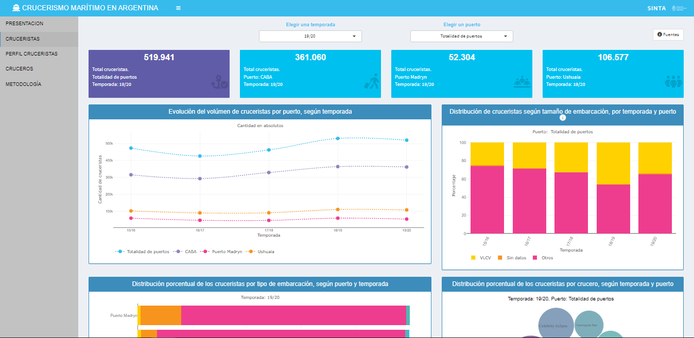
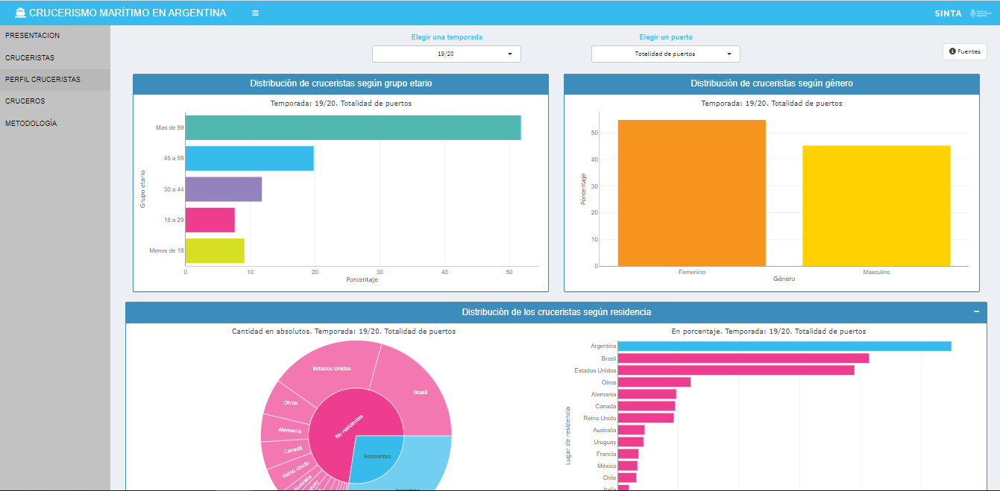
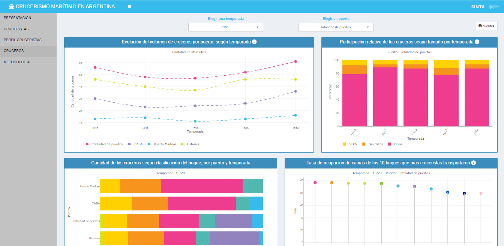

<aside>💻 [**TABLERO**: Crucerismo](https://tableros.yvera.tur.ar/crucerismo/)</aside>

El aplicativo se presenta como herramienta alternativa de navegación de los datos que ya fueron presentados en el [**Documento de Trabajo N°9: "Crucerismo Marítimo en la Argentina"**](https://tableros.yvera.tur.ar/recursos/biblioteca/dt9_cruceros.pdf) elaborado por la Dirección Nacional de Mercados y Estadística (DNMyE). El aplicativo web contiene visualizaciones gráficas y tablas con funciones interactivas que posibilitan un mejor análisis y comparación del dato, al permitir hacer selecciones de categorías, comparar etiquetas, seleccionar parte del dataset con selectores/menús específicos, filtrar o buscar un campo en la tabla, o descargar la información de las mismas en formato xlsx o csv.

**RESUMEN**

La información analiza el movimiento de cruceros y cruceristas internacionales (residentes y no residentes), registrados en alguno de los 3 puertos de cruceros marítimos de nuestro país, en los meses de septiembre a abril, período considerado como temporada de cruceros. El tablero se divide en 5 bloques que organizan la información: PRESENTACIÓN, CRUCERISTAS, PERFIL CRUCERISTAS, CRUCEROS Y METODOLOGÍA.

***Sección "Presentación":***

Dividido en dos solapas: 

- *Introducción*: induce al usuario en el aplicativo, sobre la información y organización del tablero; 
- *Recomendaciones*: ofrece una guía de uso sobre las principales funciones interactivas y del aplicativo en general.

```{r echo = FALSE}
knitr::include_graphics("x1.png")
```

***Sección "Cruceristas":***

Visualiza la principales estadísticas referida a evolución, volúmen, y distribución de cruceristas según temporada, puerto y variables específicas. En el margen superior se pone a disposición dos selectores sobre  `temporada` y `puerto` , con el fin de posibilitar al usuario que seleccione entre las temporadas 15/16 a 19/20 y los puertos argentinos.
Entre las herramientas disponibles, se pone a disposición un botón con información adicional para interpretar los indicadores, señalado con el ícono ℹ

```{r echo = FALSE}

```

***Sección "Perfil cruceristas":***

Presenta información sobre características sociodemográficas de los cruceristas.

```{r echo = FALSE}

```

***Sección "Cruceros":***

Ofrece estadísticas sobre volúmen y evolución del movimiento de cruceros en los puertos argentinos, según temporada y variables específicas como tamaño de buque, nombre de embarcaciones y clasificación de buque.

```{r echo = FALSE}

```

***Sección "Metodología":***

Se ofrece información sobre las principales definiciones conceptuales, aclaraciones metodológicas sobre la realización de los indicadores, signos convencionales y antecedentes de los datos sobre crucerismo presentados por la dirección.

```{r echo = FALSE}
knitr::include_graphics("x5.png")
```

</aside>

Se puede acceder a la plataforma desde la [página del SINTA](https://www.yvera.tur.ar/sinta/) o directamente desde la página: <https://tableros.yvera.tur.ar/crucerismo/>

::: infobox
Para recibir las novedades del SINTA escribile al bot de Telegram de la DNMyE <a href='https://bitacora.yvera.tur.ar/posts/2022-09-08-sintia/' target='_blank'>*SintIA*</a>: <a href='https://t.me/RDatinaBot' target='_blank'>@RDatinaBot</a> 🤖
:::
