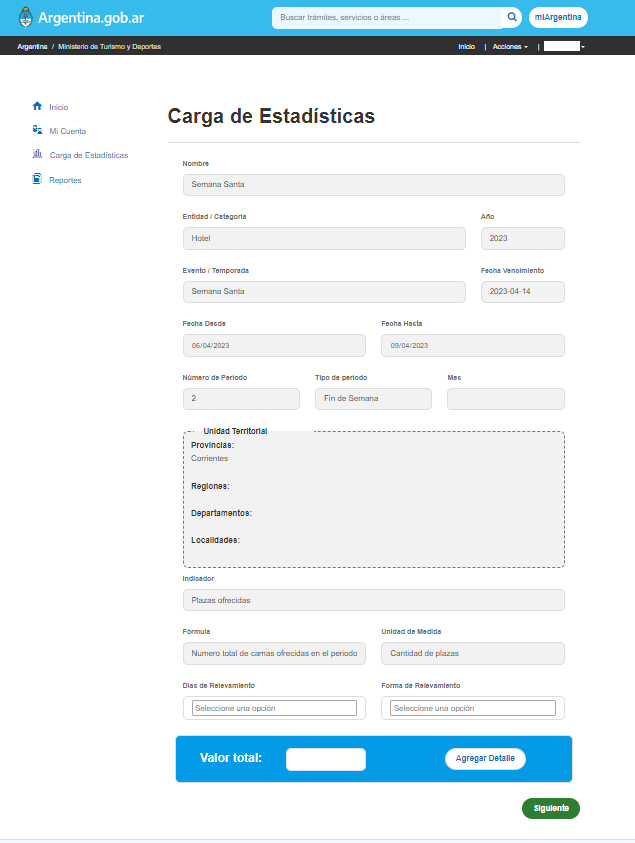

```{r setup, include=FALSE}
knitr::opts_chunk$set(echo = FALSE, fig.align = 'center')
```

La Dirección Nacional de Mercados y Estadísticas puso en funcionamiento una nueva plataforma web para el intercambio y la gestión de datos del turismo entre organismos nacionales, provinciales y locales para contribuir al fortalecimiento de los sistemas de estadísticas subnacionales, con el objetivo de generar información robusta y confiable de la actividad turística de nuestro país.

```{r}
knitr::include_graphics("land.png")
```


### Un Sistema para la Armonización

El [Sistema Federal de Gestión de Datos Turísticos (`<data>TUR`)](https://datatur.yvera.tur.ar/) es una plataforma modular y forma parte del proyecto de armonización de las estadísticas del turismo en Argentina. La puesta a punto del sistema viene siendo conversada en reuniones de trabajo con todas las jurisdicciones. Las mismas suponen pruebas, ajustes, incorporación de sugerencias, nuevas herramientas y capacitaciones. 

El primero de los módulos está constituido por un gestor de datos estadísticos de eventos y temporadas del turismo entre los organismos participantes, mientras que el segundo aborda los registros relacionados a los registros de alojamientos de las diferentes jurisdicciones.

```{r, out.width= '110%'}
knitr::include_graphics("home.png")
```

### ¿Por qué?

Previamente al uso de la plataforma, el intercambio de información de esta Dirección con las distintas jurisdicciones se realizaba a partir de solicitudes de información estadística. Las mismas se realizaban a través de una nota formal por correo electrónico, la cual se reforzaba a través de otros medios de contacto directos (mensajería, teléfono, etc.). Cada uno de los organismos provinciales y municipales de turismo enviaban los respectivos informes estadísticos a través de distintas plataformas y soportes diferentes (archivos digitales con extensiones de procesadores de texto, planillas de cálculos, presentaciones, u otros formatos como pdf, jpg o audio) lo que dificultaba la recepción, elaboración y procesamiento de la información recibida.

El objetivo es implantar un sistema homogéneo y armonizado en lo referente a la metodología de recolección y análisis de datos del turismo interno de los destinos turísticos de la Argentina. 

### Módulo de datos estadísticos

El **módulo de datos estadísticos del turismo (DEST)**, con nuevas soluciones en desarrollo,  ya está siendo utilizado por áreas provinciales y municipales responsables de las estadísticas de turismo. A través del mismo informan a la DNMyE los indicadores que ellas elaboran sobre las temporadas estival e invernal, los fines de semana largos y otros eventos locales relevados. 

```{r, out.width= '110%'}
knitr::include_graphics("lista.png")
```

El módulo DEST da un marco sistemático e institucional para la comunicación de estos indicadores mediante una interfaz sencilla y amigable, y que contempla la posibilidad de adaptar los indicadores y eventos o temporadas a lo que produce cada jurisdicción. Estos datos son usualmente relevados y comunicados al inicio y al cierre de cada evento y temporada, de forma que resulta fundamental una carga rápida y controlada de los mismos.

```{r, out.width= '110%'}

```

Además el módulo DEST resguarda el historial de datos declarados y permite su descarga en formato tabular para que los usuarios puedan comparar, analizar y compartir la información relevada en cualquier momento. De esta manera, se facilita la comunicación y gestión de los indicadores de la actividad turística elaborados por los diferentes organismos, se promueve su estandarización y normalización, como así también se agiliza su intercambio.

### Más módulos por venir

Ya en versión de desarrollo para iniciar proceso de pruebas, el próximo módulo que será puesto en funcionamiento es el módulo del **Padrón Único Nacional de Alojamientos (PUNA)**, el cual está diseñado con el mismo objetivo que contempla el módulo DEST, como una herramienta que forma parte de la estrategia de Armonización para la recolección, procesamiento, análisis y comunicación de las estadísticas del turismo. En específico, se busca generar una instrumento que permita mantener la actualización y compilación de las fuentes de información que nutren las [estadísticas de establecimientos de alojamiento turístico en la Argentina](https://tableros.yvera.tur.ar/puna/).

Por último, aunque aún en una etapa inicial de desarrollo, se planifica la creación de otros dos módulos sobre los que se detallara en entradas posteriores: (i) _Big data para el turismo_ y (ii) _Inteligencia Turística_, en el sentido del desarrollo de destinos turísticos inteligentes, tal como proponemos en la [MISION 11 del Plan Argentina Productiva 2030: Plan de desarrollo productivo, industrial y tecnológico](https://tableros.yvera.tur.ar/recursos/biblioteca/mision_11.pdf). 


::: {.infobox}
Para recibir las novedades del SINTA escribíle al bot de Telegram de la DNMyE <a href=‘https://bitacora.yvera.tur.ar/posts/2022-09-08-sintia/’ target=‘_blank’>*SintIA*</a>: <a href=‘https://t.me/RDatinaBot’ target=‘_blank’>@RDatinaBot</a> 🤖
:::
