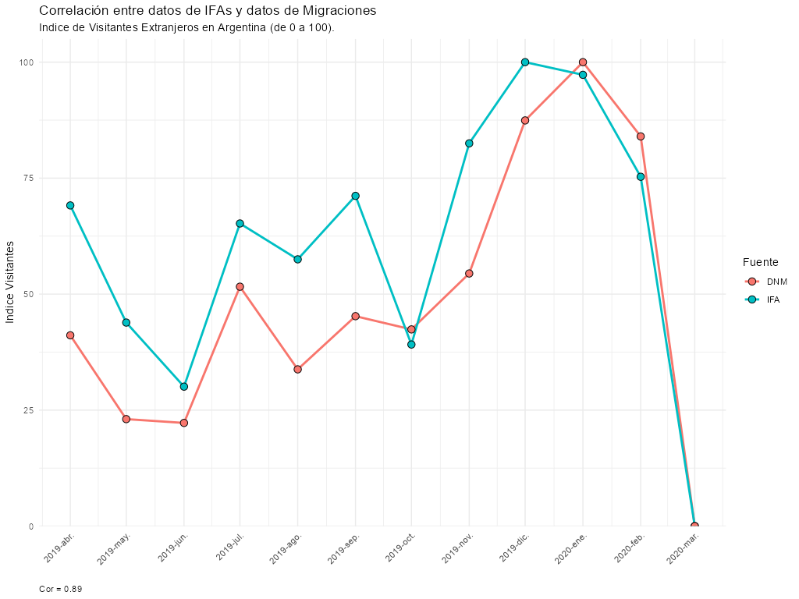

```{r setup, include=FALSE}
knitr::opts_chunk$set(echo = FALSE)

```

```{r, message=FALSE, warning=FALSE, echo = FALSE}
library(tidyverse)
library(arrow)
library(comunicacion)
library(herramientas)
library(leaflet)
library(sf)

paises_nombres <- read_csv('https://gist.githubusercontent.com/brenes/1095110/raw/c8f208b03485ba28f97c500ab7271e8bce43b9c6/paises.csv')

renombrar_paises <- function(x) {
  left_join(x, paises_nombres %>% select(iso2, nombre), 
            by = c("HomeCountry" = "iso2")) %>% 
  select(pais = nombre, everything())
  }
```

De un tiempo a esta parte, desde la Dirección Nacional de Mercados y Estadística (DNMyE), en conjunto con el [**Área de Datos de Fundar**](https://fund.ar/area/datos/), el [**Laboratorio de Simulación de Eventos Discretos de la Facultad de Ciencias Exactas y Naturales de la Universidad de Buenos Aires**](https://modsimu.exp.dc.uba.ar/sed/) y la colaboración del **INPROTUR**, venimos trabajando en la explotación de una fuente de datos novedosa que entendemos puede ser de utilidad para un mejor entendimiento del comportamiento turístico en Argentina.

La principal tarea consistió en la elaboración de un flujo de trabajo que nos permitiera la explotación de una base de datos de señales emitidas por aplicaciones de dispositivos móviles. En esta primera entrada sobre el trabajo que estamos llevando adelante queremos hacer una breve introducción y un ejemplo a través de un caso de uso simple que puede derivar de esta herramienta que estamos desarrollando. En una próxima publicación profundizaremos sobre el proceso de descubrimiento de los datos, detalles metodológicos, limitaciones, desafíos y casos de uso más desarrollados.

### Sobre los datos

El insumo está compuesto por tres grandes conjuntos de datos, con más de 6 mil millones de registros, para una ventana temporal de un año completo previo al inicio de las restricciones a la movilidad causado por la pandemia del COVID 19 en marzo de 2020.

Los datos son especialmente atractivos por el alto grado de desagregación espacio - temporal: contiene información diaria de coordenadas geográficas detalladas.

Por último, vale destacar que los datos en cuestión provienen de una fuente especializada en el ámbito del marketing digital. Esta recopila información anónima de dispositivos móviles que se identifican mediante un código único denominado IFA (*Identifier for Advertising*), utilizado con fines publicitarios. Es importante señalar que no existe la posibilidad de establecer una conexión entre los registros de datos y las personas a las que hacen referencia. En consecuencia, la base de datos en cuestión no contiene datos personales y no es posible realizar una re identificación de los individuos, ya que no se dispone de elementos que permitan asociar un registro específico con una persona en particular.

### Fuentes alternativas como complemento de información

Desde la DNMyE se administran diversos operativos estadísticos que tienen como objetivo la caracterización las diferentes formas de turismo: la [**Encuesta de Turismo Internacional (ETI)**](https://bitacora.yvera.tur.ar/posts/2022-05-31-intro-eti/) y la [**Encuesta de Ocupación Hotelera (EOH)**](https://bitacora.yvera.tur.ar/posts/2022-05-24-intro-eoh/), en conjunto con el INDEC, y la [**Encuesta de Viajes y Turismo de los Hogares (EVyTH)**](https://bitacora.yvera.tur.ar/posts/2022-06-06-intro-evyth/). Todos estos, en conjunto, conforman el Sistema de Estadísticas de Turismo de Argentina, insumo fundamental para, entre otras cosas, el desarrollo de la [**Cuenta Satelite de Turismo de Argentina (CST-A)**](https://bitacora.yvera.tur.ar/posts/2022-05-11-cst-parte2/)**.**

Para estas, de un modo esquemático, las formas de turismo se clasifican de acuerdo al origen y destino de los visitantes: Interno (quienes se desplazan en el mismo país que residen); Receptivo (no residentes que viajan al país) y Emisivo (residentes que viajan a otro país).


Amén de la relevancia de los mismos, somos conscientes que, por diversas razones, los operativos tienen limitaciones para dar cuenta de manera acabada del fenómeno que busca medir.

Así, por ejemplo, si bien la estimación del turismo internacional puede dar cuenta de los flujos para todos los pasos fronterizos del país, la caracterización y perfiles de los turistas elaborados por la ETI se releva en unos pocos pasos aéreos (*Aeroparque J. Newbery* y aeropuertos internacionales de *Ezeiza, Córdoba y Mendoza*), en el *Puerto de Buenos Aires* y en el paso fronterizo terrestre *Cristo Redentor*, que limita con Chile. En conjunto, representó aproximadamente el movimiento del 46% del total del turismo receptivo en la Argentina (año 2019).

Un recurso como el que acá empezamos a descubrir podría echar luz sobre aspectos no alcanzados por el operativo estadístico. En primer lugar, siguiendo con lo antes mencionado, porque podría ser el caso que las observaciones de la nueva fuente podrían no haber sido teóricamente alcanzadas si su egreso de Argentina (el momento cuándo se encuesta al turismo receptivo) no se realizó por alguno de los pasos fronterizos antes mencionados.

Por otro lado, la encuesta encuentra un límite razonable en el diseño del cuestionario impartido durante el operativo a los visitantes. En cambio, esta nueva fuente de datos, si bien no provee mucha de la información relevada por el operativo, si podría alguna de ella y eventualmente otra no contemplada, tal como mostramos en el ejemplo siguiente.

### Caso de Uso: Turismo receptivo en \#LaRutaNatural

Un primer análisis para conocer mejor nuestros datos podría ser evaluar la participación de cada país de origen en el conjunto de datos.

```{r graf ifas ext x pais,  message=FALSE, warning=FALSE, echo = FALSE, eval=FALSE}


# ifas_ext <- read_parquet("entradas/ifas_extranjeros_enarg.parquet")
# 
# n_ifas_pais <- ifas_ext %>% 
#   distinct(IFA, HomeCountry) %>% 
#   group_by(HomeCountry) %>% 
#   summarise(n = n())
# 
# write_rds(n_ifas_pais, 'entradas/n_ifas_pais.rds')

n_ifas_pais <- read_rds('https://github.com/d4t4tur/faevyth_big_data_patagonia/raw/main/entradas/n_ifas_pais.rds')

n_ifas_pais <- n_ifas_pais %>% 
  mutate(HomeCountry = fct_lump(HomeCountry,
                                n = 15, w = n, other_level = "Otros")) %>%
  group_by(HomeCountry) %>% 
  summarise(n = sum(n)) %>% 
  ungroup() 

n_ifas_pais <- renombrar_paises(n_ifas_pais)

n_ifas_pais <- n_ifas_pais %>% 
  mutate(pais = ifelse(HomeCountry == "Otros", "Otros paises", pais))

n_ifas_pais <- n_ifas_pais %>% 
  mutate(pais = fct_reorder(pais, n))

plot <- ggplot(n_ifas_pais) +
  geom_col(aes(pais, n, fill = pais),
           show.legend = F) +
  geom_text(aes(pais, n, 
                 label = lbl_int(n)),
             hjust = -0.15, size = 2.5) +
    ggimage::geom_flag(data = n_ifas_pais,
                     aes(x = pais, y = n+28000,
                         image = HomeCountry)) +
  scale_fill_dnmye() +
  scale_y_continuous(labels = lbl_int, expand = expansion(add = c(0, 25000))) +
  coord_flip() +
  labs(x = "", y = "") +
  theme_minimal() +
  theme(text = element_text(size = 12)) 


ggsave(plot = plot, "plot_banderas.png", dpi = 300,
       width = 6, height = 4)
```

```{r echo=FALSE,  out.width="100%"}
knitr::include_graphics("plot_banderas.png")
```

Un posible caso de uso de esta fuente de datos es el de generar información que pueda ser útil para el armado de perfiles de determinado tipo de turismo, en este caso el turismo de naturaleza. Si recurrimos a las fuentes tradicionales podemos encontrar información de utilidad al respecto. Por ejemplo, partiendo de la información de la ETI se puede identificar respondientes de la encuesta que manifiestan haber realizado actividades tales como ***(i)** turismo aventura*, ***(ii)** actividades de baja dificultad en medios naturales*, ***(iii)** visitas a parques nacionales* o ***(iv)*** *actividades en la nieve*; todas consideradas como relevantes para caracterizar el turismo de naturaleza receptivo, tal como se hizo en el [**Documento de Trabajo N°1: Turismo de Naturaleza (DNMyE)**](https://tableros.yvera.tur.ar/recursos/biblioteca/perfil_naturaleza.pdf). Por otro lado, si recurrimos a registros administrativos tenemos la posibilidad de aproximarnos al fenómeno a partir de la identificación de visitantes de los Parques Nacionales, tal como hacemos en el [**reporte de seguimiento en el SINTA**](https://tableros.yvera.tur.ar/parques_nacionales.html)**.**

Respecto de la ETI ya mencionamos dos tipos de restricciones eventuales que el operativo tiene (cobertura espacial y límites del cuestionario). Por otro lado, la información de visitas en los Parques Nacionales surge del **Registro Nacional de Autorizaciones, Recaudaciones e Infracciones (RENARI) de la Administración de Parques Nacionales (APN),** quien recopila y procesa los datos de visitantes. La información suministrada permite la clasificación de las visitas en residentes argentinos y no residentes en 36 Parques Nacionales de la Argentina. En efecto, la fuente de APN es explotada para un fin distinto del que fue creado y resulta de utilidad para ello: permite dar cuenta lo más fielmente posible del volumen de visitantes, con la posibilidad de apertura que distingue entre tipo residentes y no residentes (sin más detalle sobre el país de origen).

Respecto de la fuente de IFAs que presentamos, tampoco se encuentra exenta de limitaciones. Sabemos que los datos que provienen de estas fuentes pueden presentar fuertes sesgos porque no vienen de una selección aleatoria, ni estuvieron diseñados para responder el tipo de preguntas que nosotros queremos hacer. Sin embargo, entendemos que tiene la potencialidad de informar cosas que los recursos tradicionales no, tal como procuramos mostrar con el siguiente ejemplo, teniendo siempre en cuenta su potencialidad y sus limitaciones.

Parte del trabajo entonces es analizar los datos y en la medida de las posibilidades buscar validar su calidad a partir de otra información disponible. Así, por ejemplo, cuando analizamos IFAs relativos a turismo receptivo, buscamos compararlo contra la información que disponemos a partir de los registros de la Dirección Nacional de Migraciones. El grado de correlación entre las series nos ayuda a pensar al menos que los datos tienen un comportamiento análogo a lo largo del tiempo.

```{r echo = FALSE}

```

El siguiente mapa presenta una muestra de 10 mil señales emitidas por dispositivos móviles identificados con origen extranjero (país de residencia del IFA)[^1]. Cada punto corresponde a una coordenada geográfica aproximada. El territorio argentino está a su vez delimitado por una capa de polígonos correspondiente a [**16 de las 17 rutas naturales**](https://larutanatural.gob.ar/) (se excluye el *Continente Blanco*). Al hacer *click* sobre cada punto se distingue IFAs únicos (truncados para preservar el dato), fecha de registro y nacionalidad de origen.

[^1]: Las señales son una pequeña fracción de unos casi 16,7 millones de registros de más de 592 mil dispositivos distintos, a lo largo y ancho del territorio argentino para los 12 meses previos a la pandemia.

```{r levanta ifas receptivos, message=FALSE, warning=FALSE, echo = FALSE}

# esto queda comentado para evitar levantar todos los datos
# set.seed(45)

# geo_ifas_ext_sample <- ifas_ext %>% 
#   slice_sample(n = 10000) 

# esto es una muestra de 10 mil señales
geo_ifas_ext_sample <- read_file_srv("big_data/presentacion/sample_ifas_receptivo.parquet")


geo_ifas_ext_sample <- renombrar_paises(geo_ifas_ext_sample)

geo_ifas_ext_sample <-  geo_ifas_ext_sample %>% 
  st_as_sf(coords = c("Lon", "Lat"), crs = 4326)


```

```{r,  message=FALSE, warning=FALSE, echo = FALSE}
rutas_naturales <- read_file_srv('big_data/presentacion/rutas_naturales.geojson')

rutas_naturales <- rutas_naturales %>% 
  group_by(name) %>% 
  mutate(geometry = st_union(geometry))

palrn <- function(x) {
  
  case_when(
                               str_detect(x, "Selva Misionera") ~ "#6aa84f",
                               str_detect(x, "Iberá") ~ "#f6b26b",
                               str_detect(x, "Litoral") ~ "#d9ead3",
                               str_detect(x, "Gran Chaco") ~ "#46bdc6",
                               str_detect(x, "Puna") ~ "#e9795b",
                               str_detect(x, "Valles, Quebradas y Yungas") ~ "#34a853",
                               str_detect(x, "Altos Andes") ~ "#999999",
                               str_detect(x, "Desiertos y Volcanes") ~ "#ffe599",
                               str_detect(x, "Sierras Centrales") ~ "#d5a6bd",
                               str_detect(x, "Llanura") ~ "#e2bcf1",
                               str_detect(x, "Estepa") ~ "#fce5cd",
                               str_detect(x, "Patagonia Andina") ~ "#b6d7a8",
                               str_detect(x, "Patagonia Austral") ~ "#34d7d7",
                               str_detect(x, "Fin del Mundo") ~ "#cccccc",
                               str_detect(x, "Mar Patagónico") ~ "#dff2e2",
                               str_detect(x, "Delta") ~ "#b28fbf",
                               T ~ NA_character_
  )
  
}
  


rutas_naturales <- rutas_naturales %>% 
  mutate(color = palrn(name))

rutas_naturales <- rutas_naturales %>% 
  mutate(color= ifelse(name %in% c("Ruta de la Patagonia Andina",
                                   "Ruta del Mar Patagónico",
                                   "Ruta del Fin del Mundo",
                                   "Ruta de la Patagonia Austral",
                                   "Ruta de la Estepa"), color, "#AAAAAA"))

```

```{r plot-first, warning=FALSE, echo=FALSE}


geo_ifas_ext_sample %>% 
  leaflet() %>% 
  geoAr::addArgTiles() %>% 
  addPolygons(data = rutas_naturales, fillColor = ~ color, weight = 0, fillOpacity = 0.7, popup = ~ name) %>% 
  addCircles(popup = ~ lapply(glue::glue("Fecha: {Date}<br>IFA: {substr(IFA,1,7)}...<br>País: {pais}"),
                              htmltools::HTML))
```

### Zoom in: La Ruta Natural Patagonia Andina

Al tener información desagregada de señales con referencia espacial podemos analizar puntos de interés de áreas específicas. Por ejemplo, se puede filtrar de la muestra anterior aquellos datos que se corresponden con el polígono de la **Patagónia Andina**. Al mismo tiempo, podemos avanzar en visualizar características de interés (como colorear por el país de origen identificado en el conjunto de datos).

```{r message=FALSE, warning=FALSE, echo = FALSE}

patagonia_andina <-  rutas_naturales %>% filter(name == "Ruta de la Patagonia Andina")

ifas_ext_patagonia_andina <- geo_ifas_ext_sample %>% 
  st_filter(patagonia_andina) # FILTRO ESPACIAL: coordenadas de IFAs dentro de polígono Patagonia Andina

paisespal <- colorFactor(palette = dnmye_paletas()(length(unique(ifas_ext_patagonia_andina$pais))),
                        domain = unique(ifas_ext_patagonia_andina$pais)) # PALETA DE COLORES POR PAIS

```

```{r message=FALSE, warning=FALSE, echo = FALSE}

ifas_ext_patagonia_andina %>% 
  leaflet() %>% 
  geoAr::addArgTiles() %>% 
  addPolygons(data = patagonia_andina, fillColor = ~ color, weight = 0, fillOpacity = 0.7, popup = ~ name) %>% 
  setView(lat = -41.137,lng =  -71.304, zoom = 6) %>% 
  addCircles(color = ~ paisespal(pais), fillOpacity = 1,
             popup = ~ lapply(glue::glue("Fecha: {Date}<br>IFA: {substr(IFA,1,7)}...<br>País: {pais}"),
                              htmltools::HTML))

```

La idea detrás de este ejercicio es que podemos trabajar estos datos con la misma lógica para cualquier polígono de interés. A los datos de partida para el turismo receptivo (IFAs únicos, coordenadas, origen y fecha) se pueden agregar otras capas "para hacerle preguntas" a los datos de partida.

#### Analizar visitas a Imperdibles

Así como hicimos *zoom* hacia el polígono de una *\#RutaNatural* específica, podemos indagar sobre cualquier referencia geográfica de interés (y momento del tiempo del periodo abarcado por los datos). Siguiendo con el ejemplo de visitas a Parques Nacionales, podemos explorar muchos de ellos dentro de los "Imperdibles" catalogados por el programa [**La Ruta Natural (Imperdibles - Patagónia Andina)**](https://larutanatural.gob.ar/es/ruta/5/patagonia-andina).

```{r echo=FALSE}
knitr::include_graphics("lrn.png")
```

El uso de este recurso, siguiendo el argumento, nos permitiría potencialmente estimar una proporción de los visitantes extranjeros por país de residencia; dato no incluido en los registros administrativos con los que trabajamos usualmente. El siguiente mapa muestra, con distinción de nacionalidad de origen y fecha de visita, IFAs que fueron registrados en el interior de alguno de los **Imperdibles de la Ruta Natural Patagónia Andina** (polígonos verdes): Lanín, Siete Lagos, Villa Pehuenia y lagos Aluminé y Moquehue, etc.

```{r message=FALSE, warning=FALSE, echo = FALSE}

imperdibles <- read_file_srv('big_data/presentacion/imperdibles.gpkg')

imperdibles_patagonia_andina <- imperdibles %>% 
  filter(ruta_natural == "Patagonia Andina")


ifas_ext_patagonia_andina %>% 
  leaflet() %>% 
  geoAr::addArgTiles() %>% 
  addPolygons(data = imperdibles_patagonia_andina,
              fillColor = dnmye_colores("pera"),
              color = dnmye_colores("pera"), popup = ~ lapply(glue::glue("{nombre_ppal}"),
                              htmltools::HTML), fillOpacity = 0.7) %>% 
  setView(lat = -41.137,lng =  -71.304, zoom = 6) %>% 
  addCircles(color = ~ paisespal(pais), 
             popup = ~ lapply(glue::glue("Fecha: {Date}<br>IFA: {substr(IFA,1,7)}...<br>País: {pais}"),
                              htmltools::HTML), fillOpacity = 1)
  # addLegend(pal = factpal, values = unique(geo_ifas_ext_sample$HomeCountry)[1:10], opacity = 1) 

```

Así, por ejemplo, se podría querer indagar sobre los IFAs extranjeros que estuvieron en las cercanías de centros de ski durante la temporada invernal pre pandémica. Se podría analizar también perfiles de visitantes por localidad. Y, al revés, perfiles de localidades preferidas para los visitantes de determinados orígenes o mercados.

------------------------------------------------------------------------

Como mencionamos, en esta primera entrada queríamos poder hacer una primera presentación de este trabajo sobre el que venimos avanzando hace meses. Con un ejemplo de juguete y simplificado buscamos mostrar la lógica y potencialidad de la herramienta sobre la que trabajamos y que esperamos presentar en detalle en una próxima entrega.
