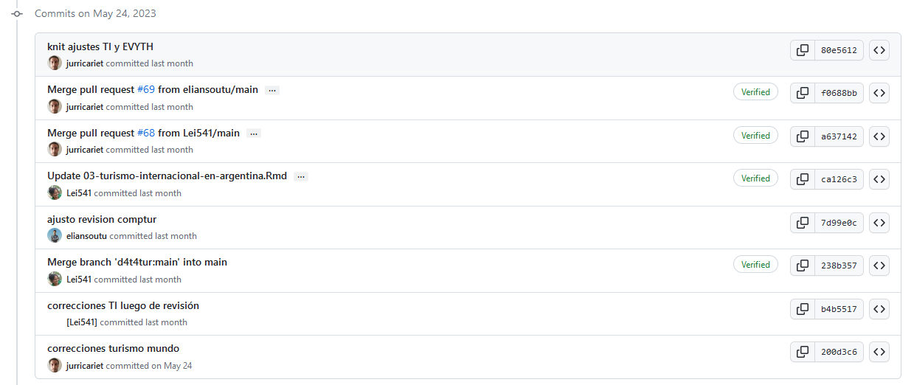

La Dirección Nacional de Mercados y Estadística (DNMyE), encargada de la elaboración de la información estadística relativa al turismo en la Argentina, tuvo entre sus tareas la confección de un informe anual que compila los resultados de las distintas áreas que forman parte de la producción sistemática de estadísticas. El Anuario Estadístico de Turismo (AET), [se publicó para los años 2005-2015](https://biblioteca.yvera.tur.ar/).

En esta nueva etapa se procuró reiniciar esa publicación, pero con una novedad: su formato principal -libro navegable a través de la web- permite un recorrido más ágil por sus capítulos, a la vez que la [publicación de su código fuente](https://github.com/dnme-minturdep/anuario_2021) permite la reproducibilidad y una base para actualizar a ediciones posteriores (o bien completar los años que no fueron publicados). También es posible descargar la versión pdf y epub.

El AET 2021 está compuesto de nueve capítulos, precedidos por una introducción en la que se presentan los principales resultados, caracterizados en este caso por la irrupción de la pandemia COVID-19 iniciada en 2020 pero con consecuencias aún más severas en algunos indicadores de 2021. El turismo internacional estuvo prácticamente paralizado, como se muestra en los valores a nivel global en el capítulo 1 y para nuestro país en el capítulo 2. El turismo interno, presentado en el capítulo 3, si bien superó los niveles de 2020, se encontraba aún en valores históricamente bajos. Lo propio ocurrió con la ocupación hotelera, que se aborda en el capítulo 4. Allí es posible distinguir la recuperación de los viajeros residentes hospedados y la casi nula actividad de viajeros no residentes. En el mismo sentido, los capítulos 5 y 6, dedicados a las visitas a parques nacionales y al transporte aéreo, dan cuenta del impacto de la crisis sanitaria. El capítulo 7 cuenta con la información de las agencias de viajes habilitadas en el registro del MINTURDEP. El capítulo 8 resume los principales indicadores económicos del turismo para nuestro país en comparación con otros países de la región. Por último, el capítulo 9 presenta los datos de empleo en el sector hotelero, puestos de trabajo registrados, tasa de feminización y cantidad de empresas en las ramas características del turismo. La publicación está acompañada de las fichas técnicas de cada uno de los capítulos. 

Asimismo, cada sección finaliza con el listado de recursos disponibles con los cuales se elaboró cada una. En este sentido, el [Sistema de Información Turística de Argentina](https://www.yvera.tur.ar/sinta/) pone a disposición la gran mayoría de los datos contenidos en el AET, en diversos formatos: datos abiertos, reportes, tableros e informes.

El trabajo realizado contó con la participación de toda la DNMyE, que trabajó colaborativamente
aprovechando las ventajas de los entornos de control de versiones. Como fuera mencionado, [el código fuente del anuario](https://github.com/dnme-minturdep/anuario_2021) está disponible para su reproducción o actualización futura por parte de la dirección.

```{r echo=F}

```

Se espera publicar en los próximos meses el AET 2022, caracterizado por la recuperación del turismo interno, que presentó valores récord en muchos de sus indicadores.

Para recorrer el AET 2021 visite el siguiente [link](https://dnme-minturdep.github.io/anuario_2021/).

::: {.infobox}
Para recibir las novedades del SINTA escribíle al bot de Telegram de la DNMyE <a href=‘https://bitacora.yvera.tur.ar/posts/2022-09-08-sintia/’ target=‘_blank’>*SintIA*</a>: <a href=‘https://t.me/RDatinaBot’ target=‘_blank’>@RDatinaBot</a> 🤖
:::
