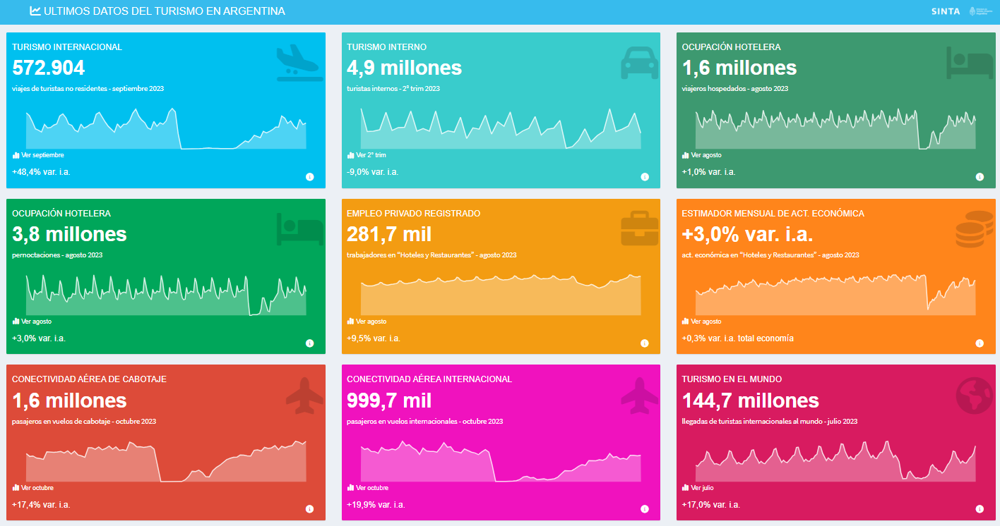
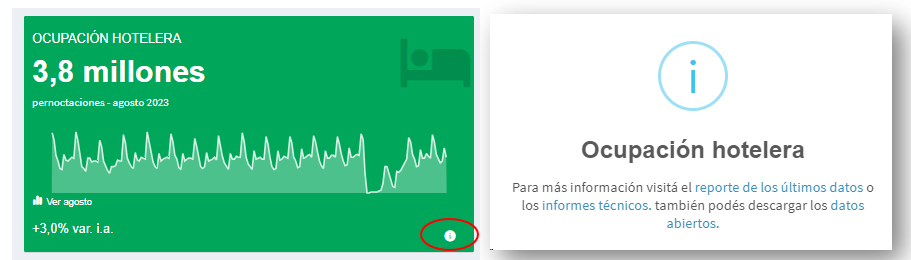

# Presentación

Contar con datos es fundamental para conocer la realidad. A su vez, es imprescindible que estos se encuentren actualizados y con la mayor accesibilidad posible. Con el objetivo de facilitar el acceso a la información más actualizada acerca del turismo en Argentina, la DNMyE publica un nuevo tablero.

El tablero [**ÚLTIMOS DATOS DEL TURISMO EN ARGENTINA**](https://tableros.yvera.tur.ar/tablero_ultimos_datos){target=”_blank”} presenta los principales indicadores publicados en el [Sistema de Información Turística de la Argentina (SINTA)](https://www.yvera.tur.ar/sinta/){target=”_blank”}, permitiendo conocer los resultados más recientes del turismo receptivo, la ocupación hotelera, el turismo interno y la conectividad aérea en nuestro país. A su vez, se presentan los resultados de indicadores relativos al turismo elaborados por otros organismos,  como el Estimador Mensual de Actividad Económica (EMAE), el empleo privado registrado (MTEySS) y las llegadas de turistas a nivel mundial (OMT).  


# Tablero

## Datos principales

Con el objetivo de visualizar un panorama de los **últimos resultados turísticos**, el tablero presenta nueve tarjetas que abarcan los principales indicadores publicados en el [Sistema de Información Turistica de la Argentina (SINTA)](https://www.yvera.tur.ar/sinta/){target=”_blank”}, a partir de las siguientes bases de información:

-   A partir de los datos de la [Estimación del Turismo Internacional por todas las vías de acceso](https://www.yvera.tur.ar/sinta/informe/info/turismo-internacional){target=”_blank”}, la cantidad de **viajes de turistas no residentes**;

-   Con la información de la [Encuesta de Turismo Interno (EVyTH)](https://www.yvera.tur.ar/sinta/informe/info/encuesta-de-viajes-y-turismo-de-los-hogares-evyth), la cantidad de **turistas internos**; 

-   La cantidad de **viajeros hospedados y pernoctaciones** a través de la [Encuesta de Ocupación Hotelera](https://www.yvera.tur.ar/sinta/informe/info/encuesta-de-ocupacion-hotelera-eoh);

-   La cantidad de **pasajeros en vuelos de cabotaje e internacionales** en base a los datos del [tablero de Conectividad Aérea](https://tableros.yvera.tur.ar/conectividad/){target=”_blank”};

Asimismo, con la informacion de otros organismos también relevamos los siguientes indicadores: 

-   Con información proveniente del [Minsterio de Trabajo, Empleo y Seguridad Social en base al SIPA](https://www.argentina.gob.ar/trabajo/estadisticas){target=”_blank”}, se obitiene la cantidad de **trabajadores registrados en el sector "Hoteles y Restaurantes"**;

-   Información proveniente del INDEC en base al [Estimador mensual de actividad económica (EMAE)](https://www.indec.gob.ar/indec/web/Nivel4-Tema-3-9-48) nos permite elaborar la **variación interanual de la actividad económica en el sector de "Hoteles y Restaurantes" y en el total de la economía**;

-   Por último, la cantidad de **llegadas de turistas al mundo**, en base a la información proveniente del [panel de datos de turismo de la OMT](https://www.unwto.org/tourism-data/global-and-regional-tourism-performance);


```{r, echo = FALSE, out.width='100%'}

```


En cada una de la tarjetas se podrá encontrar la variable a la cual hace referencia, por ejemplo **"Turismo interno"**, junto al último resultado publicado y su referencia de tiempo (mes o trimestre). A su vez también se incorporó la variación interanual de cada indicador[^var_emae].

[^var_emae]: en el caso de la actividad económica en el sector de "Hoteles y Restaurantes", se optó por dar a conocer, adicionalmente, la variación interanual de la actividad en el total de la economía,

```{r, echo = FALSE, out.width='100%'}
knitr::include_graphics("img/tarjeta_evyth.PNG")
```


## Información gráfica

Al mismo tiempo, dentro de cada tarjeta se encontrará, a través de una serie histórica, el comportamiento de la variable en el tiempo. Adicionalmente, un gráfico de barras permite ver el comportamiento específico del mes o trimestre y compararlo con el mismo período de los años anteriores.

```{r, echo = FALSE, out.width='100%'}
knitr::include_graphics("img/tarjeta_TI.PNG")
```

## Recursos

Por último, un click en el ícono de información permitirá acceder a todos los recursos de cada indicador publicado, ya sea a través de informes, tableros y/o bases de datos abiertos. 


```{r, echo = FALSE, out.width='100%'}

```

Para conocer más sobre los últimos datos del turismo en Argentina puede consultar el  [Informe mensual de estadísticas de turismo (IMET)](https://biblioteca.yvera.tur.ar/coyuntura.html){target=”_blank”}, que compila la evolución de estos y otros indicadores.

Para consultar el código fuente del tablero presentado, visite su [repositorio de Github](https://github.com/dnme-minturdep/tablero_ultimos_datos){target=”_blank”}


::: {.infobox}
Para recibir las novedades del SINTA escribíle al bot de Telegram de la DNMyE <a href='https://bitacora.yvera.tur.ar/posts/2022-09-08-sintia/' target='_blank'>*SintIA*</a>: <a href='https://t.me/RDatinaBot' target='_blank'>@RDatinaBot</a> 🤖
:::
   