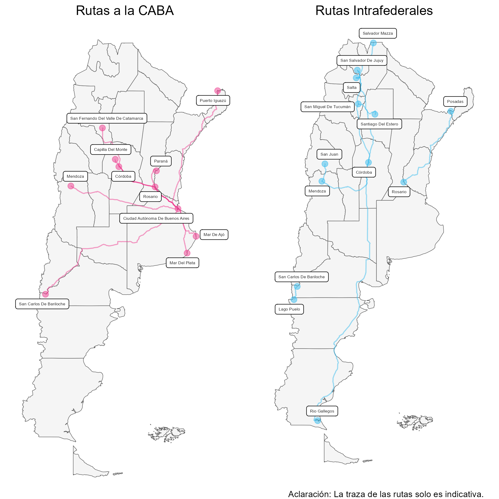

```{r setup, include=FALSE}
knitr::opts_chunk$set(echo = FALSE)
```

A partir de la colaboración con la [Comisión Nacional de Regulación del Transporte, dependiente del Ministerio de Transporte de la Nación (CNRT)](https://www.argentina.gob.ar/transporte/cnrt), la Dirección Nacional de Mercados y Estadística (DNMYE) pone a disposición una serie de nuevos recursos, entre los que se encuentra **un documento de trabajo, un tablero de datos y un conjunto de bases de datos**, para el análisis del mercado del transporte automotor interurbano y el flujo de personas al interior el país.

Los datos, facilitados por la CNRT y procesados por la DNMyE, contienen **información sobre servicios regulares de jurisdicción nacional entre dos cabeceras de origen y destino interurbano realizados por micros de media y larga distancia de empresas de transporte automotor registradas**. 

De esta manera, se facilita el estudio sobre qué líneas y rutas terrestres resultan potencialmente más relevantes para el desarrollo de los destinos regionales, aunque cabe aclarar que esto es sólo un indicador proxy de dicho fenómeno.


# Documento de trabajo

El ["Documento de Trabajo N°14: Conectividad Terrestre. Diagnóstico turístico del mercado interurbano de pasajeros."](https://tableros.yvera.tur.ar/recursos/biblioteca/conectividad_terrestre.pdf), disponible en la [Biblioteca](https://biblioteca.yvera.tur.ar/) del [Sistema de Información Turística de la Argentina (SINTA)](https://www.yvera.tur.ar/sinta/), realiza un análisis descriptivo de información estadística vinculada al flujo de viajes interurbanos realizados por buses de media y larga distancia al interior del país entre los años 2019 y 2023.

```{r}
library(tidyverse)
library(herramientas)
library(lubridate)
library(comunicacion)
options(scipen = 999)


cnrt <- read_file_srv(ruta = "cnrt/base_de_trabajo/lpvi/cnrt_lpvi_tot_final.parquet") %>% 
  filter(fecha_fin >= dmy("01/01/2019")) %>% 
  filter(fecha_fin < dmy("01/11/2023")) %>% 
  mutate(anio_fin = year(fecha_fin),
         mes_fin = month(fecha_fin))

cnrt %>% 
  group_by(anio_fin, mes_fin) %>% 
 summarise(asientos = sum(cantidad_asientos, na.rm = T),
            pasajeros = sum(pasajeros, na.rm = T)) %>% 
  ungroup() %>% 
  complete(anio_fin,
           mes_fin = seq(1,12,1),
           fill = list(asientos = 0,
                       pasajeros = 0)) %>%
  mutate(fecha = lubridate::my(paste0(mes_fin,
                                      "-",
                                      anio_fin))) %>% 
 filter(fecha < dmy("01-11-2023")) %>%
    ggplot()+
  geom_line(aes(x = fecha,
                y = pasajeros,
                color = "Pasajeros",
                group = 1))+
  geom_line(aes(x = fecha,
                y = asientos,
                color = "Asientos",
                group = 1))+
  geom_point(aes(x = fecha,
                 y = pasajeros,
                 color = "Pasajeros",))+
  geom_point(aes(x = fecha,
                 y = asientos,
                 color = "Asientos"))+
  scale_color_manual(values = c("Pasajeros" = dnmye_colores("cian"),
                                "Asientos" = dnmye_colores("rosa")))+
  scale_y_continuous(limits = c(0, 4000000),
                     breaks = seq(0, 4000000, 1000000),
                     labels = function(x) format(x, big.mark = "."))+
  labs(title = "Transporte interurbano",
       subtitle = "En buses de media y larga distancia",
       y = "",
       x = "",
       color = "", 
       caption = "Fuente: MINTURDEP en base a información de CNRT.")+
  scale_x_date(date_breaks = "3 month", 
               date_labels = "%b-%y")+
  theme_minimal() +
  theme(legend.position = "bottom",
        axis.text.x = element_text(angle = 45,
                                   hjust = 1, 
                                   vjust = 1)) +
  guides(color = guide_legend(nrow = 1))
  
```

En el período bajo análisis, los resultados muestran que la pandemia supuso un quiebre profundo en la actividad del sector. Sin embargo, a partir de octubre de 2020, el flujo de pasajeros al interior del país se ha ido recuperando progresivamente, aunque de manera despareja. No obstante, en líneas generales, el flujo de pasajeros se encuentra todavía por debajo de los valores de 2019.


# Tablero de exploración

En lo que respecta al [Tablero de Conectividad Terrestre Interurbana](https://tableros.yvera.tur.ar/conectividad_terrestre/), este reúne (de manera agregada y desagregada) información sobre **prestadores, fecha de viajes, orígenes, destinos, asientos y pasajeros** de servicios regulares de jurisdicción nacional. Esta iniciativa supone una nueva fuente de datos para el estudio de la conectividad terrestre y el turismo, y se suma a los distintos tableros de datos que contiene el [(SINTA)](https://www.yvera.tur.ar/sinta/), entre los que se encuentran [PUNA](https://tableros.yvera.tur.ar/puna/), [Turismo Internacional](https://tableros.yvera.tur.ar/turismo_internacional/), [Agencias de Viaje](https://tableros.yvera.tur.ar/agencias/),[mapeAR](https://tableros.yvera.tur.ar/mapeAr/), [Conectividad Aérea](https://tableros.yvera.tur.ar/conectividad/) y [Crucerismo](https://tableros.yvera.tur.ar/crucerismo/).

```{r}
knitr::include_graphics("cnrt.gif")
```


# Nuevos datasets en el portal de datos abiertos

Por último, de manera complementaria, se publica de manera abierta un [conjunto de bases de datos temáticos](https://datos.yvera.gob.ar/dataset/conectividad-terrestre-interurbana){target="_blank"} en el [portal de datos abiertos](https://datos.yvera.gob.ar/){target="_blank"} del [(SINTA)](https://www.yvera.tur.ar/sinta/){target="_blank"}. Los mismos contienen información sobre **viajes, pasajeros, asientos, cabeceras y características del servicio desde el año 2019**, y pueden ser encontrados de manera agregada y desagregada, con una frecuencia diaria, aunque también de manera mensual y anual, lo cual permite observar su evolución en el tiempo.


**Rutas más transitadas de 2023**

```{r}

```


# Referencias

+ **[Documento de Trabajo](https://tableros.yvera.tur.ar/recursos/biblioteca/conectividad_terrestre.pdf)**

+ **[Tablero](https://tableros.yvera.tur.ar/conectividad_terrestre/)**

+ **[Datos Abiertos](https://datos.yvera.gob.ar/dataset/conectividad-terrestre-interurbana)**

+ **[CNRT](https://www.argentina.gob.ar/transporte/cnrt/estadisticas)**


https://www.argentina.gob.ar/transporte/cnrt/estadisticas

::: {.infobox}
Para recibir las novedades del SINTA escribile al bot de Telegram de la DNMyE <a href=‘https://bitacora.yvera.tur.ar/posts/2022-09-08-sintia/’ target=‘_blank’>*SintIA*</a>: <a href=‘https://t.me/RDatinaBot’ target=‘_blank’>@RDatinaBot</a> 🤖
:::
