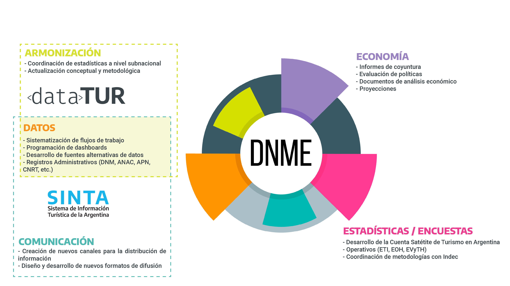

# Presentación

La Dirección Nacional de Mercados y Estadística,  de la Subsecretaría de Desarrollo Estratégico del Ministerio de Turismo y Deportes, tiene a su cargo la elaboración de las estadísticas oficiales de turismo de Argentina. Para ello se vale de operativos estadísticos -algunos de los cuales realiza en conjunto con el INDEC-, registros administrativos y otras fuentes de información.

La difusión de esta información procura satisfacer las necesidades de múltiples destinatarios, del ámbito público, privado y académico, con diferentes niveles de conocimiento del sector y de las herramientas para explotación de datos estadísticos.

Es por ello que, en 2021, la DNMyE creó el [Sistema de Información Turística de Argentina (SINTA)](https://www.yvera.tur.ar/sinta/), procurando poner en valor el vasto acervo de información que la Dirección elabora desde hace décadas. La publicación de las estadísticas turísticas en múltilples formatos- como tableros, reportes, datos abiertos-, la incorporación de nuevas fuentes de información, la elaboración de documentos de trabajo, entre otras, son algunas de las tareas que se llevaron a cabo en los últimos años. En esta etapa, el flujo de trabajo de la DNMyE se ha ido transformando, con la idea de generar procesos más abiertos, colaborativos y reproducibles de modo de captar adecuadamente el potencial de sus recursos.

[La Memoria de Gestión de la DNMyE](https://tableros.yvera.tur.ar/recursos/biblioteca/memoria_dnmye.pdf) procura describir este trabajo, detallando en su primera sección las principales responsabilidades del área. La segunda sección detalla los principales productos de la Dirección. Una tercera sección resume las mejoras de los procesos y flujos de trabajo de la Dirección. Por último, se describe la colaboración de la DNMyE con otras áreas del MINTURDEP y organismos externos.

```{r, echo=F}

```


# Manual de procedimientos

Para acompañar la publicación de este documento, la DNMyE elaboró el Manual de Procedimientos. Esta publicación, en formato de libro digital, detalla  cómo realizar cada una de las tareas que habitualmente se llevan adelante, con el objetivo de brindar un soporte acerca de cada uno de los procesos que forman parte de la producción de la Dirección.

Puede visitar el manual de procedimientos en el siguiente [enlace](https://tableros.yvera.tur.ar/dnmye/manual){target='blank'}.


::: {.infobox}
Para recibir las novedades del SINTA escribíle al bot de Telegram de la DNMyE <a href='https://bitacora.yvera.tur.ar/posts/2022-09-08-sintia/' target='_blank'>*SintIA*</a>: <a href='https://t.me/RDatinaBot' target='_blank'>@RDatinaBot</a> 🤖
:::


