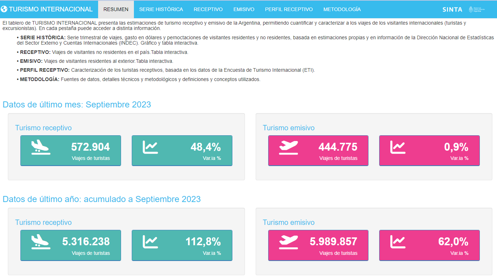
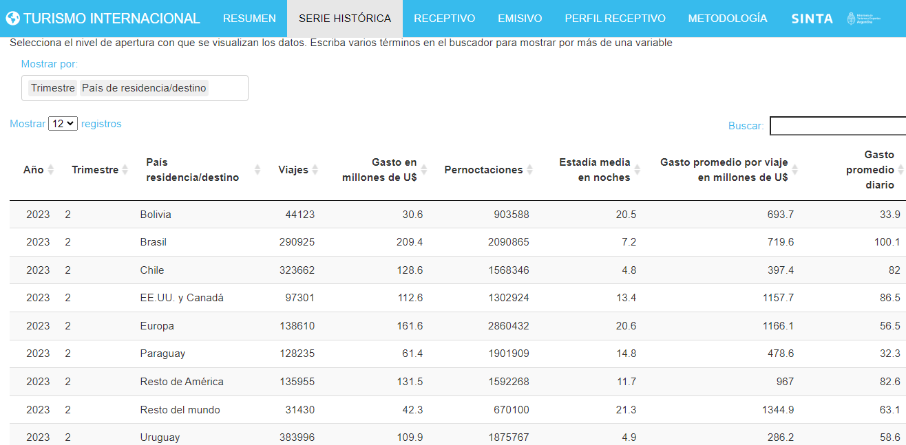

<aside>

💻 [**TABLERO**: Turismo Internacional](https://tableros.yvera.tur.ar/turismo_internacional/)

</aside>

El [**tablero de TURISMO INTERNACIONAL**](https://tableros.yvera.tur.ar/turismo_internacional/) presenta las estimaciones de turismo receptivo y emisivo de la Argentina. Esta nueva versión incorpora tres novedades. Por un lado, una nueva pestaña con la serie histórica completa incluyendo **gasto turístico, gasto promedio diario, gasto por viaje, pernoctaciones, estadía y viajes**. Por otro lado, en las pestañas receptivo y emisivo, se incluye la **serie histórica completa de viajes, con los distintos niveles de apertura** disponibles según los años. Además, en la presentación se incluye de manera destacada el **último dato** mensual y acumulado anual.  

### NOVEDADES


**ÚLTIMOS DATOS**

La primera pestaña presenta el contenido de toda la aplicación. Como novedad, se destacan los últimos datos mensuales y acumulado anual y sus respectivas variaciones, de turismo receptivo y emisivo.


```{r echo=FALSE}



```


**SERIE HISTÓRICA**

Esta nueva pestaña presenta la serie histórica trimestral de turismo receptivo y emisivo de **viajes, gasto en dólares y pernoctaciones de turistas y excursionistas**, incluyendo los indicadores de **estadía media, gasto promedio por viaje y gasto promedio diario.** Pueden visualizarse en forma de gráfico o tabla.


```{r echo=FALSE}

knitr::include_graphics("ti_serie_1.png")

```

Asimismo, se puden realizar aperturas por país, tipo de visitante y trimestre.

```{r echo=FALSE}



```

**EMISIVO / RECEPTIVO**

Las pestañas por tipo de turismo (emisivo o receptivo) permiten acceder a las estimaciones de los viajes de los turistas y de los excursionistas (aquellos visitantes que no pernoctan en el destino). Una caja de selección al comienzo de los respectivos módulos de *FILTRO* permite seleccionar la opción de preferencia. Por otro lado, está  la posibilidad de seleccionar las aperturas dentro de los módulos de *VISUALIZACIÓN*. 

La novedad es que la serie ya no está solamente desde 2016, sino desde que se tienen registros, es decir, 1990. Los primeros años no hay datos por trimestre ni por medio de transporte, pero al avanzar en el tiempo, hay cada vez  más variables disponibles. 

```{r echo = FALSE}
knitr::include_graphics("ti_5.png")

```

Para el turismo receptivo, desde 2001 se presentan datos a nivel mensual.

```{r echo = FALSE}
knitr::include_graphics("ti_4.png")

```

**PERFIL RECEPTIVO**

Al igual que en la anterior versión, esta pestaña permite caracterizar el perfil del turismo receptivo por los pasos de Ezeiza y Aeroparque, a partir de la [Encuesta de Turismo Internacional (ETI)](https://bitacora.yvera.tur.ar/posts/2022-05-31-intro-eti/ "Encuesta de Turismo Internacional (ETI)"). Se pueden analizar algunas características de los turistas (país de residencia, tipo de alojamiento principal en el país, motivo de viaje), así como conocer los destinos (localidades, provincias) que han visitado en la Argentina y el gasto turístico -a nivel trimestral- que han realizado durante sus viajes en el país.


<aside>

***Encuesta de Turismo Internacional (ETI)***

📊 [Datos Abiertos](https://datos.yvera.gob.ar/dataset/encuesta-turismo-internacional)\
📚 [Metodología](https://www.yvera.tur.ar/sinta/informe/documentos/descarga/5d5c00efe6866641938689.pdf)\
📑 [Reportes](https://www.yvera.tur.ar/sinta/informe/info/turismo-internacional/informes-tecnicos)

</aside>


Se puede acceder a la plataforma desde la [página del SINTA](https://www.yvera.tur.ar/sinta/) o directamente desde la página: <https://tableros.yvera.tur.ar/turismo_internacional/>

::: {.infobox}
Para recibir las novedades del SINTA escribíle al bot de Telegram de la DNMyE <a href='https://bitacora.yvera.tur.ar/posts/2022-09-08-sintia/' target='_blank'>*SintIA*</a>: <a href='https://t.me/RDatinaBot' target='_blank'>@RDatinaBot</a> 🤖
:::
