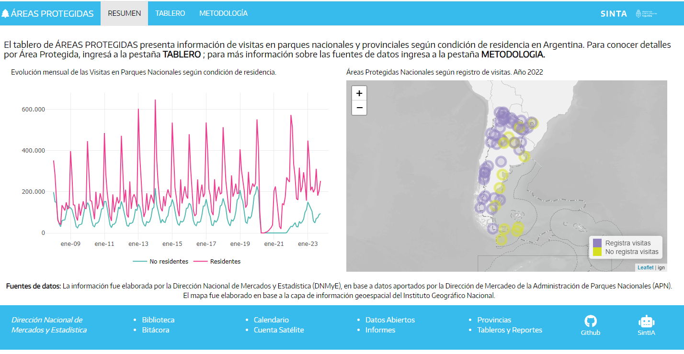

```{r setup, include=FALSE}
knitr::opts_chunk$set(echo = FALSE)
```


El [**Tablero de Áreas Protegidas**](https://tableros.yvera.tur.ar/tablero_areas_protegidas/), presenta información (de manera agregada y desagregada) sobre **visitas, condición de residencia, mes, año, región y provincia donde se ubica cada área protegida** tanto nacionales como provinciales.

**RESUMEN**

La pestaña  presenta la evolución de las visitas en las áreas protegidas nacionales desde el año 2008 al presente y un mapa que permite ver la ubicación tanto de las áreas nacionales que registran información de visitas como de las que aún no registran. 


```{r}



```


**TABLERO**

La segunda pestaña permite visualizar las visitas filtrando por **año, mes, categoría de Área Protegida (Nacionales y Provinciales[^1]), regiones turísticas y provincias donde se ubican las distintas áreas, así como por área protegida**. Asimismo, se puede seleccionar distintas opciones de visualización de la información en forma de tabla de manera tal que los usuarios puedan descargar sus propios procesamientos.

[^1]: Incluye información de 5 Áreas Naturales Protegidas del Chubut y 1 Parque Provincial de San Juan.


```{r}

knitr::include_graphics("tablero.png")

```

**METODOLOGÍA**

En esta pestaña se aclaran cuestiones conceptuales sobre los datos, definición de las variables y fuentes de información.


Se puede acceder a la plataforma desde la [página del SINTA](https://www.yvera.tur.ar/sinta/) o directamente desde la página: <https://tableros.yvera.tur.ar/tablero_areas_protegidas/>

::: {.infobox}
Para recibir las novedades del SINTA escribíle al bot de Telegram de la DNMyE <a href='https://bitacora.yvera.tur.ar/posts/2022-09-08-sintia/' target='_blank'>*SintIA*</a>: <a href='https://t.me/RDatinaBot' target='_blank'>@RDatinaBot</a> 🤖
:::

