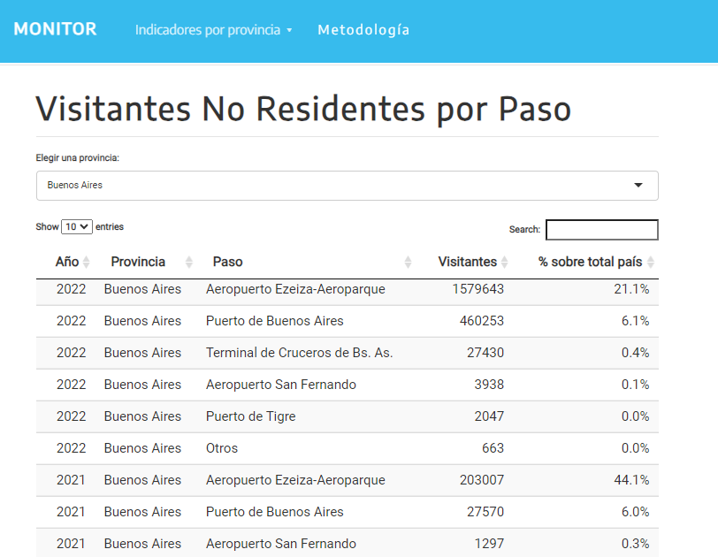
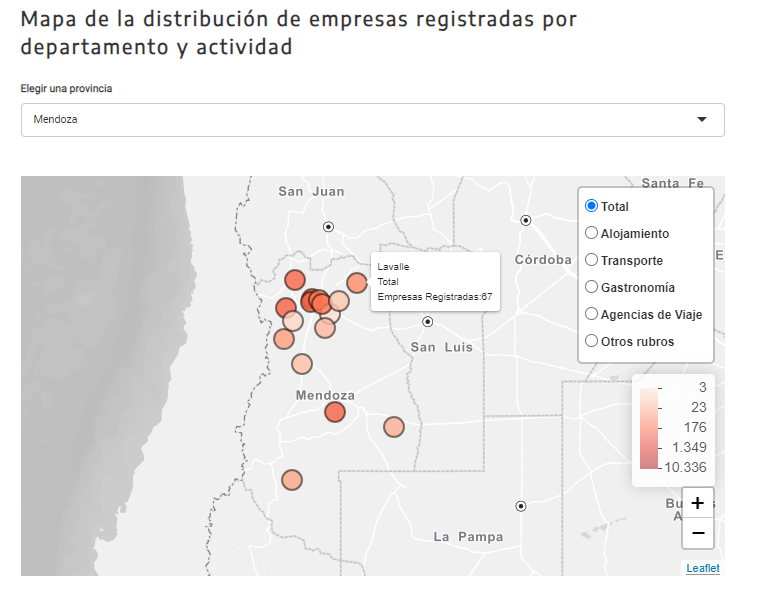

```{r setup, include=FALSE}
knitr::opts_chunk$set(echo = FALSE)
```

# Resumen

El [sitio del Monitor de Turismo en las Provincias](https://provincias.yvera.tur.ar/) constituye una herramienta para la consulta de la última información disponible relacionada al turismo en la Argentina, con una mirada a nivel provincial. De esta forma, se sistematiza una serie de indicadores relevantes para el análisis de la actividad turística con una perspectiva federal.

Todos los indicadores publicados en el sitio fueron actualizados hasta el año 2022, último período con el que se cuenta con información completa para las seis fuentes de datos utilizadas:


- **Turismo Interno** a partir de la Encuesta de Viajes y Turismo de los Hogares (EVyTH).

- **Turismo Receptivo** estimado mediante registros de la Dirección Nacional de Migraciones (DNM).

- **Padrón de Alojamientos** de la oferta hotelera y parahotelera proveniente del Padrón Único Nacional de Alojamientos (PUNA).

- **Áreas Protegidas Nacionales** a partir de información de la Administración de Parques Nacionales (APN).

- **Conectividad Aérea** proveniente de los registros de la Administración Nacional de Aviación Civil (ANAC).

- **Empresas Turísticas** correspondiente a empresas de las Ramas Características del Turismo (RCT) en base a datos de la Administración Federal de Ingresos Públicos (AFIP).

# Consulta de datos

Los indicadores se encuentran organizados en secciones separadas para su consulta. Desde el menú "Indicadores por provincia" se puede navegar a la página de interés y filtrar los datos por provincia. En primera instancia, se visualiza una tabla con el resumen de los datos pertenecientes a cada tema para la provincia seleccionada. La tabla además permite consultar datos de toda la serie disponible.



En segunda instancia, se presentan distintos tipos de gráficos interactivos acordes a los indicadores que se muestran. En el siguiente ejemplo se puede visualizar la distribución de empresas turísticas por departamento de la provincia de Mendoza, con la posibilidad de filtrar por rama turística (Alojamiento, Transporte, etc).

   

El sitio también presenta una sección de **Metodología**, donde se detallan aspectos conceptuales y metodológicos de las distintas fuentes de datos, así como del cálculo de los indicadores.

Visite el monitor en: https://provincias.yvera.tur.ar/

::: {.infobox}
Para recibir las novedades del SINTA escribíle al bot de Telegram de la DNMyE <a href='https://bitacora.yvera.tur.ar/posts/2022-09-08-sintia/' target='_blank'>*SintIA*</a>: <a href='https://t.me/RDatinaBot' target='_blank'>@RDatinaBot</a> 🤖
:::
