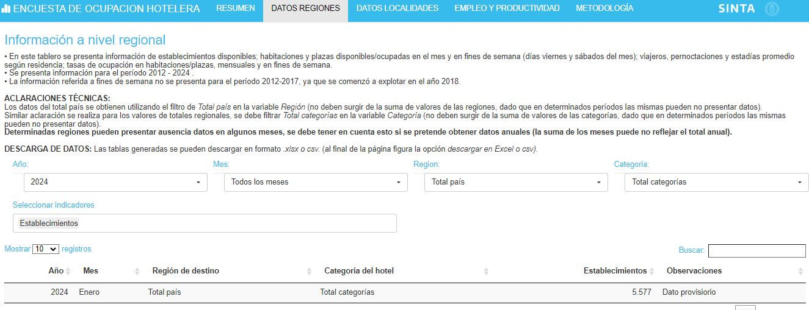
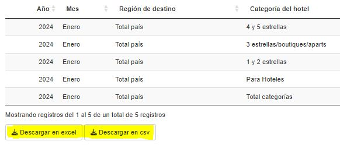

```{r setup, include=FALSE}
knitr::opts_chunk$set(echo = FALSE)
```

```{r}
# Se cargan librerías

library(shiny)
library(tidyverse)
library(DT)
library(sf)
library(shinyWidgets)
library(glue)
library(shinydashboard)
library(herramientas)
library(comunicacion)
library(leaflet)
library(geoAr)
library(shinycssloaders)

options(scipen = 9999)

```

```{r}

# Se levantan la bases de los mapas

locs_geo <- readRDS("/srv/DataDNMYE/eoh/tablero/locs_geo.rds")


regs_geo <- readRDS("/srv/DataDNMYE/eoh/tablero/regs_geo.rds")


```


# PRESENTACIÓN

La Dirección Nacional de Mercados y Estadística pone a disposición de los usuarios **un nuevo tablero interactivo** con información de la Encuesta de Ocupación Hotelera (EOH), operativo que se realiza de manera conjunta entre la Subsecretaría de Turismo y el INDEC, que mide la evolución de la actividad hotelera del país desde una perspectiva de la oferta de quienes brindan el servicio de alojamiento. Para ello, releva información de la oferta de establecimientos, plazas y habitaciones disponibles, personal empleado, etc., como también sobre variables de demanda, tales como el número de viajeros hospedados, pernoctes hoteleros, estadía promedio, ente otras, por condición de residencia.  

# INFORMACIÓN DISPONIBLE

La información se presenta en cuatro solapas:

### Resumen:

* En esta primera pantalla se ofrece un resumen de los datos más relevantes de la EOH para el último mes publicado y los datos acumulados anuales, junto con un **mapa interactivo** con datos desagregados por región y localidad de viajeros, pernoctaciones, estadías promedio y tasas de ocupación en plazas.


```{r eval=FALSE}

# Se define paleta de colores

colores <- c(dnmye_colores("gris oscuro"),"red",dnmye_colores("naranja"),dnmye_colores("amarillo"),
               dnmye_colores("azul verde"),dnmye_colores("purpura"),dnmye_colores("cian"))

# Mapa interactivo:

mapa <- leaflet() %>%
      addArgTiles() %>% #fondo de Argentina
      setMaxBounds(lat1 = 85, lat2 = -85.05, lng1 = 180, lng2 = -180) %>% 
      addPolygons(data = regs_geo, group = "Regiones",
                  fillColor = colores,
                  color = colores,
                  weight = 0.5,
                  fillOpacity = .6,
                  label = ~ region, popup = ~ paste0("<b>Región ",region,":</b>","<br>","<br>",
                                                     "<b>Últimos datos"," "," (",mes," ",anio,")",":</b>","<br>",
                                                     "<b>Viajeros (miles):</b> ",lbl_decimal(viajeros)," (",lbl_decimal(var_a),"% i.a",")", "<br>",
                                                     "<b>Pernoctes (miles):</b> ",lbl_decimal(pernoctes)," (",lbl_decimal(var_b),"% i.a",")", "<br>",
                                                     "<b>Estadía media (noches):</b> ",lbl_decimal(em)," (",lbl_decimal(var_c),"% i.a",")", "<br>",
                                                     "<b>Tasa ocup. plazas:</b> ",lbl_decimal(top),"%"," (",lbl_decimal(var_d)," p.p i.a",")","<br>","<br>",
                                                     "<b>Acumulado anual"," ","(" ,anio,")",":</b>","<br>",
                                                     "<b>Viajeros (miles):</b> ",lbl_decimal(viajeros_acum)," (",lbl_decimal(var_a_acum),"% i.a",")", "<br>",
                                                     "<b>Pernoctes (miles):</b> ",lbl_decimal(pernoctes_acum)," (",lbl_decimal(var_b_acum),"% i.a",")", "<br>",
                                                     "<b>Estadía media (noches):</b> ",lbl_decimal(em_acum)," (",lbl_decimal(var_c_acum),"% i.a",")", "<br>",
                                                     "<b>Tasa ocup. plazas:</b> ",lbl_decimal(top_acum),"%"," (",lbl_decimal(var_d_acum)," p.p i.a",")")) %>% 
      addAwesomeMarkers(data = locs_geo, group= "Localidades",
                        icon = makeAwesomeIcon(text = fontawesome::fa("hotel"),
                                               markerColor = dnmye_colores("azul verde"),
                                               iconColor = "white"),
                        label = ~ localidad_eoh, popup = ~if_else(!is.na(viajeros) & !is.na(var_a),
                                                                    true = paste0("<b>Últimos datos"," ",localidad_eoh," (",mes," ",anio,")",":</b>","<br>",
                                                                  "<b>Viajeros (miles):</b> ",lbl_decimal(viajeros)," (",lbl_decimal(var_a),"% i.a",")", "<br>",
                                                                  "<b>Pernoctes (miles):</b> ",lbl_decimal(pernoctes)," (",lbl_decimal(var_b),"% i.a",")", "<br>",
                                                                  "<b>Estadía media (noches):</b> ",lbl_decimal(em)," (",lbl_decimal(var_c),"% i.a",")", "<br>",
                                                                  "<b>Tasa ocup. plazas:</b> ",lbl_decimal(top),"%"," (",lbl_decimal(var_d)," p.p i.a",")"),
                                                                  false = if_else(!is.na(viajeros) & is.na(var_a),
                                                                                  true=paste0("<b>Últimos datos"," ",localidad_eoh," (",mes," ",anio,")",":</b>","<br>",
                                                                                              "<b>Viajeros (miles):</b> ",lbl_decimal(viajeros), "<br>",
                                                                                              "<b>Pernoctes (miles):</b> ",lbl_decimal(pernoctes), "<br>",
                                                                                              "<b>Estadía media (noches):</b> ",lbl_decimal(em), "<br>",
                                                                                              "<b>Tasa ocup. plazas:</b> ",lbl_decimal(top),"%"),
                        false=paste0("<b>No se puede presentar la información de","<br>",localidad_eoh," para ",mes," ",anio,"</b>")))) %>% 
      addLayersControl(baseGroups = c("Regiones","Localidades"),
                       options = layersControlOptions(collapsed = FALSE))

htmlwidgets::saveWidget(mapa, file = "mapa.html", selfcontained = T)


```

<iframe src = "mapa.html" height="400"></iframe>

### Datos regiones:

* Aquí se encuentran disponibles los datos más relevantes a nivel **REGIONAL Y TOTAL PAÍS:**



<br>

* El usuario podrá seleccionar información de establecimientos disponibles; habitaciones y plazas disponibles/ocupadas en el mes y en fines de semana (días viernes y sábados del mes); viajeros, pernoctaciones y estadías promedio según residencia; tasas de ocupación en habitaciones/plazas, mensuales y en fines de semana.

* Las tablas elaboradas **se podrán descargar tanto en formato xlsx. como en csv.** (misma aclaración es válida para el tablero de localidades y de empleo y productividad): 

<br>




### Localidades:

* Se presenta la misma información que en el tablero de regiones, solo que la desagregación es a nivel **LOCALIDAD**.

### Empleo y Productividad:

* Aquí encontrarán disponible **la información vinculada al empleo y productividad** de los establecimiento Hoteleros y Para hoteleros del país: facturación total/en servicios de alojamiento/en otros servicios; puestos de trabajo, puestos de trabajo equivalentes; ADR (valor promedio por noche de las unidades ofrecidas); REVpar (ingresos generados por cada unidad ofrecida); unidades vendidas por puestos de trabajo equivalentes; duración promedio de la jornada semanal laboral (expresada en horas).

* Los datos se presentan desagregados a nivel **REGIÓN**.

### Metodología:

* Se destacan aquí los principales aspectos metodológicos del relevamiento; localidades relevadas; definiciones y conceptos.

**Se recomienda que para la manipulación de la información se tengan en cuenta las aclaraciones técnicas realizadas en cada uno de los tableros.**

<br>

La información de la EOH también se encuentra disponible en:

* Formato abierto para que puedas descargarlos fácilmente en nuestro portal de [Datos Abiertos](https://datos.yvera.gob.ar/dataset/encuesta-ocupacion-hotelera-parahotelera-eoh). 

* [Informes mensuales elaborados por la Dirección](https://www.yvera.tur.ar/sinta/informe/info/encuesta-de-ocupacion-hotelera-eoh)

* [Anuario Estadístico de Turimo](https://tableros.yvera.tur.ar/recursos/biblioteca/anuario_2022.pdf)


<br>

::: {.infobox}
Para recibir las novedades del SINTA escribíle al bot de Telegram de la DNMyE <a href=‘https://bitacora.yvera.tur.ar/posts/2022-09-08-sintia/’ target=‘_blank’>*SintIA*</a>: <a href=‘https://t.me/RDatinaBot’ target=‘_blank’>@RDatinaBot</a> 🤖
:::


