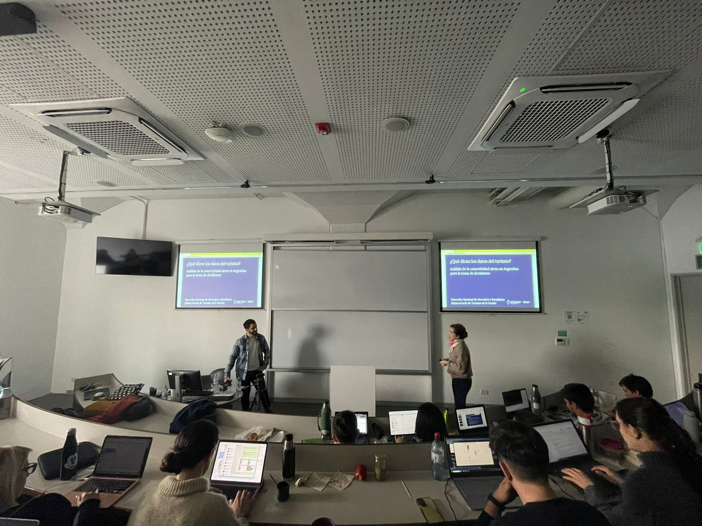

```{r setup, include=FALSE}
knitr::opts_chunk$set(echo = F, message = F, warning = F, 
                      fig.align = 'left', fig.width = 10, fig.height = 6)
```

```{r}

```


La Subsecretaría de Turismo de la Nación, a través el equipo de **la Dirección Nacional de Mercados y Estadísticas (DNMyE)**, participó de la tercera Clínica de Datos de la **Universidad Torcuato di Tella**.

Dicho evento, dirigido a alumnos de las maestrías de Economía Urbana y de Políticas Públicas, reunió a especialistas de los sectores privado y público, la academia y la sociedad civil, en torno al uso de datos e inteligencia artificial.

El equipo de la Subsecretaría expuso sobre el trabajo realizado en el [Sistema Información Turística de la Argentina (SINTA)](https://www.yvera.tur.ar/sinta/), recientemente premiado por la **ONU Turismo** como buena práctica de digitalización en turismo; la importancia y oportunidades del uso de datos en la gestión pública y en el diseño de políticas públicas; y el rol de la innovación en el manejo de la información en el sector turístico nacional.

Se utilizó como caso de estudio los desarrollos en el área de información de conectividad aérea, los cuales abarcan el intercambio de información con la Administración de Aviación Civil (ANAC), el procesamiento y el análisis de los datos, así como la generación de visualizaciones y productos de difusión como el documento de trabajo, el tablero y el reporte de conectividad.

Esta actividad se enmarca en el trabajo activo de la **apertura de información, de la difusión de conocimiento de calidad y herramientas turísticas innovadoras**.

En esta línea, también se realizará una **mesa técnica federal con los entes provinciales de turismo**, a fin de poner en común los sistemas estadísticos actuales; identificar las principales limitaciones u obstáculos para la producción de datos de calidad; dar a conocer circuitos de comunicación y difusión de la información; plantear nuevas instancias de colaboración e intercambio; e identificar las principales temáticas de interés y los desafíos para su medición.

# Referencias

Accedé a los recursos de conectividad aérea publicados por la DNMyE:

+ **[Documento de Trabajo](https://tableros.yvera.tur.ar/recursos/biblioteca/conectividad_aerea.pdf)**

+ **[Tablero](https://tableros.yvera.tur.ar/conectividad/)**

+ **[Reporte](https://tableros.yvera.tur.ar/conectividad.html)**

+ **[Datos Abiertos](http://datos.yvera.gob.ar/dataset/conectividad-aerea)**

+ **[ANAC](https://www.argentina.gob.ar/anac)**

::: {.infobox}
Para recibir las novedades del SINTA escribíle al bot de Telegram de la DNMyE <a href=‘https://bitacora.yvera.tur.ar/posts/2022-09-08-sintia/’ target=‘_blank’>*SintIA*</a>: <a href=‘https://t.me/RDatinaBot’ target=‘_blank’>@RDatinaBot</a> 🤖
:::
