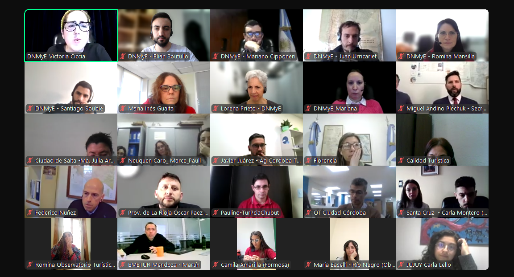

```{r setup, include=FALSE}
knitr::opts_chunk$set(echo = F, message = F, warning = F, 
                      fig.align = 'center', fig.width = 10, fig.height = 6)
```

```{r}

```

**La Subsecretaría de Turismo de la Nación**, a través del equipo de la **Dirección Nacional de Mercados y Estadística (DNMyE)**, lideró una mesa técnica de estadística con equipos provinciales y locales en torno a los principales desafíos que enfrentan a la hora de generar información de calidad para la toma de decisiones del sector turístico.

Participaron más de 80 referentes del área miembros de **19 provincias y 14 gobiernos locales**. El encuentro, que se realizó virtualmente, tuvo como objetivo *poner en común los sistemas estadísticos actuales; identificar las principales limitaciones u obstáculos para la producción de datos de calidad; dar a conocer circuitos de comunicación y difusión de la información; plantear nuevas instancias de colaboración e intercambio; e identificar las principales temáticas de interés y los desafíos para la medición de indicadores*.

La jornada de trabajo comenzó con la presentación del equipo de Nación y la puesta en común de los principales retos expresados por equipos técnicos subnacionales a la hora de trabajar en sus proyectos propios.

Luego, los participantes se dividieron en mesas de trabajo donde debatieron y pusieron en común sus problemas en torno a la generación de estadísticas, sus casos de innovación y la manera en la que se adaptan a las principales tendencias tecnológicas.

Se finalizó con la presentación [DATATUR](https://datatur.yvera.tur.ar/), la plataforma web para el intercambio y la gestión de datos del turismo entre organismos, y el de [Sistema Información Turística de la Argentina (SINTA)](https://www.yvera.tur.ar/sinta/).

Esta jornada de trabajo tuvo como fin ser el puntapié inicial para una serie de reuniones especiales entre la DNMyE y los diversos equipos de trabajo subnacionales con el fin de coordinar esfuerzos, compartir soluciones y fortalecer el sistema estadístico nacional.


# Referencias

Accedé a los recursos publicados por la DNMyE:

+ **[DATATUR](https://datatur.yvera.tur.ar/)**

+ **[SINTA](https://www.yvera.tur.ar/sinta/)**

::: {.infobox}
Para recibir las novedades del SINTA escribíle al bot de Telegram de la DNMyE <a href=‘https://bitacora.yvera.tur.ar/posts/2022-09-08-sintia/’ target=‘_blank’>*SintIA*</a>: <a href=‘https://t.me/RDatinaBot’ target=‘_blank’>@RDatinaBot</a> 🤖
:::
