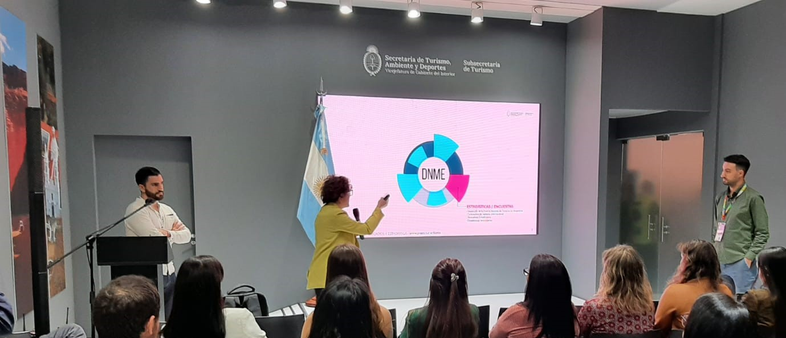

```{r setup, include=FALSE}
knitr::opts_chunk$set(echo = F, message = F, warning = F, 
                      fig.align = 'center', fig.width = 10, fig.height = 6)
```

```{r}

```

El martes 1 de octubre, **la Dirección Nacional de Mercados y Estadísticas (DNMyE)** de la Subsecretaría de Turismo de la Nación participó de la **[28° Feria Internacional de Turismo de América Latina (FIT)](https://fit.org.ar/)**.

En la edición de este año, el equipo de la DNMyE estuvo a cargo de la charla "*[Entendiendo el turismo a través de los datos: un recorrido por el SINTA](https://d4t4tur.github.io/presentaciones/SINTA_FIT2024.html#1)*" donde expuso sobre el trabajo realizado en el **[Sistema Información Turística de la Argentina (SINTA)](https://www.yvera.tur.ar/sinta/)**, recientemente premiado por la **ONU Turismo** como buena práctica de digitalización en turismo, los nuevos proyectos en producción, y la aplicación práctica y el potencial para la planificación estratégica (pública y privada) de las distintas bases de datos y recursos sectoriales.

En lo respectivo a las aplicaciones prácticas desarrolladas, estas plantearon algunas de las preguntas que los distintos actores del sector -tanto del ámbito privado, público o académico- se realizan comunmente en lo referente a el empleo y la actividad económica, la oferta de alojamientos, la ocupación hotelera, el flujo de transporte aéreo, terrestre y de cruceros, las visitas a áreas protegidas, entre otras, las cuales pueden ser respondidos con información disponible en el SINTA. En particular, se hizo un repaso de los [informes de Cuenta Satélite de Turismo](https://www.yvera.tur.ar/sinta/informe/info/cuenta-satelite-de-turismo), los tableros del [Padrón Nacional de Alojamientos](https://tableros.yvera.tur.ar/puna/), [Encuesta de Ocupación Hotelera](https://tableros.yvera.tur.ar/tablero_eoh/), [conectividad aérea](https://tableros.yvera.tur.ar/conectividad/) y [terrestre](https://tableros.yvera.tur.ar/conectividad_terrestre/), [crucerismo marítimo](https://tableros.yvera.tur.ar/crucerismo/), y [áreas protegidas](https://tableros.yvera.tur.ar/tablero_areas_protegidas/).

Para concluir, la presentación repasó de los principales números del SINTA del mes de septiembre:

+ La sección **Tableros y Reportes** recibió la visita de **1.068 usuarios totales**, de los cuales 940 fueron usuarios nuevos.

+ En lo que va del año, la mencionada sección acumula **12.418 sesiones realizadas por 7.570 usuarios**.

+ La cantidad de usuarios totales se **incrementó 24,8% respecto del año pasado**.

+ El **86% de los usuarios ingresaron desde Argentina**.

La FIT, una de las ferias internacionales de la industria turística más importante del mundo, tuvo lugar entre el 28 de septiembre y el 1 de octubre de 2024, en La Rural, Predio Ferial de Buenos Aires. En la actual edición, asistieron 135 mil personas entre profesionales del sector, invitados internacionales y público general, y participaron 1870 expositores (nacionales y extranjeros), las 24 provincias argentinas y más de 50 países de distintas partes del mundo.

```{r}
knitr::include_graphics("sinta5.jpg")
```


# Referencias

Accedé a los recursos del SINTA:

+ **[Biblioteca](https://biblioteca.yvera.tur.ar/)**

+ **[Bitácora](https://bitacora.yvera.tur.ar/)**

+ **[Informes](https://www.yvera.tur.ar/sinta/informe)**

+ **[Tableros](https://tableros.yvera.tur.ar/)**

+ **[Datos Abiertos](http://datos.yvera.gob.ar/)**

+ **[Cuenta Satélite](https://www.yvera.tur.ar/sinta/informe/info/cuenta-satelite-de-turismo)**

+ **[DATATUR](https://datatur.yvera.tur.ar/)**

+ **[Calendario](https://calendario.yvera.tur.ar/)**

::: {.infobox}
Para recibir las novedades del SINTA escribíle al bot de Telegram de la DNMyE <a href=‘https://bitacora.yvera.tur.ar/posts/2022-09-08-sintia/’ target=‘_blank’>*SintIA*</a>: <a href=‘https://t.me/RDatinaBot’ target=‘_blank’>@RDatinaBot</a> 🤖
:::


