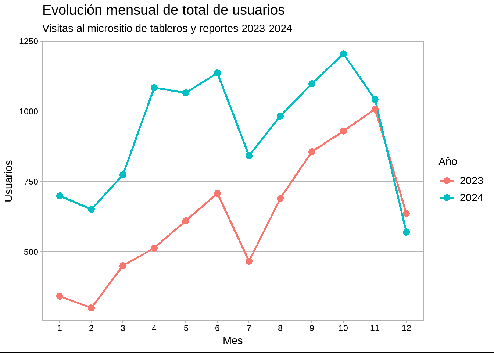
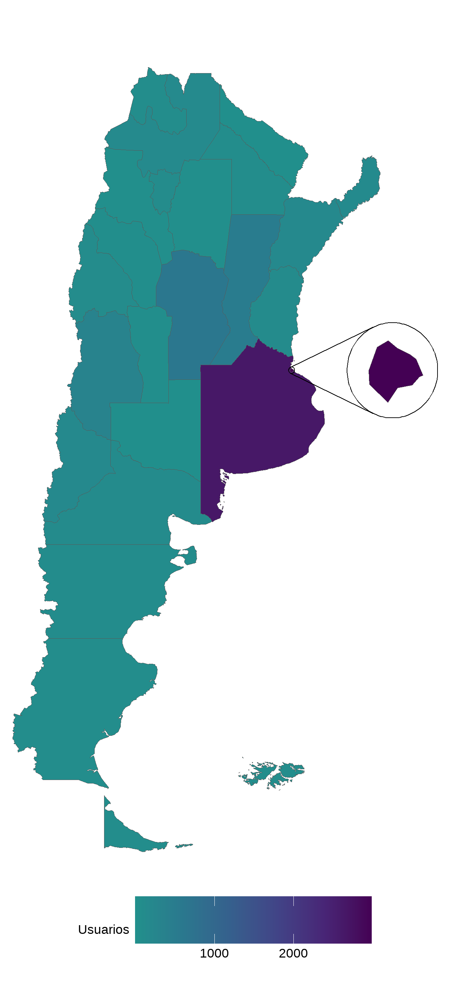
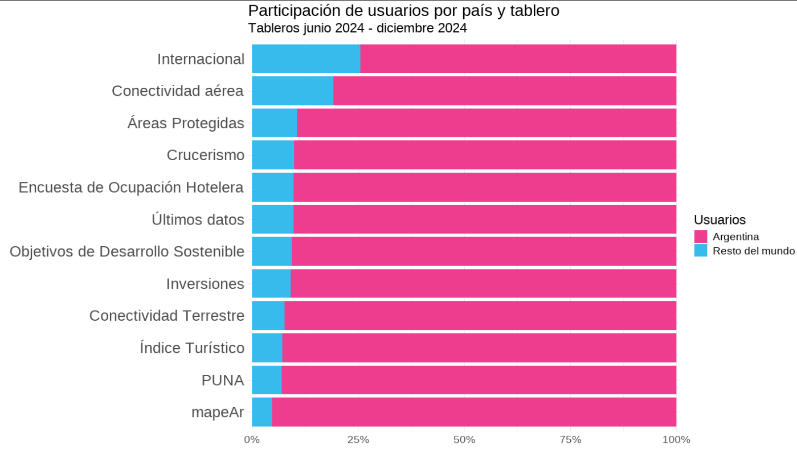

```{r setup, include=FALSE}
knitr::opts_chunk$set(echo = FALSE)
```

## Introducción

La Dirección de Mercados y Estadística (DMyE) no solo monitorea una serie de indicadores relativos a la actividad turística en Argentina, sino que también hace un seguimiento de los usuarios interesados en estos indicadores. Esto es de utilidad para dimensionar el público que consume la información, el cual abarca organismos públicos subnacionales, empresas y organizaciones del sector privado, periodistas, estudiantes, docentes, investigadores y ciudadanos en general.

Además, el análisis del público que visita el SINTA permite entender mejor el impacto de la política de apertura de datos llevada adelante por la DMyE. Conocer cuáles son los temas más relevantes para los usuarios (turismo internacional, interno, conectividad, etc.), desde qué lugares se consulta la información y en qué momentos hay mayor flujo de usuarios, son datos relevantes para la planificación y difusión de las estadísticas.

Cabe aclarar, que el SINTA se conforma de una serie de micrositios: portal de datos abiertos, sitio de informes, tableros y reportes, biblioteca, entre otros. Debido a esto, es difícil medir el flujo de las visitas dentro de todo el sistema. Los datos presentados a continuación corresponden únicamente al micrositio de [Tableros y Reportes](https://tableros.yvera.tur.ar/), uno de los principales recursos del SINTA donde se puede consultar información actualizada de manera interactiva, y pueden consultarse en el [informe disponible en Biblioteca](https://tableros.yvera.tur.ar/recursos/biblioteca/usuarios_sinta_2024.pdf).


## Resumen

A lo largo del año 2024, el sitio de tableros y reportes recibió más de 10 mil usuarios, representando un incremento del 55,4%, respecto al año previo. Además, el 98,5% de los usuarios fueron nuevos, es decir, no habían visitado el sitio anteriormente.

Al ver los datos a nivel mensual, se observa que diciembre 2024 fue el único mes que registró menor flujo al sitio, respecto al año anterior. Por otra parte, se puede mencionar que la evolución de visitas presenta una estacionalidad inversa a la de la actividad turística, es decir, durante los períodos de temporada alta (dciembre-marzo y julio) hay menor "demanda" de información.

```{r}

```


## Reportes

Los reportes presentan los últimos datos disponibles por tema, en un formato estático. Por ejemplo, se puede consultar el reporte de [Turismo Internacional](https://tableros.yvera.tur.ar/internacional.html), que contiene un resumen del turismo receptivo y emisivo en el último mes, desagregado por medio de transporte o por mercado.

El ranking por reporte más visitado lo encabezó Turismo Internacional, con 3.518 usuarios y un crecimiento interanual del 120,8%, seguido de los reportes de Sector Hotelero (1.393 usuarios y 43,2% i.a.) y de Ingresos y Egresos por Turismo en el Mercado de Cambios (1.264 usuarios y 48,5% i.a.).

En cuanto al origen de los usuarios, como era de esperarse, la mayoría visitó el sitio desde Argentina (82,9%). Le siguieron Estados Unidos y España, con el 2,3% y 1,9%, respectivamente. Cabe aclarar que el origen refiere al país desde el cual el usuario consultó la información.

Finalmente, a nivel provincias la Ciudad Autónoma de Buenos Aires fue el distrito que tuvo mayor participación de usuarios (34%), seguida de la provincia de Buenos Aires (30,1%) y Córdoba (7,1%).

**Usuarios que visitaron Tableros y Reportes en el 2024 por provincia**

```{r out.width="40%", fig.align='center'}

```

## Tableros

En cuanto a los tableros, estos constituyen una herramienta para la consulta de datos actuales e históricos de manera interactiva. Los tableros permiten filtrar y agrupar datos de forma personalizada, facilitando el acceso a la información pública. Por ejemplo, se puede consultar el tablero de [Conectividad Aérea](https://tableros.yvera.tur.ar/conectividad/) para visualizar indicadores de cantidad de vuelos, pasajeros, asientos, rutas, tanto de cabotaje como internacionales, entre otros.

El ranking de los tableros más visitados lo encabeza [mapeAr](https://tableros.yvera.tur.ar/mapeAr/), una aplicación web libre y gratuita que permite crear mapas estáticos de la Argentina y provincias, de manera intuitiva e interactiva (sin necesidad de saber de diseño o programación). Luego, le siguieron los tableros de [Turismo Internacional](https://tableros.yvera.tur.ar/turismo_internacional/), [Últimos datos](https://tableros.yvera.tur.ar/tablero_ultimos_datos/), [Conectividad Aérea](https://tableros.yvera.tur.ar/conectividad/) y [Padrón de alojamientos](https://tableros.yvera.tur.ar/puna/).

La mayoría de los usuarios entraron desde Argentina, aunque se destacan algunos tableros con mayor participación de consultas en el extranjero.

```{r}

```

Este tipo de información es de vital importancia para la DMyE, dado que permite evaluar el alcance del SINTA. El 2024 sin dudas fue un año de crecimiento en cuanto a las visitas de usuarios, impulsado por el compromiso en la continuidad y actualización de las diversas fuentes de datos, la incorporación de nuevos productos como el tablero de la [Encuesta de Ocupación Hotelera](https://tableros.yvera.tur.ar/tablero_eoh/) o el reporte de [Conectividad Terrestre](https://tableros.yvera.tur.ar/conectividad_terrestre.html) y la participación en eventos de difusión, como la [Feria Internacional de Turismo (FIT)](https://bitacora.yvera.tur.ar/posts/2024-10-03-la-DMyE-expuso-el-sinta-en-la-fit-2024/) y la [Clínica de Datos de la Universidad Torcuato di Tella](https://bitacora.yvera.tur.ar/posts/2024-08-27-la-subsecretara-de-turismo-particip-del-simposio-de-datos-de-la-universidad-torcuato-di-tella/).

Para más información puede visitar el informe de [Usuarios del SINTA](https://tableros.yvera.tur.ar/recursos/biblioteca/usuarios_sinta_2024.pdf).

::: {.infobox}
Para recibir las novedades del SINTA escribíle al bot de Telegram de la DMyE <a href='https://bitacora.yvera.tur.ar/posts/2022-09-08-sintia/' target='_blank'>*SintIA*</a>: <a href='https://t.me/RDatinaBot' target='_blank'>@RDatinaBot</a> 🤖
:::
